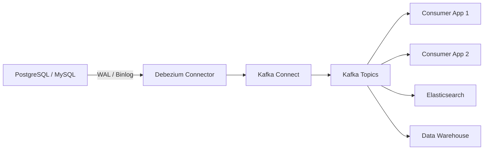

# How to Set Up Debezium for Change Data Capture on RHEL 9

Author: [nawazdhandala](https://www.github.com/nawazdhandala)

Tags: RHEL, Debezium, CDC, Kafka, Database, Data Streaming, Linux

Description: Set up Debezium on RHEL 9 to capture database changes in real time and stream them to Apache Kafka using change data capture (CDC).

---

Debezium is a distributed platform for change data capture (CDC). It monitors your databases and produces an event for every row-level change, streaming those events into Apache Kafka. This makes it possible to react to data changes in real time, keep systems synchronized, and build event-driven architectures. This guide covers setting up Debezium on RHEL 9.

## Prerequisites

- RHEL 9 with at least 4 GB RAM
- Apache Kafka and Kafka Connect running
- A source database (PostgreSQL or MySQL)
- Root or sudo access

## Architecture Overview



## Step 1: Prepare the Source Database

### For PostgreSQL

```bash
# Connect to PostgreSQL and configure WAL settings
sudo -u postgres psql

# Enable logical replication in PostgreSQL
# Edit postgresql.conf
sudo tee -a /var/lib/pgsql/data/postgresql.conf <<EOF

# Debezium CDC settings
wal_level = logical
max_wal_senders = 4
max_replication_slots = 4
EOF

# Restart PostgreSQL to apply WAL changes
sudo systemctl restart postgresql

# Create a replication user for Debezium
sudo -u postgres psql <<EOF
CREATE ROLE debezium WITH LOGIN REPLICATION PASSWORD 'DebeziumPass123';
GRANT SELECT ON ALL TABLES IN SCHEMA public TO debezium;
ALTER DEFAULT PRIVILEGES IN SCHEMA public GRANT SELECT ON TABLES TO debezium;
EOF
```

### For MySQL

```bash
# Enable binary logging in MySQL for CDC
sudo tee /etc/my.cnf.d/debezium.cnf <<EOF
[mysqld]
server-id = 1
log_bin = mysql-bin
binlog_format = ROW
binlog_row_image = FULL
expire_logs_days = 7
EOF

# Restart MySQL
sudo systemctl restart mysqld

# Create a Debezium user in MySQL
mysql -u root -p <<EOF
CREATE USER 'debezium'@'%' IDENTIFIED BY 'DebeziumPass123';
GRANT SELECT, RELOAD, SHOW DATABASES, REPLICATION SLAVE, REPLICATION CLIENT ON *.* TO 'debezium'@'%';
FLUSH PRIVILEGES;
EOF
```

## Step 2: Install Debezium Connectors

Download the Debezium connector plugins and place them in the Kafka Connect plugin directory.

```bash
# Create a directory for Debezium plugins
sudo mkdir -p /opt/kafka/plugins/debezium

# Download the Debezium PostgreSQL connector
cd /opt/kafka/plugins/debezium
sudo curl -LO https://repo1.maven.org/maven2/io/debezium/debezium-connector-postgres/2.5.0.Final/debezium-connector-postgres-2.5.0.Final-plugin.tar.gz
sudo tar xzf debezium-connector-postgres-2.5.0.Final-plugin.tar.gz

# Download the Debezium MySQL connector
sudo curl -LO https://repo1.maven.org/maven2/io/debezium/debezium-connector-mysql/2.5.0.Final/debezium-connector-mysql-2.5.0.Final-plugin.tar.gz
sudo tar xzf debezium-connector-mysql-2.5.0.Final-plugin.tar.gz

# Clean up the archives
sudo rm -f *.tar.gz

# Set permissions
sudo chown -R kafka:kafka /opt/kafka/plugins/debezium

# Restart Kafka Connect to pick up the new plugins
sudo systemctl restart kafka-connect
```

## Step 3: Verify Plugin Installation

```bash
# List available connector plugins (Debezium should appear)
curl -s http://localhost:8083/connector-plugins | python3 -m json.tool | grep -i debezium
```

You should see entries for `io.debezium.connector.postgresql.PostgresConnector` and `io.debezium.connector.mysql.MySqlConnector`.

## Step 4: Create a PostgreSQL CDC Connector

```bash
# Deploy the Debezium PostgreSQL connector
curl -X POST http://localhost:8083/connectors \
    -H "Content-Type: application/json" \
    -d '{
    "name": "postgres-cdc",
    "config": {
        "connector.class": "io.debezium.connector.postgresql.PostgresConnector",
        "database.hostname": "localhost",
        "database.port": "5432",
        "database.user": "debezium",
        "database.password": "DebeziumPass123",
        "database.dbname": "myapp",
        "topic.prefix": "myapp",
        "table.include.list": "public.orders,public.customers,public.products",
        "plugin.name": "pgoutput",
        "slot.name": "debezium_slot",
        "publication.name": "debezium_pub",
        "snapshot.mode": "initial",
        "tombstones.on.delete": true,
        "decimal.handling.mode": "string",
        "tasks.max": 1
    }
}'
```

## Step 5: Create a MySQL CDC Connector

```bash
# Deploy the Debezium MySQL connector
curl -X POST http://localhost:8083/connectors \
    -H "Content-Type: application/json" \
    -d '{
    "name": "mysql-cdc",
    "config": {
        "connector.class": "io.debezium.connector.mysql.MySqlConnector",
        "database.hostname": "localhost",
        "database.port": "3306",
        "database.user": "debezium",
        "database.password": "DebeziumPass123",
        "database.server.id": "1001",
        "topic.prefix": "mysqldb",
        "database.include.list": "myapp",
        "table.include.list": "myapp.orders,myapp.users",
        "schema.history.internal.kafka.bootstrap.servers": "localhost:9092",
        "schema.history.internal.kafka.topic": "schema-changes.myapp",
        "snapshot.mode": "initial",
        "tasks.max": 1
    }
}'
```

## Step 6: Monitor the Connectors

```bash
# Check the connector status
curl -s http://localhost:8083/connectors/postgres-cdc/status | python3 -m json.tool

# List Kafka topics created by Debezium
/opt/kafka/bin/kafka-topics.sh --bootstrap-server localhost:9092 --list | grep myapp

# Consume change events from a topic to verify data flow
/opt/kafka/bin/kafka-console-consumer.sh \
    --bootstrap-server localhost:9092 \
    --topic myapp.public.orders \
    --from-beginning \
    --max-messages 5 | python3 -m json.tool
```

## Step 7: Understand the Change Event Format

Debezium produces events with a standard structure:

```json
{
    "schema": { "...": "..." },
    "payload": {
        "before": null,
        "after": {
            "id": 1001,
            "customer_id": 42,
            "amount": "99.99",
            "status": "pending",
            "created_at": 1709568000000
        },
        "source": {
            "version": "2.5.0.Final",
            "connector": "postgresql",
            "name": "myapp",
            "ts_ms": 1709568000000,
            "db": "myapp",
            "schema": "public",
            "table": "orders"
        },
        "op": "c",
        "ts_ms": 1709568000123
    }
}
```

The `op` field indicates the operation type: `c` for create, `u` for update, `d` for delete, `r` for read (snapshot).

## Step 8: Configure Event Transformations

Use Single Message Transforms (SMTs) to modify events before they reach Kafka.

```bash
# Update the connector to add transformations
curl -X PUT http://localhost:8083/connectors/postgres-cdc/config \
    -H "Content-Type: application/json" \
    -d '{
    "connector.class": "io.debezium.connector.postgresql.PostgresConnector",
    "database.hostname": "localhost",
    "database.port": "5432",
    "database.user": "debezium",
    "database.password": "DebeziumPass123",
    "database.dbname": "myapp",
    "topic.prefix": "myapp",
    "table.include.list": "public.orders,public.customers",
    "plugin.name": "pgoutput",
    "slot.name": "debezium_slot",
    "snapshot.mode": "initial",
    "tasks.max": 1,
    "transforms": "unwrap,route",
    "transforms.unwrap.type": "io.debezium.transforms.ExtractNewRecordState",
    "transforms.unwrap.drop.tombstones": false,
    "transforms.route.type": "org.apache.kafka.connect.transforms.RegexRouter",
    "transforms.route.regex": "([^.]+)\\.([^.]+)\\.([^.]+)",
    "transforms.route.replacement": "cdc-$3"
}'
```

## Conclusion

Debezium is now capturing real-time changes from your databases and streaming them into Kafka topics on RHEL 9. This enables a wide range of use cases including cache invalidation, search index updates, data replication across systems, and event-driven microservices. For production, consider adding Schema Registry for Avro serialization, configuring signal tables for on-demand snapshots, and monitoring connector lag metrics.
