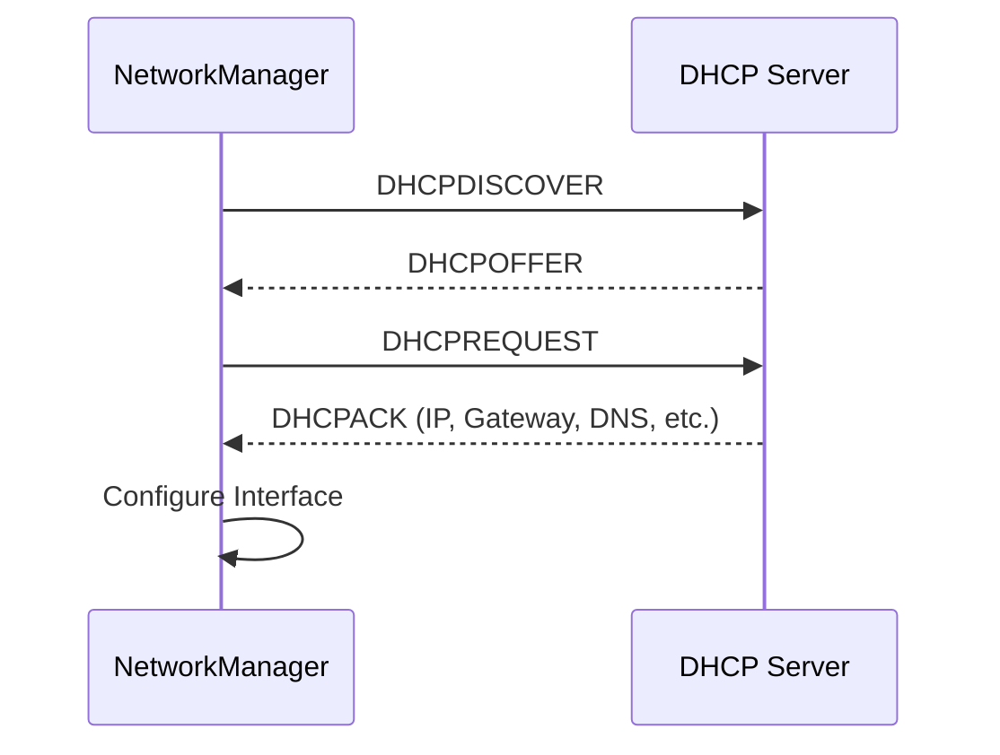

# How to Set Up DHCP Client Configuration Using NetworkManager on RHEL

Author: [nawazdhandala](https://www.github.com/nawazdhandala)

Tags: RHEL, DHCP, NetworkManager, Linux

Description: Configure and tune DHCP client behavior on RHEL through NetworkManager, including custom options, persistent settings, and troubleshooting DHCP issues.

---

DHCP is the default network configuration method for most RHEL installations. While it "just works" in many cases, there are plenty of situations where you need to customize how the DHCP client behaves. Maybe you need to send a specific hostname to the DHCP server, request additional options, or override certain DHCP-provided settings. NetworkManager gives you full control over all of this.

## How DHCP Works with NetworkManager

On RHEL, NetworkManager includes its own internal DHCP client. By default, it uses the built-in client rather than an external one like dhclient. When a connection with `ipv4.method auto` is activated, NetworkManager's DHCP client broadcasts a DHCPDISCOVER, receives an offer, and configures the interface automatically.



## Basic DHCP Configuration

The simplest DHCP setup is the default - just create a connection with automatic addressing:

```bash
# Create a basic DHCP connection
nmcli connection add \
  con-name "dhcp-primary" \
  ifname ens192 \
  type ethernet \
  ipv4.method auto

# Activate it
nmcli connection up dhcp-primary
```

## Choosing the DHCP Client

NetworkManager on RHEL supports two DHCP clients:

- **internal** (default) - NetworkManager's built-in DHCP client
- **dhclient** - The ISC DHCP client (must be installed separately)

To check which client is in use:

```bash
# Check the DHCP client configuration
grep -r dhcp /etc/NetworkManager/conf.d/ /etc/NetworkManager/NetworkManager.conf 2>/dev/null
```

To switch DHCP clients:

```bash
# Install dhclient if needed
dnf install dhcp-client -y

# Configure NetworkManager to use dhclient
cat > /etc/NetworkManager/conf.d/dhcp-client.conf << 'EOF'
[main]
dhcp=dhclient
EOF

# Restart NetworkManager to apply
systemctl restart NetworkManager
```

For most use cases, the internal client works fine and is the recommended option.

## Sending a Hostname to the DHCP Server

Many DHCP servers use the client hostname to create DNS records. Configure what hostname NetworkManager sends:

```bash
# Send the system hostname to the DHCP server
nmcli connection modify dhcp-primary ipv4.dhcp-send-hostname yes

# Send a specific hostname (different from the system hostname)
nmcli connection modify dhcp-primary ipv4.dhcp-hostname "webserver01.example.com"

# Apply changes
nmcli connection up dhcp-primary
```

To stop sending any hostname:

```bash
# Do not send hostname to DHCP server
nmcli connection modify dhcp-primary ipv4.dhcp-send-hostname no
nmcli connection up dhcp-primary
```

## Setting the DHCP Client Identifier

Some networks require a specific client identifier for DHCP:

```bash
# Set the DHCP client ID
nmcli connection modify dhcp-primary ipv4.dhcp-client-id "webserver01"

# Apply changes
nmcli connection up dhcp-primary
```

## Requesting Specific DHCP Options

You can configure which DHCP options the client requests:

```bash
# Request specific DHCP options (by number)
# Option 42 = NTP servers, Option 119 = domain search list
nmcli connection modify dhcp-primary ipv4.dhcp-request-options "1,3,6,15,42,119"

# Apply changes
nmcli connection up dhcp-primary
```

## Overriding DHCP-Provided Settings

Sometimes the DHCP server provides settings you want to override locally. For example, you might want to use your own DNS servers instead of what DHCP provides:

```bash
# Ignore DNS servers from DHCP and use your own
nmcli connection modify dhcp-primary ipv4.ignore-auto-dns yes
nmcli connection modify dhcp-primary ipv4.dns "1.1.1.1,1.0.0.1"

# Ignore routes from DHCP
nmcli connection modify dhcp-primary ipv4.ignore-auto-routes yes

# Apply changes
nmcli connection up dhcp-primary
```

You can also add to the DHCP-provided settings rather than replacing them:

```bash
# Add a DNS server alongside DHCP-provided ones
nmcli connection modify dhcp-primary +ipv4.dns "10.0.1.2"

# Add a DNS search domain alongside DHCP-provided ones
nmcli connection modify dhcp-primary +ipv4.dns-search "internal.example.com"

# Apply changes
nmcli connection up dhcp-primary
```

## DHCP Timeout Configuration

If your network is slow to provide DHCP leases, you can adjust the timeout:

```bash
# Set DHCP timeout (in seconds, 0 = infinite)
nmcli connection modify dhcp-primary ipv4.dhcp-timeout 60

# Apply changes
nmcli connection up dhcp-primary
```

The default timeout depends on the DHCP client being used. The internal client defaults to a reasonable timeout.

## Configuring DHCP for IPv6

IPv6 DHCP (DHCPv6) configuration follows a similar pattern:

```bash
# Enable DHCPv6
nmcli connection modify dhcp-primary ipv6.method auto

# Send hostname in DHCPv6 requests
nmcli connection modify dhcp-primary ipv6.dhcp-send-hostname yes

# Ignore DNS from DHCPv6
nmcli connection modify dhcp-primary ipv6.ignore-auto-dns yes
nmcli connection modify dhcp-primary ipv6.dns "2001:4860:4860::8888"

# Apply changes
nmcli connection up dhcp-primary
```

## Viewing Current DHCP Lease Information

To see what the DHCP server provided:

```bash
# Show the current DHCP lease details
nmcli device show ens192

# Check specific DHCP-related fields
nmcli -f DHCP4 device show ens192

# View the lease file directly (for internal DHCP client)
ls /var/lib/NetworkManager/internal-*
cat /var/lib/NetworkManager/internal-$(nmcli -t -f UUID connection show --active | head -1)-ens192.lease
```

## DHCP with Static Fallback

If you want DHCP but need a fallback static IP when no DHCP server is available:

```bash
# This is not a built-in NM feature, but you can use a dispatcher script
cat > /etc/NetworkManager/dispatcher.d/99-dhcp-fallback << 'SCRIPT'
#!/bin/bash
# If DHCP fails, assign a fallback static IP

INTERFACE="ens192"
FALLBACK_IP="169.254.1.100/16"

if [ "$1" = "$INTERFACE" ] && [ "$2" = "dhcp4-change" ]; then
    # DHCP succeeded, nothing to do
    exit 0
fi

if [ "$1" = "$INTERFACE" ] && [ "$2" = "down" ]; then
    # Check if DHCP failed
    STATE=$(nmcli -t -f GENERAL.STATE device show "$INTERFACE" | cut -d: -f2)
    if [ "$STATE" != "100 (connected)" ]; then
        ip addr add "$FALLBACK_IP" dev "$INTERFACE"
        ip link set "$INTERFACE" up
    fi
fi
SCRIPT

chmod +x /etc/NetworkManager/dispatcher.d/99-dhcp-fallback
```

## Troubleshooting DHCP Issues

### Checking DHCP Logs

```bash
# View DHCP-specific log entries
journalctl -u NetworkManager | grep -i dhcp

# Enable debug logging for DHCP
nmcli general logging level DEBUG domains DHCP4

# Watch the DHCP process in real time
journalctl -u NetworkManager -f | grep -i dhcp
```

### Common DHCP Problems

**No DHCP offer received:**

```bash
# Check if the interface has carrier (link is up)
cat /sys/class/net/ens192/carrier

# Check for DHCP traffic on the wire
tcpdump -i ens192 -n port 67 or port 68
```

**Wrong IP address assigned:**

```bash
# Release and renew the DHCP lease
nmcli connection down dhcp-primary
nmcli connection up dhcp-primary
```

**DHCP DNS overriding local settings:**

```bash
# Prevent DHCP from setting DNS
nmcli connection modify dhcp-primary ipv4.ignore-auto-dns yes
nmcli connection up dhcp-primary
```

### Reset Logging After Troubleshooting

```bash
# Reset logging to default
nmcli general logging level INFO domains DEFAULT
```

## Wrapping Up

DHCP on RHEL is managed entirely through NetworkManager, and the configuration options cover everything from basic automatic addressing to fine-grained control over what the client sends and accepts. The most common customizations are sending a hostname, overriding DNS servers, and adjusting timeouts. For most production servers, you will eventually switch to static IPs anyway, but for development environments, DHCP with a few tweaks is usually all you need.
