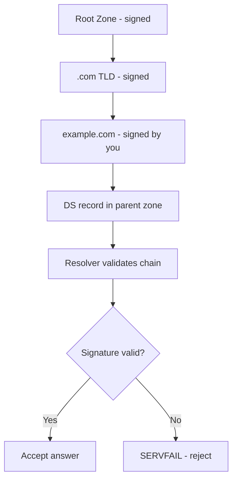

# How to Set Up DNSSEC Zone Signing with BIND on RHEL

Author: [nawazdhandala](https://www.github.com/nawazdhandala)

Tags: RHEL, DNSSEC, BIND, DNS Security, Linux

Description: A practical guide to enabling DNSSEC zone signing on your BIND DNS server running RHEL to protect against DNS spoofing and cache poisoning.

---

DNSSEC adds cryptographic signatures to your DNS records, allowing resolvers to verify that the answers they receive haven't been tampered with. Without DNSSEC, DNS is essentially an honor system, and attackers can forge responses to redirect traffic. Setting it up on BIND takes some work, but it's the right thing to do for any zone you care about.

## How DNSSEC Works

DNSSEC uses public key cryptography to sign DNS records. Each zone has signing keys, and resolvers can follow a chain of trust from the root zone down to your zone to validate responses.



There are two types of keys:
- **KSK (Key Signing Key)** - Signs the DNSKEY records. This is what you communicate to your parent zone via DS records.
- **ZSK (Zone Signing Key)** - Signs all other records in the zone. Rotated more frequently.

## Prerequisites

You need a working BIND authoritative server. Make sure BIND is installed and running:

```bash
dnf install bind bind-utils -y
systemctl status named
```

Verify your zone is working before adding DNSSEC:

```bash
dig @localhost example.com SOA
```

## Generating DNSSEC Keys

Create a directory to store the keys:

```bash
mkdir -p /var/named/keys
chown named:named /var/named/keys
```

Generate the KSK (Key Signing Key):

```bash
dnssec-keygen -a ECDSAP256SHA256 -f KSK -K /var/named/keys example.com
```

Generate the ZSK (Zone Signing Key):

```bash
dnssec-keygen -a ECDSAP256SHA256 -K /var/named/keys example.com
```

This creates four files (two per key): `.key` (public) and `.private` files. List them:

```bash
ls -la /var/named/keys/
```

## Including Keys in Your Zone

Add the public keys to your zone file. You can include them directly:

```bash
cat /var/named/keys/Kexample.com.*.key >> /var/named/example.com.zone
```

Or use the `$INCLUDE` directive in your zone file:

```
$INCLUDE "/var/named/keys/Kexample.com.+013+12345.key"
$INCLUDE "/var/named/keys/Kexample.com.+013+67890.key"
```

## Signing the Zone

Sign the zone file using `dnssec-signzone`:

```bash
dnssec-signzone -A -3 $(head -c 16 /dev/urandom | od -A n -t x1 | tr -d ' \n') \
    -N INCREMENT \
    -o example.com \
    -t \
    -K /var/named/keys \
    /var/named/example.com.zone
```

The flags mean:
- `-A` - Generate NSEC3 records for all sets
- `-3` - Use NSEC3 with the provided salt
- `-N INCREMENT` - Automatically increment the serial
- `-o` - Origin (zone name)
- `-t` - Print statistics
- `-K` - Key directory

This produces `example.com.zone.signed` and a `dsset-example.com.` file.

## Updating named.conf

Point BIND to the signed zone file instead of the original:

```bash
# In named.conf, change the zone file reference
zone "example.com" IN {
    type primary;
    file "example.com.zone.signed";
    allow-update { none; };
    auto-dnssec maintain;
    inline-signing yes;
};
```

With `inline-signing yes`, BIND can manage re-signing automatically.

## Reload BIND

Verify the configuration:

```bash
named-checkconf /etc/named.conf
```

Reload the service:

```bash
systemctl reload named
```

## Testing DNSSEC

Check that DNSSEC records are being served:

```bash
dig @localhost example.com DNSKEY +dnssec
```

You should see DNSKEY and RRSIG records in the response.

Verify the signatures:

```bash
dig @localhost example.com A +dnssec
```

Look for the `ad` (Authenticated Data) flag in the response header and RRSIG records in the answer section.

## Submitting DS Records to Your Registrar

The DS record links your zone's DNSSEC to the parent zone. View your DS record:

```bash
cat /var/named/dsset-example.com.
```

Or generate it from your KSK:

```bash
dnssec-dsfromkey /var/named/keys/Kexample.com.+013+12345.key
```

Submit this DS record to your domain registrar. Each registrar has a different interface for this, typically found in the domain's DNS settings.

## Automated Key Management with BIND

BIND 9.16 supports automated key management. Add this to your zone configuration:

```
zone "example.com" IN {
    type primary;
    file "example.com.zone";
    key-directory "/var/named/keys";
    auto-dnssec maintain;
    inline-signing yes;
    allow-update { none; };
};
```

With `auto-dnssec maintain`, BIND will automatically sign new records and manage key rollovers based on timing metadata in the key files.

## Key Rollover

Keys should be rotated periodically. ZSKs typically every 1-3 months, KSKs annually or less frequently.

For a ZSK rollover, generate a new ZSK:

```bash
dnssec-keygen -a ECDSAP256SHA256 -K /var/named/keys example.com
```

BIND with `auto-dnssec maintain` will detect the new key and handle the rollover.

For a KSK rollover, you also need to update the DS record at your registrar. This is a more involved process, so plan it carefully.

## Monitoring DNSSEC

Check signature expiration:

```bash
dig @localhost example.com SOA +dnssec | grep RRSIG
```

The RRSIG record shows the expiration date. Make sure re-signing happens before signatures expire.

Check DNSSEC validation with an external tool:

```bash
dig @8.8.8.8 example.com +dnssec +cd
```

DNSSEC takes some initial effort to set up, but once it's running with inline signing and automated key management, it mostly takes care of itself. The important thing is to monitor signature expiration and plan your key rollovers ahead of time.
