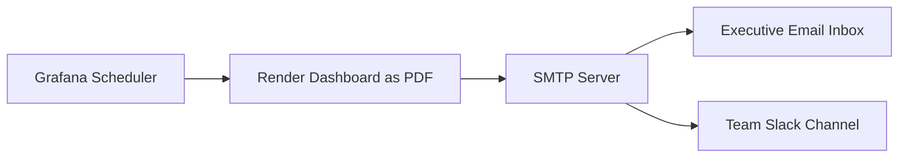

# How to Set Up Grafana for Business Dashboard Reporting on RHEL 9

Author: [nawazdhandala](https://www.github.com/nawazdhandala)

Tags: RHEL, Grafana, Dashboard, Reporting, Data Visualization, Linux

Description: Set up Grafana on RHEL 9 for business dashboard reporting, connecting it to multiple data sources and building production-ready visualizations.

---

Grafana is widely known for infrastructure monitoring, but it is also a powerful tool for business dashboard reporting. With support for SQL databases, APIs, and spreadsheet-like transformations, Grafana can serve as the reporting layer for your business metrics. This guide focuses on setting up Grafana specifically for business intelligence use cases on RHEL 9.

## Prerequisites

- RHEL 9 with at least 2 GB RAM
- PostgreSQL or MySQL as a data source
- Root or sudo access

## Step 1: Install Grafana

```bash
# Add the official Grafana repository
sudo tee /etc/yum.repos.d/grafana.repo <<EOF
[grafana]
name=grafana
baseurl=https://rpm.grafana.com
repo_gpgcheck=1
enabled=1
gpgcheck=1
gpgkey=https://rpm.grafana.com/gpg.key
sslverify=1
sslcacert=/etc/pki/tls/certs/ca-bundle.crt
EOF

# Install Grafana Enterprise (includes reporting features)
sudo dnf install -y grafana-enterprise

# Start and enable Grafana
sudo systemctl enable --now grafana-server

# Open the firewall port
sudo firewall-cmd --permanent --add-port=3000/tcp
sudo firewall-cmd --reload
```

## Step 2: Configure Grafana for Business Use

Edit the main configuration file to optimize for business reporting.

```ini
# /etc/grafana/grafana.ini

[server]
# Set the root URL for proper link generation in reports
root_url = https://dashboards.example.com
http_port = 3000

[database]
# Use PostgreSQL instead of the default SQLite for production
type = postgres
host = localhost:5432
name = grafana
user = grafana
password = GrafanaSecurePass123

[security]
# Admin credentials (change after first login)
admin_user = admin
admin_password = admin

# Disable user signups for business environments
[users]
allow_sign_up = false
allow_org_create = false
auto_assign_org = true
auto_assign_org_role = Viewer

[auth]
# Disable anonymous access
disable_login_form = false

[smtp]
# Configure email for scheduled reports and alerts
enabled = true
host = smtp.example.com:587
user = grafana@example.com
password = email_password
from_address = grafana@example.com
from_name = Grafana Reports

[reporting]
# Enable scheduled PDF report delivery (Enterprise feature)
enabled = true
```

```bash
# Create the PostgreSQL database for Grafana
sudo -u postgres psql <<EOF
CREATE USER grafana WITH PASSWORD 'GrafanaSecurePass123';
CREATE DATABASE grafana OWNER grafana;
EOF

# Restart Grafana to apply the configuration
sudo systemctl restart grafana-server
```

## Step 3: Connect Business Data Sources

Log in to Grafana at `http://your-server:3000` and add data sources.

### PostgreSQL Data Source

Navigate to Configuration > Data Sources > Add Data Source > PostgreSQL.

```
Host: db-server.example.com:5432
Database: business_analytics
User: grafana_reader
Password: reader_password
TLS/SSL Mode: require
```

### MySQL Data Source

```
Host: mysql-server.example.com:3306
Database: sales_data
User: grafana_reader
Password: reader_password
```

## Step 4: Build a Business Dashboard

Create a new dashboard and add panels with SQL queries. Here is an example for a sales dashboard:

```sql
-- Monthly revenue trend
-- This query groups sales by month and calculates total revenue
SELECT
    date_trunc('month', order_date) AS time,
    SUM(total_amount) AS revenue,
    COUNT(*) AS order_count
FROM orders
WHERE order_date >= $__timeFrom()
  AND order_date <= $__timeTo()
GROUP BY 1
ORDER BY 1;
```

```sql
-- Top products by revenue
-- Shows the best-selling products within the selected time range
SELECT
    p.product_name,
    SUM(oi.quantity) AS units_sold,
    SUM(oi.quantity * oi.unit_price) AS total_revenue
FROM order_items oi
JOIN products p ON p.id = oi.product_id
JOIN orders o ON o.id = oi.order_id
WHERE o.order_date >= $__timeFrom()
  AND o.order_date <= $__timeTo()
GROUP BY p.product_name
ORDER BY total_revenue DESC
LIMIT 10;
```

```sql
-- Customer acquisition by channel
-- Tracks new customer signups grouped by acquisition channel
SELECT
    date_trunc('week', created_at) AS time,
    acquisition_channel,
    COUNT(*) AS new_customers
FROM customers
WHERE created_at >= $__timeFrom()
  AND created_at <= $__timeTo()
GROUP BY 1, 2
ORDER BY 1;
```

## Step 5: Configure Dashboard Variables

Add template variables to make dashboards interactive. In your dashboard settings, add variables:

```
# Variable: region
Type: Query
Query: SELECT DISTINCT region FROM orders ORDER BY region;

# Variable: product_category
Type: Query
Query: SELECT DISTINCT category FROM products ORDER BY category;
```

Then use these in your panel queries with `WHERE region = '$region'`.

## Step 6: Set Up Scheduled Reports



For Grafana Enterprise, configure scheduled email reports:

1. Open any dashboard
2. Click the Share icon
3. Select the "Report" tab
4. Configure the schedule (daily, weekly, monthly)
5. Add recipient email addresses
6. Choose the time zone and format (PDF or CSV)

For the open-source edition, use the Grafana Image Renderer and a cron job:

```bash
# Install the image renderer plugin
sudo grafana-cli plugins install grafana-image-renderer
sudo systemctl restart grafana-server

# Create a script to generate and email dashboard snapshots
sudo tee /opt/grafana/send_report.sh <<'SCRIPT'
#!/bin/bash
# Generate a dashboard PDF and send it via email

GRAFANA_URL="http://localhost:3000"
API_KEY="your-grafana-api-key"
DASHBOARD_UID="your-dashboard-uid"

# Render the dashboard as a PNG
curl -H "Authorization: Bearer $API_KEY" \
    "$GRAFANA_URL/render/d/$DASHBOARD_UID?orgId=1&width=1200&height=800" \
    -o /tmp/dashboard_report.png

# Send via email using mailx
echo "Daily Business Report - $(date +%Y-%m-%d)" | \
    mailx -s "Daily Dashboard Report" \
    -a /tmp/dashboard_report.png \
    team@example.com
SCRIPT

chmod +x /opt/grafana/send_report.sh

# Schedule the report to run every weekday at 8 AM
echo "0 8 * * 1-5 root /opt/grafana/send_report.sh" | sudo tee /etc/cron.d/grafana-report
```

## Step 7: Set Up Alerts for Business Metrics

Configure alerts to notify when business metrics cross thresholds.

```yaml
# Example alert rule (configured via Grafana UI)
# Alert: Revenue Drop Detection
#
# Condition: When the average revenue over the last 24 hours
#            drops below 80% of the previous 7-day average
#
# Notification: Send to #business-alerts Slack channel and email
```

In the Grafana UI:

1. Open a panel with your revenue query
2. Click the Alert tab
3. Set conditions (e.g., "When avg() of query A is below 10000")
4. Choose notification channels
5. Set evaluation frequency

## Conclusion

Grafana is now configured on RHEL 9 as a business reporting platform. Your dashboards can pull from multiple SQL databases, display key business metrics, and deliver scheduled reports to stakeholders. Consider organizing dashboards into folders by department (Sales, Marketing, Operations) and setting up team-based permissions so each group sees only the data relevant to them.
