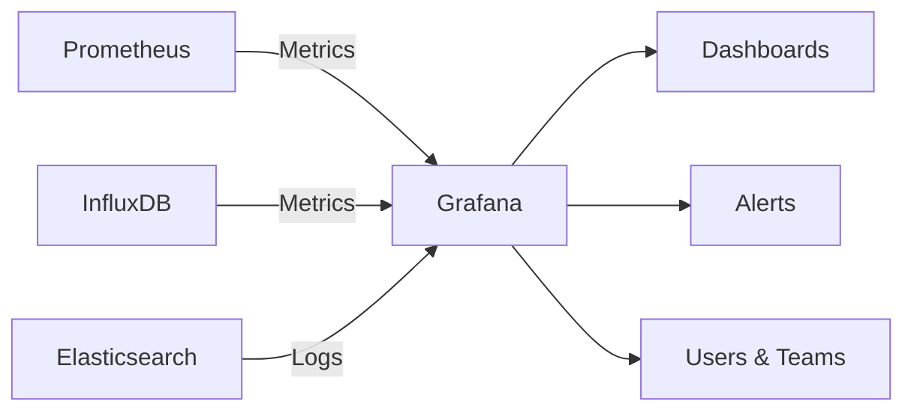

# How to Set Up Grafana for Dashboard Visualization on RHEL

Author: [nawazdhandala](https://www.github.com/nawazdhandala)

Tags: RHEL, Grafana, Monitoring, Dashboard, Visualization, Linux

Description: Learn how to install and configure Grafana on RHEL to create monitoring dashboards that visualize metrics from Prometheus and other data sources.

---

Grafana is the standard open-source platform for building monitoring dashboards. It connects to data sources like Prometheus, InfluxDB, and Elasticsearch, and lets you create rich visualizations with graphs, tables, heatmaps, and alerts. On RHEL, you can install Grafana from the official repository and have it running in minutes.

## Architecture



## Step 1: Add the Grafana Repository

```bash
# Create the Grafana repository file
sudo vi /etc/yum.repos.d/grafana.repo
```

```ini
[grafana]
name=grafana
baseurl=https://rpm.grafana.com
repo_gpgcheck=1
enabled=1
gpgcheck=1
gpgkey=https://rpm.grafana.com/gpg.key
sslverify=1
sslcacert=/etc/pki/tls/certs/ca-bundle.crt
```

## Step 2: Install Grafana

```bash
# Install Grafana
sudo dnf install grafana -y

# Verify the installation
grafana-server -v
```

## Step 3: Start and Enable Grafana

```bash
# Start Grafana
sudo systemctl start grafana-server

# Enable it to start on boot
sudo systemctl enable grafana-server

# Check the status
sudo systemctl status grafana-server
```

## Step 4: Configure the Firewall

```bash
# Allow access to the Grafana web UI (default port 3000)
sudo firewall-cmd --permanent --add-port=3000/tcp
sudo firewall-cmd --reload
```

## Step 5: Access Grafana

Open your browser and go to:

```bash
http://your-server-ip:3000
```

The default credentials are:
- Username: `admin`
- Password: `admin`

You will be prompted to change the password on first login.

## Step 6: Configure Grafana

Edit the main configuration file for customization:

```bash
sudo vi /etc/grafana/grafana.ini
```

Key settings to consider:

```ini
[server]
# The HTTP port Grafana listens on
http_port = 3000

# The public-facing domain name
domain = grafana.example.com

# Root URL (important if behind a reverse proxy)
root_url = %(protocol)s://%(domain)s:%(http_port)s/

[security]
# Secret key for signing cookies and tokens
secret_key = your-secret-key-here

# Disable user sign-up
allow_sign_up = false

# Disable anonymous access
[auth.anonymous]
enabled = false

[smtp]
# Enable email notifications
enabled = true
host = smtp.example.com:587
user = grafana@example.com
password = your-smtp-password
from_address = grafana@example.com
from_name = Grafana Alerts
```

Restart Grafana after changes:

```bash
sudo systemctl restart grafana-server
```

## Step 7: Add Prometheus as a Data Source

### Via the Web UI

1. Go to **Configuration** (gear icon) then **Data Sources**
2. Click **Add data source**
3. Select **Prometheus**
4. Set the URL to `http://localhost:9090` (or your Prometheus server address)
5. Click **Save & Test**

### Via Provisioning (Automated)

Create a provisioning file for automatic data source setup:

```bash
sudo vi /etc/grafana/provisioning/datasources/prometheus.yml
```

```yaml
apiVersion: 1

datasources:
  - name: Prometheus
    type: prometheus
    access: proxy
    url: http://localhost:9090
    isDefault: true
    editable: true
    jsonData:
      timeInterval: "15s"
      httpMethod: POST
```

```bash
# Restart Grafana to pick up the provisioned data source
sudo systemctl restart grafana-server
```

## Step 8: Import a Dashboard

Grafana has a library of community dashboards. The most popular for system monitoring is the Node Exporter Full dashboard.

### Via the Web UI

1. Go to **Dashboards** then **Import**
2. Enter the dashboard ID: `1860` (Node Exporter Full)
3. Click **Load**
4. Select your Prometheus data source
5. Click **Import**

### Via Provisioning

```bash
# Create a directory for provisioned dashboards
sudo mkdir -p /var/lib/grafana/dashboards

# Create a dashboard provisioning configuration
sudo vi /etc/grafana/provisioning/dashboards/default.yml
```

```yaml
apiVersion: 1

providers:
  - name: "Default"
    orgId: 1
    folder: ""
    type: file
    disableDeletion: false
    updateIntervalSeconds: 30
    options:
      path: /var/lib/grafana/dashboards
      foldersFromFilesStructure: false
```

## Step 9: Create a Custom Dashboard

Here is a simple dashboard JSON you can import or save to the provisioning directory:

```bash
sudo vi /var/lib/grafana/dashboards/system-overview.json
```

```json
{
  "dashboard": {
    "title": "System Overview",
    "panels": [
      {
        "title": "CPU Usage",
        "type": "timeseries",
        "gridPos": {"h": 8, "w": 12, "x": 0, "y": 0},
        "targets": [
          {
            "expr": "100 - (avg by(instance) (rate(node_cpu_seconds_total{mode=\"idle\"}[5m])) * 100)",
            "legendFormat": "{{instance}}"
          }
        ]
      },
      {
        "title": "Memory Usage",
        "type": "timeseries",
        "gridPos": {"h": 8, "w": 12, "x": 12, "y": 0},
        "targets": [
          {
            "expr": "(1 - node_memory_MemAvailable_bytes / node_memory_MemTotal_bytes) * 100",
            "legendFormat": "{{instance}}"
          }
        ]
      },
      {
        "title": "Disk Usage",
        "type": "gauge",
        "gridPos": {"h": 8, "w": 12, "x": 0, "y": 8},
        "targets": [
          {
            "expr": "(1 - node_filesystem_avail_bytes{mountpoint=\"/\"} / node_filesystem_size_bytes{mountpoint=\"/\"}) * 100",
            "legendFormat": "{{instance}}"
          }
        ]
      },
      {
        "title": "Network Traffic",
        "type": "timeseries",
        "gridPos": {"h": 8, "w": 12, "x": 12, "y": 8},
        "targets": [
          {
            "expr": "rate(node_network_receive_bytes_total{device!=\"lo\"}[5m]) * 8",
            "legendFormat": "{{instance}} - {{device}} RX"
          },
          {
            "expr": "rate(node_network_transmit_bytes_total{device!=\"lo\"}[5m]) * 8",
            "legendFormat": "{{instance}} - {{device}} TX"
          }
        ]
      }
    ],
    "time": {"from": "now-1h", "to": "now"},
    "refresh": "30s"
  }
}
```

## Setting Up Grafana Behind a Reverse Proxy

If you want to access Grafana through Nginx:

```bash
# Install Nginx
sudo dnf install nginx -y

# Create a virtual host configuration
sudo vi /etc/nginx/conf.d/grafana.conf
```

```nginx
server {
    listen 80;
    server_name grafana.example.com;

    location / {
        proxy_pass http://localhost:3000;
        proxy_set_header Host $host;
        proxy_set_header X-Real-IP $remote_addr;
        proxy_set_header X-Forwarded-For $proxy_add_x_forwarded_for;
        proxy_set_header X-Forwarded-Proto $scheme;
    }

    # WebSocket support for live updates
    location /api/live/ {
        proxy_pass http://localhost:3000;
        proxy_http_version 1.1;
        proxy_set_header Upgrade $http_upgrade;
        proxy_set_header Connection "upgrade";
        proxy_set_header Host $host;
    }
}
```

```bash
# Start Nginx
sudo systemctl enable --now nginx

# Allow HTTP through the firewall
sudo firewall-cmd --permanent --add-service=http
sudo firewall-cmd --reload
```

## Troubleshooting

```bash
# Check Grafana logs
sudo journalctl -u grafana-server --no-pager -n 50

# Check Grafana log file
sudo tail -50 /var/log/grafana/grafana.log

# Verify Grafana is listening
sudo ss -tlnp | grep 3000

# Reset admin password
sudo grafana-cli admin reset-admin-password newpassword

# Check data source connectivity
curl -s http://localhost:9090/api/v1/query?query=up
```

## Summary

Grafana on RHEL gives you powerful dashboard visualization for your monitoring data. Install it from the official repository, add Prometheus (or any other supported data source), and either import community dashboards or build your own. For production deployments, configure SMTP for alert notifications, use provisioning for automated setup, and put Grafana behind a reverse proxy with TLS.
