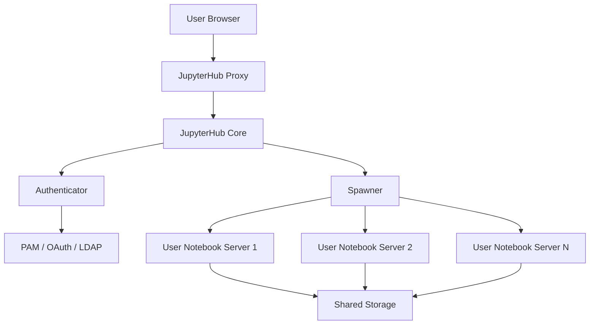

# How to Set Up JupyterHub Multi-User Notebook Server on RHEL

Author: [nawazdhandala](https://www.github.com/nawazdhandala)

Tags: RHEL, JupyterHub, Jupyter, Data Science, Python, Linux

Description: Set up JupyterHub on RHEL to provide multi-user Jupyter notebook environments for teams of data scientists and developers.

---

JupyterHub lets you serve Jupyter notebooks to multiple users from a single server. Instead of each person running their own notebook instance, JupyterHub manages user authentication, spawns individual notebook servers, and handles resource allocation. This guide covers installing and configuring JupyterHub on RHEL.

## Prerequisites

- RHEL with at least 4 GB RAM and 2 CPU cores
- Python 3.9 or later installed
- Root or sudo access
- A domain name (optional, for SSL)

## Architecture Overview


```mermaid
graph TD
    A[User Browser] --> B[JupyterHub Proxy]
    B --> C[JupyterHub Core]
    C --> D[Authenticator]
    C --> E[Spawner]
    D --> F[PAM / OAuth / LDAP]
    E --> G[User Notebook Server 1]
    E --> H[User Notebook Server 2]
    E --> I[User Notebook Server N]
    G --> J[Shared Storage]
    H --> J
    I --> J
```

## Step 1: Install Python and Node.js

JupyterHub requires both Python and Node.js.

```bash
# Install Python 3.9+ and development libraries

sudo dnf install -y python3 python3-pip python3-devel

# Install Node.js (required for the configurable HTTP proxy)
sudo dnf module install -y nodejs:18

# Verify installations
python3 --version
node --version
npm --version
```

## Step 2: Create a Virtual Environment

Isolate JupyterHub in a virtual environment to avoid conflicts with system packages.

```bash
# Create a dedicated directory for JupyterHub
sudo mkdir -p /opt/jupyterhub
sudo python3 -m venv /opt/jupyterhub/venv

# Activate the virtual environment
source /opt/jupyterhub/venv/bin/activate

# Upgrade pip inside the virtual environment
pip install --upgrade pip setuptools wheel
```

## Step 3: Install JupyterHub and Components

```bash
# Install JupyterHub and the HTTP proxy
pip install jupyterhub
npm install -g configurable-http-proxy

# Install JupyterLab as the default notebook interface
pip install jupyterlab notebook

# Install the idle culler used later in the JupyterHub configuration
pip install jupyterhub-idle-culler

# Install common data science packages for all users
pip install numpy pandas matplotlib scikit-learn seaborn
```

## Step 4: Create the JupyterHub Configuration

Generate and customize the configuration file.

```bash
# Create a configuration directory
sudo mkdir -p /etc/jupyterhub
cd /etc/jupyterhub

# Generate a default configuration file
/opt/jupyterhub/venv/bin/jupyterhub --generate-config
```

Now edit the configuration file to match your needs.

```python
# /etc/jupyterhub/jupyterhub_config.py

# Basic JupyterHub settings
c.JupyterHub.ip = '0.0.0.0'        # Listen on all interfaces
c.JupyterHub.port = 8000             # Port for the hub
c.JupyterHub.bind_url = 'http://:8000'

# Use JupyterLab as the default interface
c.Spawner.default_url = '/lab'

# Set the data directory for JupyterHub runtime files
c.JupyterHub.data_files_path = '/opt/jupyterhub/share/jupyterhub'

# Cookie secret file
c.JupyterHub.cookie_secret_file = '/etc/jupyterhub/jupyterhub_cookie_secret'

# Use PAM authentication (system users)
c.JupyterHub.authenticator_class = 'jupyterhub.auth.PAMAuthenticator'

# Define an existing user who can manage the hub
c.Authenticator.admin_users = {'user1'}

# Allow only these system users to log in
c.Authenticator.allowed_users = {'user1', 'user2', 'user3'}

# Spawner settings - use the local process spawner
c.JupyterHub.spawner_class = 'jupyterhub.spawner.LocalProcessSpawner'

# Document desired resource limits per user
# LocalProcessSpawner does not enforce these limits; use a spawner with
# cgroup/container support, such as SystemdSpawner, DockerSpawner, or KubeSpawner.
c.Spawner.cpu_limit = 2
c.Spawner.mem_limit = '4G'

# Set the notebook directory for each user
c.Spawner.notebook_dir = '~/notebooks'

# Timeout settings
c.Spawner.start_timeout = 60         # Seconds to wait for spawner
c.JupyterHub.shutdown_on_logout = False
c.Spawner.http_timeout = 30

# Idle server culling (shut down inactive servers)
c.JupyterHub.services = [
    {
        'name': 'idle-culler',
        'command': [
            '/opt/jupyterhub/venv/bin/python3', '-m', 'jupyterhub_idle_culler',
            '--timeout=3600',         # Cull after 1 hour of inactivity
            '--max-age=0',            # No max age limit
            '--cull-every=300',       # Check every 5 minutes
        ],
    }
]
c.JupyterHub.load_roles = [
    {
        'name': 'idle-culler-role',
        'services': ['idle-culler'],
        'scopes': [
            'list:users',
            'read:users:activity',
            'admin:servers',
        ],
    }
]
```

## Step 5: Create System Users

JupyterHub with PAM authentication requires system users.

```bash
# Create users for JupyterHub
sudo useradd -m -s /bin/bash user1
sudo useradd -m -s /bin/bash user2
sudo useradd -m -s /bin/bash user3

# Set passwords for each user
sudo passwd user1
sudo passwd user2
sudo passwd user3

# Create notebook directories for each user
sudo -u user1 mkdir -p /home/user1/notebooks
sudo -u user2 mkdir -p /home/user2/notebooks
sudo -u user3 mkdir -p /home/user3/notebooks
```

## Step 6: Create a Systemd Service

Run JupyterHub as a system service so it starts on boot.

```ini
# /etc/systemd/system/jupyterhub.service
[Unit]
Description=JupyterHub Multi-User Notebook Server
After=network.target

[Service]
Type=simple
User=root
ExecStart=/opt/jupyterhub/venv/bin/jupyterhub \
    -f /etc/jupyterhub/jupyterhub_config.py
WorkingDirectory=/etc/jupyterhub
Restart=on-failure
RestartSec=10

# Environment variables
Environment="PATH=/opt/jupyterhub/venv/bin:/usr/local/bin:/usr/bin:/bin"
Environment="CONFIGPROXY_AUTH_TOKEN=replace-with-a-long-random-token"

[Install]
WantedBy=multi-user.target
```

```bash
# Reload systemd and start JupyterHub
sudo systemctl daemon-reload
sudo systemctl enable --now jupyterhub

# Check the service status
sudo systemctl status jupyterhub
```

## Step 7: Configure the Firewall

```bash
# Allow JupyterHub through the firewall
sudo firewall-cmd --permanent --add-port=8000/tcp
sudo firewall-cmd --reload
```

## Step 8: Set Up SSL with Nginx Reverse Proxy

For production, put JupyterHub behind Nginx with SSL.

```bash
# Install Nginx
sudo dnf install -y nginx

# Install Certbot from the official snap package
sudo dnf install -y https://dl.fedoraproject.org/pub/epel/epel-release-latest-9.noarch.rpm
sudo dnf install -y snapd
sudo systemctl enable --now snapd.socket
sudo ln -s /var/lib/snapd/snap /snap
sudo snap install --classic certbot
sudo ln -s /snap/bin/certbot /usr/local/bin/certbot

# Allow HTTP and HTTPS traffic through the firewall
sudo firewall-cmd --permanent --add-port={80/tcp,443/tcp}
sudo firewall-cmd --reload

# Obtain an SSL certificate before enabling the HTTPS server block below
sudo certbot certonly --standalone -d jupyter.example.com
```

```nginx
# /etc/nginx/conf.d/jupyterhub.conf
# Nginx reverse proxy configuration for JupyterHub

map $http_upgrade $connection_upgrade {
    default upgrade;
    ''      close;
}

upstream jupyterhub {
    server 127.0.0.1:8000;
}

server {
    listen 80;
    server_name jupyter.example.com;

    # Redirect all HTTP traffic to HTTPS
    return 301 https://$host$request_uri;
}

server {
    listen 443 ssl;
    server_name jupyter.example.com;

    ssl_certificate /etc/letsencrypt/live/jupyter.example.com/fullchain.pem;
    ssl_certificate_key /etc/letsencrypt/live/jupyter.example.com/privkey.pem;

    location / {
        proxy_pass http://jupyterhub;
        proxy_set_header Host $host;
        proxy_set_header X-Real-IP $remote_addr;
        proxy_set_header X-Forwarded-For $proxy_add_x_forwarded_for;
        proxy_set_header X-Forwarded-Proto $scheme;
        proxy_set_header X-Scheme $scheme;
        proxy_http_version 1.1;
        proxy_set_header Upgrade $http_upgrade;
        proxy_set_header Connection $connection_upgrade;
        proxy_buffering off;
    }
}
```

```bash
# Allow Nginx to proxy traffic to JupyterHub on SELinux-enabled systems
sudo dnf install -y policycoreutils-python-utils
sudo semanage port -a -t http_port_t -p tcp 8000
sudo setsebool -P httpd_can_network_relay 1
sudo setsebool -P httpd_can_network_connect 1
```

```bash
# Enable and start Nginx
sudo systemctl enable --now nginx

# Test automatic certificate renewal
sudo certbot renew --dry-run
```

## Step 9: Verify the Idle Culler

The idle culler shuts down notebook servers that are not in use, saving resources.

```bash
# Verify the idle culler package installed earlier
source /opt/jupyterhub/venv/bin/activate
python -m jupyterhub_idle_culler --help
```

## Troubleshooting

```bash
# Check JupyterHub logs
sudo journalctl -u jupyterhub -f

# Test the configuration file for syntax errors
/opt/jupyterhub/venv/bin/jupyterhub -f /etc/jupyterhub/jupyterhub_config.py --debug

# Verify that configurable-http-proxy is accessible
which configurable-http-proxy
```

## Conclusion

You now have JupyterHub running on RHEL, providing each user with their own Jupyter notebook environment. The setup includes PAM authentication, idle server culling, and an Nginx reverse proxy with SSL. For larger deployments, consider using SystemdSpawner, DockerSpawner, or KubeSpawner to provide enforceable resource limits, better isolation, and scalability.
