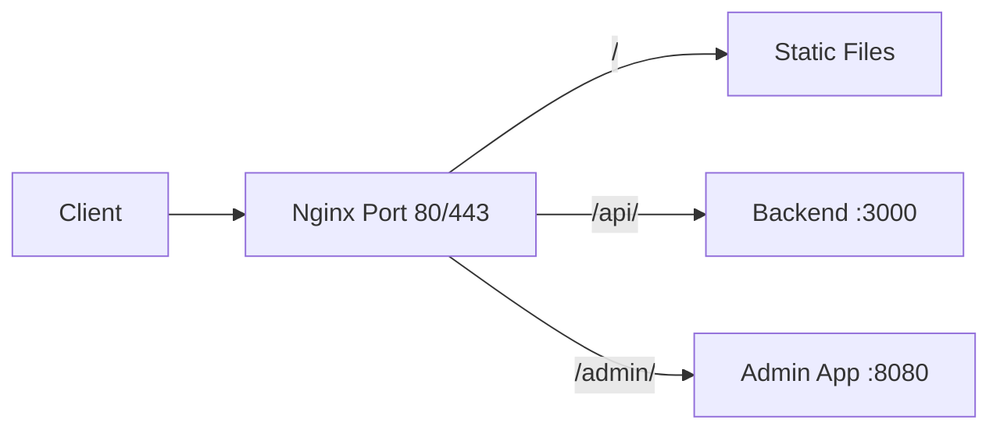

# How to Set Up Nginx as a Reverse Proxy on RHEL

Author: [nawazdhandala](https://www.github.com/nawazdhandala)

Tags: RHEL, Nginx, Reverse Proxy, Linux

Description: How to configure Nginx as a reverse proxy on RHEL to forward client requests to backend application servers.

---

## Why Use Nginx as a Reverse Proxy?

Nginx excels at handling thousands of simultaneous connections with minimal memory. Placing it in front of your application server lets you offload TLS termination, serve static files directly, and add caching or rate limiting without touching your application code.

## Prerequisites

- RHEL with Nginx installed
- A backend application running (e.g., on port 3000 or 8080)
- Root or sudo access

## Step 1 - Fix the SELinux Boolean

This is the step people always forget. SELinux blocks Nginx from making outgoing network connections by default:

```bash
# Allow Nginx to connect to backend servers
sudo setsebool -P httpd_can_network_connect 1
```

Skip this and you will get 502 Bad Gateway errors.

## Step 2 - Create the Reverse Proxy Configuration

```bash
# Create a reverse proxy server block
sudo tee /etc/nginx/conf.d/app-proxy.conf > /dev/null <<'EOF'
server {
    listen 80;
    server_name app.example.com;

    # Pass the original host header to the backend
    proxy_set_header Host $host;
    proxy_set_header X-Real-IP $remote_addr;
    proxy_set_header X-Forwarded-For $proxy_add_x_forwarded_for;
    proxy_set_header X-Forwarded-Proto $scheme;

    location / {
        # Forward all requests to the backend on port 3000
        proxy_pass http://127.0.0.1:3000;
    }
}
EOF
```

## Step 3 - Proxy Only Specific Paths

You can serve static content from Nginx while proxying API calls:

```nginx
server {
    listen 80;
    server_name www.example.com;
    root /var/www/mysite;

    # Serve static files directly
    location / {
        try_files $uri $uri/ =404;
    }

    # Proxy API requests to the backend
    location /api/ {
        proxy_pass http://127.0.0.1:3000;
        proxy_set_header Host $host;
        proxy_set_header X-Real-IP $remote_addr;
        proxy_set_header X-Forwarded-For $proxy_add_x_forwarded_for;
    }
}
```

## Step 4 - Configure Proxy Timeouts

Adjust timeouts for slower backends:

```nginx
location / {
    proxy_pass http://127.0.0.1:3000;

    # Timeout waiting for the backend to connect
    proxy_connect_timeout 60s;

    # Timeout waiting for the backend to send data
    proxy_read_timeout 120s;

    # Timeout for sending data to the backend
    proxy_send_timeout 60s;
}
```

## Step 5 - Buffer Configuration

Nginx buffers backend responses by default, which is usually what you want:

```nginx
location / {
    proxy_pass http://127.0.0.1:3000;

    # Enable response buffering
    proxy_buffering on;
    proxy_buffer_size 4k;
    proxy_buffers 8 16k;
    proxy_busy_buffers_size 32k;
}
```

For streaming responses (like server-sent events), disable buffering:

```nginx
location /events {
    proxy_pass http://127.0.0.1:3000;

    # Disable buffering for streaming
    proxy_buffering off;
}
```

## Step 6 - Proxy to Multiple Backends with Upstream

Define a named upstream group for load balancing:

```nginx
upstream myapp {
    server 127.0.0.1:3001;
    server 127.0.0.1:3002;
    server 127.0.0.1:3003;
}

server {
    listen 80;
    server_name app.example.com;

    location / {
        proxy_pass http://myapp;
        proxy_set_header Host $host;
        proxy_set_header X-Real-IP $remote_addr;
    }
}
```

## Reverse Proxy Architecture



## Step 7 - Add Health Checks

Nginx can detect failed backends passively:

```nginx
upstream myapp {
    server 127.0.0.1:3001 max_fails=3 fail_timeout=30s;
    server 127.0.0.1:3002 max_fails=3 fail_timeout=30s;
}
```

If a backend fails 3 times within 30 seconds, Nginx marks it as down and stops sending traffic to it for 30 seconds.

## Step 8 - Handle WebSocket Connections

If your backend uses WebSockets, add the upgrade headers:

```nginx
location /ws {
    proxy_pass http://127.0.0.1:3000;
    proxy_http_version 1.1;
    proxy_set_header Upgrade $http_upgrade;
    proxy_set_header Connection "upgrade";
    proxy_set_header Host $host;
}
```

## Step 9 - Test and Apply

```bash
# Test the configuration
sudo nginx -t

# Reload Nginx
sudo systemctl reload nginx
```

Verify with curl:

```bash
# Test the proxy
curl -I http://app.example.com
```

If you get a 502 error, check:

1. Is the backend running?
2. Is the SELinux boolean set?
3. Is the firewall allowing traffic on the backend port?

```bash
# Check the error log for details
sudo tail -20 /var/log/nginx/error.log
```

## Wrap-Up

Nginx as a reverse proxy is one of the most common production setups. The critical RHEL-specific step is the SELinux boolean, so set that first. After that, configure your proxy headers, tune your timeouts, and you are ready for production traffic. Use upstream blocks when you have multiple backends to get automatic failover.
