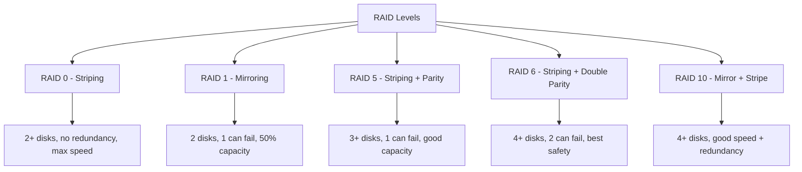

# How to Set Up RAID Storage Using the Cockpit Web Console on RHEL 9

Author: [nawazdhandala](https://www.github.com/nawazdhandala)

Tags: RHEL, Cockpit, RAID, Storage, Linux

Description: Learn how to create and manage software RAID arrays using the Cockpit web console on RHEL 9, covering RAID levels, monitoring, and disk replacement.

---

Software RAID on Linux using mdadm is a proven way to add redundancy and performance to your storage without a hardware RAID controller. Cockpit's storage page makes RAID creation visual, so you can see which disks go where and what level of redundancy you're getting.

## RAID Levels Overview

Before creating an array, understand your options:



| Level | Min Disks | Redundancy | Usable Capacity | Best For |
|-------|-----------|------------|-----------------|----------|
| RAID 0 | 2 | None | 100% | Temp data, speed |
| RAID 1 | 2 | 1 disk | 50% | Boot drives, OS |
| RAID 5 | 3 | 1 disk | (n-1)/n | General storage |
| RAID 6 | 4 | 2 disks | (n-2)/n | Critical data |
| RAID 10 | 4 | 1 per mirror | 50% | Databases |

## Prerequisites

You need at least two unused disks for RAID. Make sure the disks have no existing partitions or data you want to keep.

Install mdadm if not present:

```bash
# Install the RAID management tool
sudo dnf install mdadm -y
```

Identify available disks:

```bash
# List all block devices
lsblk

# Show disks without partitions
lsblk -d -o NAME,SIZE,TYPE,MOUNTPOINT
```

## Creating a RAID Array in Cockpit

Go to the Storage page and click "Create MDRAID device." You'll be asked to provide:

- **Name** - a label for the array
- **RAID level** - select from the dropdown
- **Chunk size** - the stripe size (usually 512K is fine)
- **Disks** - select the disks to include

For example, to create a RAID 1 mirror with two disks:

1. Select RAID Level: RAID 1
2. Check `/dev/sdb` and `/dev/sdc`
3. Click "Create"

Cockpit creates the array and shows it on the Storage page. You'll see it as `/dev/md/your-array-name` or `/dev/md0`.

## Creating the Array from CLI

The equivalent mdadm command for a RAID 1 mirror:

```bash
# Create a RAID 1 array with two disks
sudo mdadm --create /dev/md0 \
    --level=1 \
    --raid-devices=2 \
    /dev/sdb /dev/sdc

# Watch the sync progress
cat /proc/mdstat
```

For RAID 5 with three disks:

```bash
# Create a RAID 5 array
sudo mdadm --create /dev/md0 \
    --level=5 \
    --raid-devices=3 \
    /dev/sdb /dev/sdc /dev/sdd
```

## Formatting and Mounting the Array

After creating the RAID array, you need a filesystem on it. In Cockpit, click on the new RAID device, then click "Create partition table" (GPT), create a partition, and format it with XFS or ext4.

```bash
# Create a filesystem on the array
sudo mkfs.xfs /dev/md0

# Create a mount point
sudo mkdir -p /data

# Mount it
sudo mount /dev/md0 /data

# Add to fstab for persistence
# Use the UUID for reliability
UUID=$(sudo blkid -s UUID -o value /dev/md0)
echo "UUID=$UUID /data xfs defaults 0 0" | sudo tee -a /etc/fstab
```

## Saving the RAID Configuration

The mdadm configuration must be saved so the array is assembled correctly on boot:

```bash
# Save the current RAID configuration
sudo mdadm --detail --scan | sudo tee -a /etc/mdadm.conf

# Rebuild the initramfs to include the RAID config
sudo dracut --force
```

This is important. Without the configuration saved, the array might not assemble automatically after a reboot.

## Monitoring RAID Health

Cockpit's Storage page shows the RAID status, including whether the array is clean, degraded, or rebuilding. Click on the RAID device to see details.

From the CLI:

```bash
# Check the RAID status
cat /proc/mdstat

# Detailed information about a specific array
sudo mdadm --detail /dev/md0

# Check for degraded arrays
sudo mdadm --detail /dev/md0 | grep "State"
```

Set up email alerts for RAID events:

```bash
# Configure mdadm monitoring
sudo tee /etc/mdadm.conf << 'EOF'
MAILADDR root@localhost
PROGRAM /usr/sbin/mdadm
EOF

# Enable the monitoring daemon
sudo systemctl enable --now mdmonitor
```

## Adding a Spare Disk

A hot spare sits idle until a disk fails, then automatically takes over. In Cockpit, click on the RAID device and add a disk as a spare.

```bash
# Add a spare disk to an existing array
sudo mdadm --add /dev/md0 /dev/sde

# Verify it appears as a spare
sudo mdadm --detail /dev/md0
```

## Simulating a Disk Failure

It's worth testing your RAID setup to make sure recovery works. Only do this in a test environment.

```bash
# Mark a disk as failed
sudo mdadm --fail /dev/md0 /dev/sdc

# Check the array status - should show degraded
sudo mdadm --detail /dev/md0

# Remove the failed disk
sudo mdadm --remove /dev/md0 /dev/sdc
```

If you have a hot spare, rebuilding starts automatically. Check progress with:

```bash
cat /proc/mdstat
```

## Replacing a Failed Disk

In Cockpit, the RAID device page shows which disks are healthy and which have failed. To replace a failed disk:

1. Physically replace the drive (or identify the replacement)
2. In Cockpit, remove the failed disk from the array
3. Add the replacement disk

```bash
# Remove the failed disk (if not already removed)
sudo mdadm --remove /dev/md0 /dev/sdc

# Add the replacement disk
sudo mdadm --add /dev/md0 /dev/sdc

# Monitor rebuild progress
watch cat /proc/mdstat
```

Rebuild time depends on the array size and disk speed. During rebuilding, the array is operational but slower.

## Growing a RAID Array

You can add more disks to expand a RAID 5 or RAID 6 array:

```bash
# Add a new disk to a RAID 5 array
sudo mdadm --add /dev/md0 /dev/sde

# Grow the array to use the new disk
sudo mdadm --grow /dev/md0 --raid-devices=4

# After reshape completes, grow the filesystem
sudo xfs_growfs /data
```

## RAID Performance Considerations

Different RAID levels have different performance profiles:

```bash
# Check the current chunk size
sudo mdadm --detail /dev/md0 | grep "Chunk Size"

# Benchmark read speed
sudo hdparm -tT /dev/md0

# Test I/O performance
sudo dd if=/dev/zero of=/data/testfile bs=1G count=1 oflag=direct
sudo rm /data/testfile
```

For database workloads, RAID 10 typically gives the best performance. For sequential reads and writes (file servers), RAID 5 or RAID 6 works well.

## Wrapping Up

Cockpit simplifies RAID creation with a visual interface that shows you which disks are in which array and their current health. For creating arrays, formatting them, and monitoring status, the web console covers everything. The critical parts - saving the mdadm configuration and rebuilding the initramfs - should be verified from the command line to make sure boot-time assembly works correctly. Regular monitoring through Cockpit or the mdmonitor service ensures you catch failures before they become data loss.
