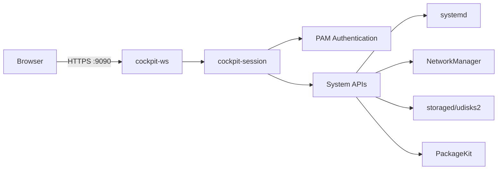

# How to Set Up the RHEL 9 Web Console (Cockpit) After a Fresh Installation

Author: [nawazdhandala](https://www.github.com/nawazdhandala)

Tags: RHEL, Cockpit, Web Console, System Administration, Linux

Description: A hands-on guide to installing and configuring the Cockpit web console on RHEL 9, covering installation, firewall rules, SSL certificates, and initial login.

---

Cockpit is one of those tools that seems too simple to be useful until you actually use it. It is a web-based management interface for Linux servers that lets you monitor system health, manage storage, inspect logs, control services, and do basic networking configuration from a browser. Red Hat ships it with RHEL 9, and on some installation profiles it is already installed. Here is how to get it running from scratch after a fresh install.

## What Cockpit Gives You

Before diving into the setup, here is what you get out of the box:

- Real-time system performance monitoring (CPU, memory, disk, network)
- Service management (start, stop, enable, disable)
- Log viewer with filtering
- Storage management (disks, partitions, LVM, RAID)
- Network configuration
- User account management
- Terminal access right in the browser
- Software update management
- SELinux troubleshooting

You can also install additional modules for managing containers (Podman), virtual machines (KVM), and more. It is lightweight, does not run a separate web server (it uses its own systemd socket-activated service), and integrates with your existing system authentication.

## Installing Cockpit

On a minimal RHEL 9 installation, Cockpit is not installed by default. Let's fix that.

```bash
# Install the cockpit package and common modules
sudo dnf install -y cockpit cockpit-storaged cockpit-networkmanager cockpit-packagekit
```

Here is what each package provides:

- `cockpit` - Core web console and system overview
- `cockpit-storaged` - Disk and storage management UI
- `cockpit-networkmanager` - Network configuration UI
- `cockpit-packagekit` - Software update management UI

If you want the full set of modules available in the RHEL repos:

```bash
# See all available cockpit packages
dnf search cockpit
```

Some useful optional modules:

```bash
# For managing Podman containers
sudo dnf install -y cockpit-podman

# For managing KVM virtual machines
sudo dnf install -y cockpit-machines
```

## Enabling the Cockpit Service

Cockpit uses socket activation, meaning it does not run a persistent web server. The service starts on demand when someone connects to port 9090.

```bash
# Enable and start the cockpit socket
sudo systemctl enable --now cockpit.socket

# Verify it is listening
sudo systemctl status cockpit.socket
```

You should see the socket is active and listening. The actual `cockpit.service` will start when the first connection comes in.

```bash
# Confirm port 9090 is listening
ss -tlnp | grep 9090
```

## Configuring the Firewall

Cockpit listens on TCP port 9090. You need to open this in the firewall.

```bash
# Add the cockpit service to firewalld
sudo firewall-cmd --permanent --add-service=cockpit

# Reload the firewall
sudo firewall-cmd --reload

# Verify the rule is in place
sudo firewall-cmd --list-services
```

The `cockpit` service definition in firewalld already maps to port 9090, so you do not need to specify the port number manually.

## First Login

Open a browser and navigate to:

```
https://your-server-ip:9090
```

You will see a certificate warning because Cockpit uses a self-signed certificate by default. Accept the warning for now (we will fix this in the next section).

Log in with your regular system credentials. Any user who is a member of the `wheel` group can log in and perform administrative tasks. Non-wheel users can log in but will have limited access.

### The "Reuse my password for privileged tasks" Option

On the login screen, there is a checkbox labeled "Reuse my password for privileged tasks." When enabled, Cockpit will use your login password for `sudo` operations. If you leave it unchecked, you will need to enter your password separately for each administrative action.

For day-to-day admin work, I usually check this box. For shared accounts, leave it unchecked.

## Configuring SSL/TLS Certificates

The self-signed certificate works for testing, but for production use you should install a proper certificate.

### Using a Certificate from a Certificate Authority

Cockpit looks for certificate files in `/etc/cockpit/ws-certs.d/`. The file must have a `.cert` extension and contain both the certificate and the private key in PEM format, or you can split them.

```bash
# Create the directory if it doesn't exist
sudo mkdir -p /etc/cockpit/ws-certs.d

# Combine your certificate and key into a single file
# The cert file must come first, then the key
sudo cat /path/to/your-cert.pem /path/to/your-key.pem > /tmp/cockpit-combined.cert
sudo mv /tmp/cockpit-combined.cert /etc/cockpit/ws-certs.d/50-custom.cert

# Set proper permissions (key material must be protected)
sudo chmod 640 /etc/cockpit/ws-certs.d/50-custom.cert
sudo chown root:cockpit-ws /etc/cockpit/ws-certs.d/50-custom.cert

# Restart cockpit to pick up the new certificate
sudo systemctl restart cockpit
```

Cockpit loads certificate files in alphabetical order and uses the last one it successfully parses. The `50-` prefix ensures your certificate takes priority over the default `0-self-signed.cert`.

### Using Let's Encrypt with Certbot

If your server has a public DNS name, you can use Let's Encrypt:

```bash
# Install certbot
sudo dnf install -y certbot

# Get a certificate (standalone mode, temporarily uses port 80)
sudo certbot certonly --standalone -d cockpit.example.com

# Create a deploy hook to copy certs to Cockpit's directory
sudo tee /etc/letsencrypt/renewal-hooks/deploy/cockpit.sh << 'SCRIPT'
#!/bin/bash
cat /etc/letsencrypt/live/cockpit.example.com/fullchain.pem \
    /etc/letsencrypt/live/cockpit.example.com/privkey.pem \
    > /etc/cockpit/ws-certs.d/50-letsencrypt.cert
chmod 640 /etc/cockpit/ws-certs.d/50-letsencrypt.cert
chown root:cockpit-ws /etc/cockpit/ws-certs.d/50-letsencrypt.cert
systemctl restart cockpit
SCRIPT

# Make the hook executable
sudo chmod +x /etc/letsencrypt/renewal-hooks/deploy/cockpit.sh

# Run the hook manually for the first time
sudo /etc/letsencrypt/renewal-hooks/deploy/cockpit.sh
```

## Customizing Cockpit Configuration

Cockpit's main configuration file is `/etc/cockpit/cockpit.conf`. Create it if it does not exist.

```bash
# Create a custom Cockpit configuration
sudo tee /etc/cockpit/cockpit.conf << 'EOF'
[WebService]
# Set the page title shown in the browser tab
Origins = https://cockpit.example.com:9090
LoginTitle = My Server Console
MaxStartups = 10

[Session]
# Session idle timeout in minutes
IdleTimeout = 30
EOF

# Restart cockpit to apply
sudo systemctl restart cockpit
```

### Changing the Listening Port

If you want Cockpit on a different port (say 443 for convenience), create a systemd override:

```bash
# Create an override for the cockpit socket
sudo systemctl edit cockpit.socket
```

This opens an editor. Add:

```ini
[Socket]
ListenStream=
ListenStream=443
```

The first empty `ListenStream=` clears the default, and the second sets the new port.

```bash
# Reload and restart
sudo systemctl daemon-reload
sudo systemctl restart cockpit.socket

# Update the firewall
sudo firewall-cmd --permanent --remove-service=cockpit
sudo firewall-cmd --permanent --add-port=443/tcp
sudo firewall-cmd --reload
```

Note: if you are also running a web server on port 443, this will conflict. Only do this if Cockpit is the sole service on that port.

## Architecture Overview



Cockpit's architecture is straightforward. The `cockpit-ws` process handles the HTTPS connection. It spawns `cockpit-session` for each authenticated user, which communicates with the system through standard Linux APIs and D-Bus interfaces. There is no database, no separate user management, and no agent to install.

## Managing Multiple Servers

One of Cockpit's underrated features is its ability to manage multiple servers from a single dashboard. You can add remote servers in the web interface, and Cockpit will connect to them via SSH.

On the remote servers, you just need Cockpit installed and the socket enabled. The primary server handles the web interface.

```bash
# On each remote server, install and enable cockpit
sudo dnf install -y cockpit
sudo systemctl enable --now cockpit.socket
sudo firewall-cmd --permanent --add-service=cockpit
sudo firewall-cmd --reload
```

Then in the Cockpit web interface on your primary server, click the host selector in the top-left and add the remote server's hostname or IP.

## Troubleshooting

### Cannot Connect to Port 9090

```bash
# Check if the socket is active
sudo systemctl status cockpit.socket

# Check if the firewall allows it
sudo firewall-cmd --list-services | grep cockpit

# Check if something else is using port 9090
ss -tlnp | grep 9090
```

### Login Fails

```bash
# Check PAM configuration
ls -la /etc/pam.d/cockpit

# Check authentication logs
sudo journalctl -u cockpit -f
```

### Certificate Errors After Installing Custom Cert

```bash
# List certificates Cockpit sees
sudo remotectl certificate

# Check file permissions
ls -la /etc/cockpit/ws-certs.d/
```

## Final Notes

Cockpit is not a replacement for the command line, and it is not trying to be. It is a quick way to check system health, manage routine tasks, and give less-experienced team members a safe way to interact with servers. The built-in terminal means you can always drop to a shell when the GUI does not cover what you need. For RHEL 9 servers, it is worth the five minutes to install and enable.
