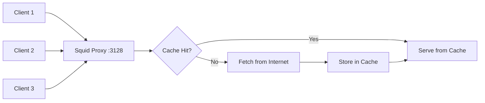

# How to Set Up Squid as a Caching Proxy on RHEL 9

Author: [nawazdhandala](https://www.github.com/nawazdhandala)

Tags: RHEL, Squid, Caching Proxy, Linux

Description: Learn how to install and configure Squid as a forward caching proxy server on RHEL 9 to speed up web access and reduce bandwidth usage.

---

## Why Use a Caching Proxy?

If you run a network with dozens or hundreds of machines all hitting the same websites and repositories, you are burning bandwidth for no good reason. A caching proxy sits between your clients and the internet, storing frequently requested content locally so subsequent requests get served from cache instead of fetching everything fresh each time.

Squid has been the go-to caching proxy for Linux environments for over two decades. It handles HTTP, HTTPS, and FTP traffic, supports access control lists, and its cache management is battle-tested. On RHEL 9, setting it up is straightforward.

## Prerequisites

- A RHEL 9 system with root or sudo access
- A valid Red Hat subscription or configured repositories
- Firewall access to allow proxy traffic (default port 3128)

## Installing Squid

Install the squid package from the default RHEL repositories:

```bash
# Install squid
sudo dnf install -y squid
```

Verify the installation:

```bash
# Check the installed version
squid -v | head -2
```

## Understanding the Configuration File

The main configuration file lives at `/etc/squid/squid.conf`. Before making changes, back it up:

```bash
# Back up the default configuration
sudo cp /etc/squid/squid.conf /etc/squid/squid.conf.bak
```

The default config is heavily commented and works out of the box for basic local network proxying. Here are the key directives you will want to customize.

## Configuring Squid for Caching

Edit the main configuration file:

```bash
sudo vi /etc/squid/squid.conf
```

### Define Your Local Network

Add your network range so internal clients can use the proxy:

```
# Define the local network ACL
acl localnet src 10.0.0.0/8
acl localnet src 172.16.0.0/12
acl localnet src 192.168.0.0/16

# Allow local network access
http_access allow localnet
```

### Set Up Cache Storage

Configure the disk cache directory. The `ufs` storage type is reliable for most setups:

```
# Cache directory: type, path, size in MB, L1 dirs, L2 dirs
cache_dir ufs /var/spool/squid 10000 16 256
```

This gives you a 10 GB disk cache. Adjust the size based on your available disk space.

### Configure Memory Cache

Set the memory cache for frequently accessed objects:

```
# Maximum memory used for caching (default is 256 MB)
cache_mem 512 MB

# Maximum size of individual objects stored in memory
maximum_object_size_in_memory 2 MB

# Maximum size of objects stored on disk
maximum_object_size 512 MB
```

### Set the Proxy Port and Hostname

```
# Listen on port 3128 (default)
http_port 3128

# Set a visible hostname for error pages
visible_hostname proxy.example.com
```

### Configure Cache Refresh Patterns

These rules determine when cached content is considered stale:

```
# Refresh patterns: regex, min-age (minutes), percentage, max-age (minutes)
refresh_pattern ^ftp:           1440    20%     10080
refresh_pattern -i (/cgi-bin/|\?) 0     0%      0
refresh_pattern .               0       20%     4320
```

### Enable Access Logging

```
# Access log location
access_log /var/log/squid/access.log squid

# Cache log for debugging
cache_log /var/log/squid/cache.log
```

## Initializing the Cache and Starting Squid

Before starting Squid for the first time, initialize the cache directories:

```bash
# Create swap directories for the cache
sudo squid -z
```

Start and enable the service:

```bash
# Start squid and enable it on boot
sudo systemctl enable --now squid
```

Check that it is running:

```bash
# Verify squid status
sudo systemctl status squid
```

## Configuring the Firewall

Open the Squid port in firewalld:

```bash
# Allow squid traffic through the firewall
sudo firewall-cmd --permanent --add-service=squid
sudo firewall-cmd --reload
```

If you are using a non-standard port, add it manually:

```bash
# Allow a custom port (e.g., 8080)
sudo firewall-cmd --permanent --add-port=8080/tcp
sudo firewall-cmd --reload
```

## Configuring Clients

### Linux Clients

Set the proxy environment variables:

```bash
# Set proxy for the current session
export http_proxy="http://proxy.example.com:3128"
export https_proxy="http://proxy.example.com:3128"
export no_proxy="localhost,127.0.0.1,.example.com"
```

To make these persistent, add them to `/etc/environment` or `/etc/profile.d/proxy.sh`.

### DNF/YUM Proxy Configuration

For RHEL clients to use the proxy for package management:

```bash
# Add to /etc/dnf/dnf.conf
proxy=http://proxy.example.com:3128
```

## Access Control Examples

Squid ACLs give you fine-grained control over who can access what.

### Block Specific Domains

```
# Define blocked sites
acl blocked_sites dstdomain .facebook.com .twitter.com .youtube.com

# Deny access to blocked sites
http_access deny blocked_sites
```

### Time-Based Access

```
# Allow full access only during business hours
acl business_hours time MTWHF 08:00-18:00
http_access allow localnet business_hours
```

### Restrict by Content Type

```
# Block large file downloads
acl large_downloads rep_mime_type -i video/
http_access deny large_downloads
```

## Monitoring Cache Performance

Check cache hit rates with the built-in cache manager:

```bash
# View cache statistics
sudo squidclient -h 127.0.0.1 -p 3128 mgr:info
```

Check how effectively the cache is being used:

```bash
# View cache utilization
sudo squidclient -h 127.0.0.1 -p 3128 mgr:utilization
```

Monitor real-time access logs:

```bash
# Watch access logs in real time
sudo tail -f /var/log/squid/access.log
```

## Architecture Overview



## SELinux Considerations

If SELinux is enforcing, Squid should work out of the box with its default port and directories. If you change the cache directory, update the SELinux context:

```bash
# Set the correct SELinux context for a custom cache directory
sudo semanage fcontext -a -t squid_cache_t "/data/squid_cache(/.*)?"
sudo restorecon -Rv /data/squid_cache
```

If you change the port, update the SELinux port type:

```bash
# Allow Squid to listen on port 8080
sudo semanage port -a -t squid_port_t -p tcp 8080
```

## Tuning for Performance

For high-traffic environments, consider these tweaks:

```
# Increase the number of file descriptors
max_filedescriptors 65535

# Adjust the number of helper processes
dns_children 32 startup=10 idle=5

# Set a realistic connection timeout
connect_timeout 30 seconds
read_timeout 3 minutes
```

Also increase the system file descriptor limit in `/etc/security/limits.conf`:

```
squid soft nofile 65535
squid hard nofile 65535
```

## Troubleshooting Common Issues

**Squid fails to start after config changes:**

```bash
# Parse and validate the configuration file
sudo squid -k parse
```

**Cache is not storing objects:**

Check the cache directory permissions:

```bash
# Ensure squid owns the cache directory
sudo chown -R squid:squid /var/spool/squid
```

**Clients cannot connect:**

Verify the firewall and that Squid is listening:

```bash
# Check if squid is listening on the expected port
sudo ss -tlnp | grep squid
```

## Wrapping Up

Squid is a solid, proven caching proxy that can significantly reduce bandwidth usage and improve response times on your network. The configuration is flexible enough to handle simple caching setups and complex access control scenarios. Start with a basic configuration, monitor the cache hit rates, and tune from there based on your traffic patterns.
