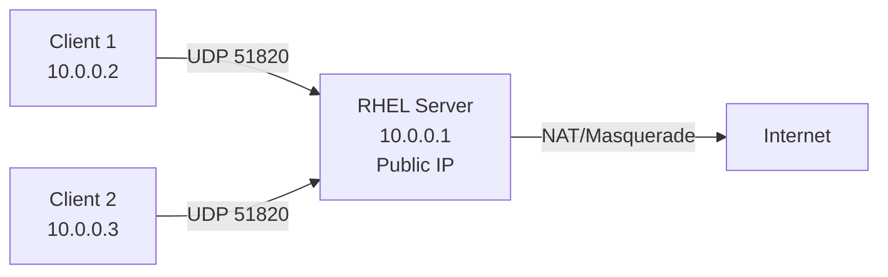

# How to Set Up a WireGuard VPN Server on RHEL

Author: [nawazdhandala](https://www.github.com/nawazdhandala)

Tags: RHEL, WireGuard, VPN, Server, Linux

Description: A complete walkthrough for setting up a WireGuard VPN server on RHEL, from installation and key generation to peer configuration, firewall rules, and persistent connections.

---

WireGuard has become the go-to VPN for Linux. It's fast, the codebase is small enough to actually audit, and the configuration is refreshingly simple compared to IPsec or OpenVPN. On RHEL, WireGuard is supported in the kernel, so there's no need for DKMS or third-party kernel modules.

## Prerequisites

- RHEL server with a public IP address (or at least reachable from your clients)
- Root or sudo access
- EPEL repository enabled (for WireGuard tools)
- A UDP port available for WireGuard (default is 51820)

## Installing WireGuard

WireGuard kernel support is built into the RHEL kernel. You just need the userspace tools.

```bash
# Enable EPEL if not already done
sudo dnf install -y epel-release

# Install WireGuard tools
sudo dnf install -y wireguard-tools
```

## Generating Server Keys

WireGuard uses Curve25519 key pairs. Generate them with proper permissions.

```bash
# Create the WireGuard config directory with restrictive permissions
sudo mkdir -p /etc/wireguard
sudo chmod 700 /etc/wireguard

# Generate the server private key
wg genkey | sudo tee /etc/wireguard/server_private.key
sudo chmod 600 /etc/wireguard/server_private.key

# Derive the public key from the private key
sudo cat /etc/wireguard/server_private.key | wg pubkey | sudo tee /etc/wireguard/server_public.key
```

## Creating the Server Configuration

```bash
# Read the private key (you'll need it for the config)
SERVER_PRIVKEY=$(sudo cat /etc/wireguard/server_private.key)

# Create the WireGuard interface configuration
sudo tee /etc/wireguard/wg0.conf > /dev/null << EOF
[Interface]
# Server's private key
PrivateKey = ${SERVER_PRIVKEY}

# VPN tunnel address for the server
Address = 10.0.0.1/24

# Port to listen on
ListenPort = 51820

# Enable IP forwarding and NAT when the interface comes up
PostUp = sysctl -w net.ipv4.ip_forward=1; firewall-cmd --add-masquerade; firewall-cmd --add-port=51820/udp
PostDown = firewall-cmd --remove-masquerade; firewall-cmd --remove-port=51820/udp
EOF

# Lock down the config file
sudo chmod 600 /etc/wireguard/wg0.conf
```

## Generating Client Keys

For each client that will connect, generate a key pair.

```bash
# Generate keys for the first client
wg genkey | tee /tmp/client1_private.key | wg pubkey > /tmp/client1_public.key

# Display the keys (you'll need these)
echo "Client private key: $(cat /tmp/client1_private.key)"
echo "Client public key: $(cat /tmp/client1_public.key)"
```

## Adding Peers to the Server

Each client needs a `[Peer]` section in the server config.

```bash
CLIENT1_PUBKEY=$(cat /tmp/client1_public.key)

# Add the peer to the server config
sudo tee -a /etc/wireguard/wg0.conf > /dev/null << EOF

[Peer]
# Client 1
PublicKey = ${CLIENT1_PUBKEY}

# IP address assigned to this client inside the tunnel
AllowedIPs = 10.0.0.2/32
EOF
```

## Starting WireGuard

```bash
# Bring up the WireGuard interface
sudo wg-quick up wg0

# Enable it to start on boot
sudo systemctl enable wg-quick@wg0

# Check the interface status
sudo wg show
```

You should see output showing the interface, listening port, and any configured peers.

## Firewall Configuration

If you didn't use PostUp/PostDown scripts, configure the firewall manually.

```bash
# Allow WireGuard UDP port
sudo firewall-cmd --permanent --add-port=51820/udp

# Enable masquerading for VPN traffic
sudo firewall-cmd --permanent --add-masquerade

# Reload firewall
sudo firewall-cmd --reload
```

## Enabling IP Forwarding Persistently

```bash
# Make IP forwarding persistent
echo "net.ipv4.ip_forward = 1" | sudo tee /etc/sysctl.d/99-wireguard.conf
sudo sysctl -p /etc/sysctl.d/99-wireguard.conf
```

## Creating the Client Configuration

Create this on the client machine (or generate it on the server and transfer securely).

```ini
[Interface]
# Client's private key
PrivateKey = CLIENT_PRIVATE_KEY_HERE

# Client's VPN address
Address = 10.0.0.2/24

# DNS server to use through the tunnel
DNS = 1.1.1.1

[Peer]
# Server's public key
PublicKey = SERVER_PUBLIC_KEY_HERE

# Server's public IP and WireGuard port
Endpoint = YOUR_SERVER_IP:51820

# Route all traffic through the VPN
AllowedIPs = 0.0.0.0/0

# Keep the connection alive behind NAT
PersistentKeepalive = 25
```

## Network Architecture



## Verifying the Connection

On the server:

```bash
# Show WireGuard status with peer info
sudo wg show

# Check for recent handshakes
sudo wg show wg0 latest-handshakes

# Verify the interface has traffic
ip -s link show wg0
```

On the client, after connecting:

```bash
# Ping the server's tunnel address
ping -c 4 10.0.0.1

# Verify your public IP has changed
curl ifconfig.me
```

## Managing Peers

```bash
# Add a new peer without restarting
sudo wg set wg0 peer NEW_CLIENT_PUBLIC_KEY allowed-ips 10.0.0.3/32

# Remove a peer
sudo wg set wg0 peer CLIENT_PUBLIC_KEY remove

# Save the running config back to the file
sudo wg-quick save wg0
```

## Troubleshooting

**No handshake happening:**

```bash
# Check that the port is open
ss -ulnp | grep 51820

# Check firewall
sudo firewall-cmd --list-ports

# Verify the server is listening
sudo wg show wg0
```

**Handshake succeeds but no traffic flows:**

```bash
# Check IP forwarding
sysctl net.ipv4.ip_forward

# Check masquerading
sudo firewall-cmd --query-masquerade

# Verify routing
ip route show
```

## Wrapping Up

WireGuard on RHEL gives you a fast, modern VPN with minimal configuration overhead. The server setup boils down to: install tools, generate keys, write a config file, open a port, enable forwarding. Each client is just a public key and an allowed IP. Keep your private keys secure, and you've got yourself a solid VPN.
