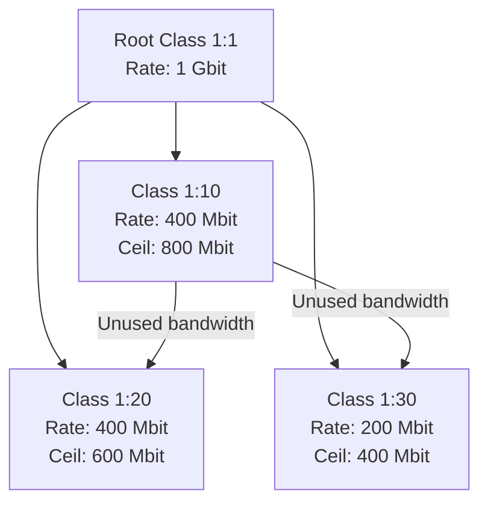
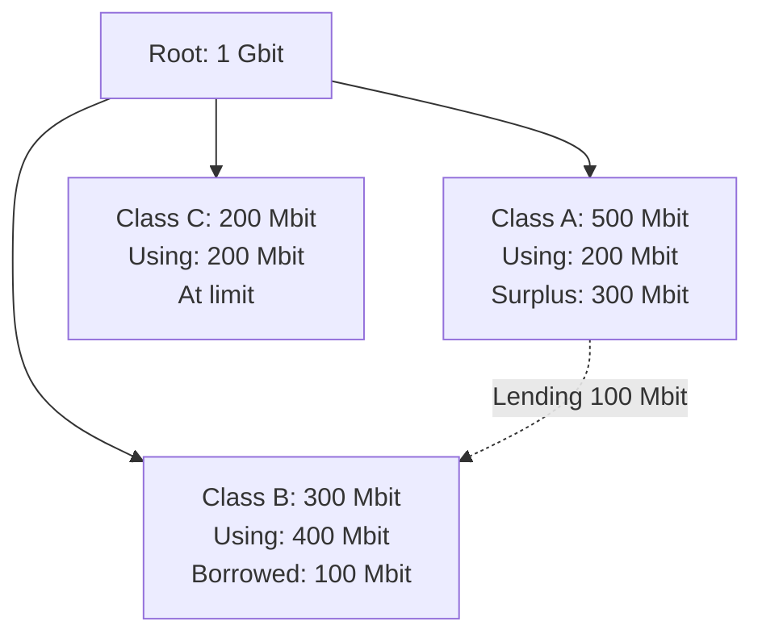

# How to Shape Outbound Traffic with tc htb on RHEL

Author: [nawazdhandala](https://www.github.com/nawazdhandala)

Tags: RHEL, tc htb, Traffic Shaping, Linux

Description: A detailed guide to using Hierarchical Token Bucket (HTB) with tc on RHEL for sophisticated outbound traffic shaping, covering class hierarchies, bandwidth borrowing, burst handling, and real-world configurations.

---

HTB (Hierarchical Token Bucket) is the most widely used classful qdisc in Linux traffic shaping. It lets you build a tree of bandwidth allocations where each class has a guaranteed minimum rate and can borrow unused bandwidth from siblings. On RHEL, it's the foundation for any serious QoS deployment.

## How HTB Works



Key concepts:
- **Rate** - Guaranteed bandwidth. Even under full congestion, this class gets at least this much.
- **Ceil** - Maximum bandwidth, including borrowed capacity from idle siblings.
- **Prio** - Priority for borrowing. Lower numbers get to borrow first.
- **Burst** - How much data can be sent at line rate before the rate limiter kicks in.

## Basic HTB Setup

```bash
# Step 1: Add the root HTB qdisc
# "default 30" means unmatched traffic goes to class 1:30
sudo tc qdisc add dev ens192 root handle 1: htb default 30

# Step 2: Root class - total available bandwidth
sudo tc class add dev ens192 parent 1: classid 1:1 htb rate 1gbit

# Step 3: Child classes
# Web traffic: guaranteed 400 Mbit, can burst to 800 Mbit
sudo tc class add dev ens192 parent 1:1 classid 1:10 htb rate 400mbit ceil 800mbit prio 1 burst 15k

# Database traffic: guaranteed 400 Mbit, limited to 600 Mbit max
sudo tc class add dev ens192 parent 1:1 classid 1:20 htb rate 400mbit ceil 600mbit prio 2 burst 15k

# Default: guaranteed 200 Mbit, can burst to 400 Mbit
sudo tc class add dev ens192 parent 1:1 classid 1:30 htb rate 200mbit ceil 400mbit prio 3 burst 15k
```

## Adding Leaf Qdiscs

Each leaf class needs its own qdisc to handle queueing within the class. fq_codel is the best choice.

```bash
# Fair queueing within each class
sudo tc qdisc add dev ens192 parent 1:10 handle 10: fq_codel
sudo tc qdisc add dev ens192 parent 1:20 handle 20: fq_codel
sudo tc qdisc add dev ens192 parent 1:30 handle 30: fq_codel
```

## Classifying Traffic

### By Destination Port

```bash
# HTTPS traffic (port 443) to web class
sudo tc filter add dev ens192 parent 1: protocol ip prio 1 u32 \
    match ip dport 443 0xffff flowid 1:10

# HTTP traffic (port 80) to web class
sudo tc filter add dev ens192 parent 1: protocol ip prio 1 u32 \
    match ip dport 80 0xffff flowid 1:10

# PostgreSQL (port 5432) to database class
sudo tc filter add dev ens192 parent 1: protocol ip prio 2 u32 \
    match ip dport 5432 0xffff flowid 1:20

# MySQL (port 3306) to database class
sudo tc filter add dev ens192 parent 1: protocol ip prio 2 u32 \
    match ip dport 3306 0xffff flowid 1:20
```

### By Source Port

```bash
# Traffic originating from our web server (source port 443)
sudo tc filter add dev ens192 parent 1: protocol ip prio 1 u32 \
    match ip sport 443 0xffff flowid 1:10
```

### By Destination IP

```bash
# All traffic to the database server
sudo tc filter add dev ens192 parent 1: protocol ip prio 2 u32 \
    match ip dst 192.168.1.50/32 flowid 1:20
```

### By Subnet

```bash
# Traffic to the entire backup subnet
sudo tc filter add dev ens192 parent 1: protocol ip prio 3 u32 \
    match ip dst 10.0.10.0/24 flowid 1:30
```

## Building a Hierarchy with Sub-Classes

HTB supports nested hierarchies. You can create sub-classes within a class.

```bash
# Root
sudo tc qdisc add dev ens192 root handle 1: htb default 99
sudo tc class add dev ens192 parent 1: classid 1:1 htb rate 1gbit

# Web class: 600 Mbit total
sudo tc class add dev ens192 parent 1:1 classid 1:10 htb rate 600mbit ceil 1gbit

# Sub-class: Production web - 400 Mbit from the web allocation
sudo tc class add dev ens192 parent 1:10 classid 1:11 htb rate 400mbit ceil 600mbit prio 1

# Sub-class: Staging web - 200 Mbit from the web allocation
sudo tc class add dev ens192 parent 1:10 classid 1:12 htb rate 200mbit ceil 400mbit prio 2

# Other traffic: 400 Mbit
sudo tc class add dev ens192 parent 1:1 classid 1:99 htb rate 400mbit ceil 1gbit

# Add leaf qdiscs
sudo tc qdisc add dev ens192 parent 1:11 fq_codel
sudo tc qdisc add dev ens192 parent 1:12 fq_codel
sudo tc qdisc add dev ens192 parent 1:99 fq_codel
```

## Understanding Bandwidth Borrowing



When Class A isn't using its full 500 Mbit allocation, Classes B and C can borrow the unused bandwidth, up to their `ceil` values. Priority determines who gets to borrow first.

## Monitoring HTB Performance

```bash
# Show class statistics
tc -s class show dev ens192

# Show detailed info including tokens
tc -s -d class show dev ens192

# Focus on a specific class
tc -s class show dev ens192 classid 1:10

# Watch in real time
watch -n 1 'tc -s class show dev ens192'
```

Key statistics to watch:
- **rate** - Current throughput
- **overlimits** - Times the class needed more than its rate (borrowed or waited)
- **lended/borrowed** - Bandwidth sharing activity
- **tokens** - Available burst tokens

## Calculating Burst Values

The `burst` parameter determines how much data can be sent at line rate before the rate limiter activates. Too small and you get throughput below the configured rate. The minimum recommended burst:

```bash
# Burst should be at least: rate / HZ
# HZ on RHEL is typically 1000
# For 400 Mbit rate: 400,000,000 / 8 / 1000 = 50,000 bytes = ~50KB

# Safe burst value for 400 Mbit
# burst 50k or higher
```

A good rule of thumb: start with `burst 15k` for rates under 100 Mbit, and `burst 64k` for higher rates.

## Complete Production Example

Here's a full HTB configuration for a web application server:

```bash
#!/bin/bash
# Production HTB QoS for a web application server
IFACE="ens192"

# Clean slate
tc qdisc del dev $IFACE root 2>/dev/null

# Root: 1 Gbit link, default traffic goes to class 40
tc qdisc add dev $IFACE root handle 1: htb default 40
tc class add dev $IFACE parent 1: classid 1:1 htb rate 1gbit burst 64k

# Critical services: SSH, DNS, monitoring
tc class add dev $IFACE parent 1:1 classid 1:10 htb rate 50mbit ceil 1gbit prio 0 burst 15k
tc qdisc add dev $IFACE parent 1:10 fq_codel
tc filter add dev $IFACE parent 1: protocol ip prio 1 u32 match ip dport 22 0xffff flowid 1:10
tc filter add dev $IFACE parent 1: protocol ip prio 1 u32 match ip sport 22 0xffff flowid 1:10
tc filter add dev $IFACE parent 1: protocol ip prio 1 u32 match ip dport 53 0xffff flowid 1:10

# Web traffic: HTTP/HTTPS
tc class add dev $IFACE parent 1:1 classid 1:20 htb rate 600mbit ceil 950mbit prio 1 burst 64k
tc qdisc add dev $IFACE parent 1:20 fq_codel
tc filter add dev $IFACE parent 1: protocol ip prio 2 u32 match ip sport 80 0xffff flowid 1:20
tc filter add dev $IFACE parent 1: protocol ip prio 2 u32 match ip sport 443 0xffff flowid 1:20

# Database replication
tc class add dev $IFACE parent 1:1 classid 1:30 htb rate 200mbit ceil 500mbit prio 2 burst 32k
tc qdisc add dev $IFACE parent 1:30 fq_codel
tc filter add dev $IFACE parent 1: protocol ip prio 3 u32 match ip dport 5432 0xffff flowid 1:30

# Default: everything else
tc class add dev $IFACE parent 1:1 classid 1:40 htb rate 150mbit ceil 400mbit prio 3 burst 15k
tc qdisc add dev $IFACE parent 1:40 fq_codel

echo "HTB QoS active on $IFACE"
```

## Troubleshooting HTB

**Traffic not being classified:**

```bash
# Check filter statistics
tc -s filter show dev ens192

# If a filter shows 0 packets, the match isn't working
# Verify with tcpdump that traffic actually matches
sudo tcpdump -i ens192 -nn dst port 443 -c 5
```

**Lower throughput than expected:**

```bash
# Check burst values - too small bursts limit throughput
tc -s -d class show dev ens192 | grep -A 5 "class htb"

# Look for "tokens" being consistently at 0
# Increase burst if needed
```

**Classes showing 0 bytes:**

```bash
# Traffic might be going to the default class instead
# Check what the default class is
tc qdisc show dev ens192 | grep default
```

## Wrapping Up

HTB on RHEL is the go-to solution for outbound traffic shaping when you need per-service bandwidth guarantees. The hierarchy lets you model your bandwidth allocation to match your priorities, and the borrowing mechanism ensures bandwidth isn't wasted when a class is idle. Combine it with fq_codel on the leaf classes, and you get both inter-class fairness and intra-class fairness. Start with a simple flat hierarchy, add complexity as needed, and always monitor with `tc -s class show` to verify traffic is being classified correctly.
