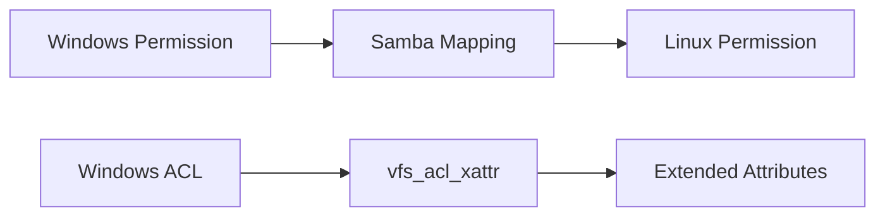

# How to Share Directories with Windows Clients Using Samba on RHEL

Author: [nawazdhandala](https://www.github.com/nawazdhandala)

Tags: RHEL, Samba, Windows, File Sharing, Linux

Description: Configure Samba on RHEL to share directories with Windows clients, covering share types, permissions mapping, and Windows-specific considerations.

---

## Sharing with Windows

Samba bridges the gap between Linux and Windows file systems. Windows clients access Samba shares just like any other network share using UNC paths (\\server\share). From the Windows side, it looks and feels native.

## Share Types

### Authenticated Share

Only users with valid Samba credentials can access:

```ini
[projects]
    path = /srv/samba/projects
    browseable = yes
    writable = yes
    valid users = @dev_team
    create mask = 0664
    directory mask = 0775
```

### Guest Share (Public)

No authentication required:

```ini
[public]
    path = /srv/samba/public
    browseable = yes
    writable = yes
    guest ok = yes
    create mask = 0666
    directory mask = 0777
```

### Read-Only Share

```ini
[docs]
    path = /srv/samba/docs
    browseable = yes
    writable = no
    guest ok = yes
```

## Setting Up Linux Permissions

Windows and Linux permission models are different. The Linux permissions on the shared directory must be broad enough for Samba to work:

```bash
# For an authenticated share with group access
sudo mkdir -p /srv/samba/projects
sudo groupadd dev_team
sudo chgrp dev_team /srv/samba/projects
sudo chmod 2775 /srv/samba/projects
```

The setgid bit (2) ensures new files inherit the group ownership.

## Permission Mapping

Samba maps Windows permissions to Linux permissions using masks:

```ini
[projects]
    path = /srv/samba/projects
    writable = yes
    create mask = 0664    # New files get rw-rw-r--
    directory mask = 0775  # New dirs get rwxrwxr-x
    force group = dev_team # All files owned by this group
```



## Connecting from Windows

### Map a Network Drive

1. Open File Explorer
2. Right-click "This PC" and select "Map network drive"
3. Enter `\\rhel-server\projects`
4. Check "Connect using different credentials" if needed
5. Enter `WORKGROUP\smbuser1` and the Samba password

### Using the Command Line

```cmd
REM Map a network drive from Windows CMD
net use Z: \\192.168.1.10\projects /user:smbuser1 password123

REM List current mappings
net use

REM Disconnect
net use Z: /delete
```

### Using PowerShell

```powershell
# Map drive with credentials
New-PSDrive -Name "Z" -PSProvider FileSystem -Root "\\192.168.1.10\projects" -Credential (Get-Credential)
```

## Handling Windows ACLs

For environments that need full Windows ACL support:

```ini
[projects]
    path = /srv/samba/projects
    writable = yes
    vfs objects = acl_xattr
    map acl inherit = yes
    store dos attributes = yes
```

This stores Windows ACLs as extended attributes on the Linux filesystem.

## Guest Access Configuration

For guest (anonymous) shares:

```ini
[global]
    map to guest = Bad User
    guest account = nobody

[public]
    path = /srv/samba/public
    guest ok = yes
    writable = yes
```

The `map to guest = Bad User` setting maps failed login attempts to the guest account, allowing anonymous access.

## SELinux for Samba Shares

```bash
# Set the Samba context on shared directories
sudo semanage fcontext -a -t samba_share_t "/srv/samba(/.*)?"
sudo restorecon -Rv /srv/samba

# Enable necessary booleans
sudo setsebool -P samba_export_all_rw on
```

## Hiding Files from Windows

You can hide Linux-specific files that confuse Windows users:

```ini
[projects]
    path = /srv/samba/projects
    veto files = /._*/.DS_Store/.Thumbs.db/
    delete veto files = yes
    hide dot files = yes
```

## Performance Settings for Windows Clients

```ini
[global]
    socket options = TCP_NODELAY IPTOS_LOWDELAY
    read raw = yes
    write raw = yes
    use sendfile = yes
    min receivefile size = 16384
    aio read size = 16384
    aio write size = 16384
```

## Troubleshooting Windows Connections

If Windows cannot connect:

```bash
# Check Samba is running
sudo systemctl status smb

# Check firewall
sudo firewall-cmd --list-services | grep samba

# Check the Samba log for the client
sudo tail -f /var/log/samba/log.$(hostname)
```

On Windows, if cached credentials are causing issues:

```cmd
REM Clear cached SMB credentials
net use * /delete /yes
cmdkey /list
cmdkey /delete:192.168.1.10
```

## Wrap-Up

Sharing directories from RHEL to Windows clients via Samba works well once you get the permission mapping, SELinux context, and firewall configuration right. Use `create mask` and `directory mask` to control how Windows operations translate to Linux permissions, and consider Windows ACL support via `vfs_acl_xattr` for environments that need fine-grained access control.
