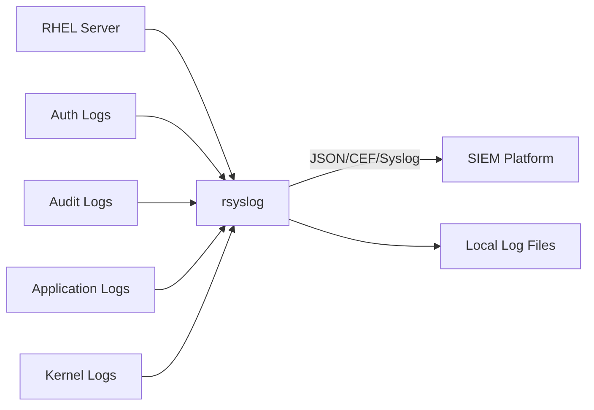

# How to Ship Logs to a SIEM with rsyslog on RHEL

Author: [nawazdhandala](https://www.github.com/nawazdhandala)

Tags: RHEL, Rsyslog, SIEM, Security, Logging, Linux

Description: Learn how to configure rsyslog on RHEL to forward system and application logs to a SIEM platform for security monitoring and threat detection.

---

A SIEM (Security Information and Event Management) system is only as good as the data it receives. On RHEL, rsyslog is the primary tool for collecting and forwarding logs to your SIEM platform. Whether you use Splunk, Elastic SIEM, IBM QRadar, or another solution, rsyslog can format and ship your logs in the right format.

## Architecture



## Prerequisites

- RHEL server with rsyslog installed
- Network access from the server to your SIEM's log collection endpoint
- Knowledge of your SIEM's required log format and port

## Step 1: Identify What to Ship

Security teams typically want these log sources:

```bash
# Authentication and authorization logs
/var/log/secure

# System messages
/var/log/messages

# Audit logs (requires special handling)
/var/log/audit/audit.log

# Firewall logs
# (captured via journald/syslog from firewalld)

# Application-specific logs
/var/log/httpd/access_log
/var/log/httpd/error_log
```

## Step 2: Create JSON Output Templates

Most modern SIEMs prefer JSON-formatted logs:

```bash
# Create the SIEM forwarding configuration
sudo vi /etc/rsyslog.d/siem-forward.conf
```

```bash
# JSON template for SIEM ingestion
template(name="SIEMJson" type="list") {
    constant(value="{")
    constant(value="\"@timestamp\":\"")
    property(name="timestamp" dateFormat="rfc3339")
    constant(value="\",\"host\":\"")
    property(name="hostname")
    constant(value="\",\"source_ip\":\"")
    property(name="fromhost-ip")
    constant(value="\",\"facility\":\"")
    property(name="syslogfacility-text")
    constant(value="\",\"severity\":\"")
    property(name="syslogseverity-text")
    constant(value="\",\"program\":\"")
    property(name="programname")
    constant(value="\",\"pid\":\"")
    property(name="procid")
    constant(value="\",\"message\":\"")
    property(name="msg" format="json")
    constant(value="\"}\n")
}

# CEF (Common Event Format) template for SIEMs that prefer it
template(name="CEFFormat" type="string"
    string="CEF:0|RHEL|rsyslog|9.0|%syslogfacility-text%|%syslogseverity-text%|%syslogseverity%|src=%fromhost-ip% dhost=%hostname% msg=%msg:::json%\n"
)
```

## Step 3: Configure Forwarding to Your SIEM

### Forwarding via TCP (Splunk, QRadar, Generic)

```bash
# Forward all security-relevant logs to the SIEM over TCP
# Auth and privilege escalation logs
auth,authpriv.* action(
    type="omfwd"
    target="siem.example.com"
    port="514"
    protocol="tcp"
    template="SIEMJson"
    queue.type="LinkedList"
    queue.filename="siem_auth_queue"
    queue.maxdiskspace="1g"
    queue.saveonshutdown="on"
    action.resumeRetryCount="-1"
    action.resumeInterval="30"
)

# All warning-level and above messages
*.warn action(
    type="omfwd"
    target="siem.example.com"
    port="514"
    protocol="tcp"
    template="SIEMJson"
    queue.type="LinkedList"
    queue.filename="siem_warn_queue"
    queue.maxdiskspace="1g"
    queue.saveonshutdown="on"
    action.resumeRetryCount="-1"
    action.resumeInterval="30"
)
```

### Forwarding via TLS (Encrypted)

```bash
# Load TLS module
global(
    DefaultNetstreamDriver="gtls"
    DefaultNetstreamDriverCAFile="/etc/pki/rsyslog/ca-cert.pem"
    DefaultNetstreamDriverCertFile="/etc/pki/rsyslog/client-cert.pem"
    DefaultNetstreamDriverKeyFile="/etc/pki/rsyslog/client-key.pem"
)

# Forward to SIEM over encrypted TLS
*.* action(
    type="omfwd"
    target="siem.example.com"
    port="6514"
    protocol="tcp"
    StreamDriver="gtls"
    StreamDriverMode="1"
    StreamDriverAuthMode="x509/name"
    StreamDriverPermittedPeers="siem.example.com"
    template="SIEMJson"
    queue.type="LinkedList"
    queue.filename="siem_tls_queue"
    queue.maxdiskspace="2g"
    queue.saveonshutdown="on"
    action.resumeRetryCount="-1"
)
```

### Forwarding to Elasticsearch/OpenSearch (HTTP)

For Elastic SIEM, you can use the rsyslog HTTP output module:

```bash
# Install the elasticsearch output module
sudo dnf install rsyslog-elasticsearch -y
```

```bash
# Elasticsearch output configuration
module(load="omelasticsearch")

template(name="ElasticIndex" type="string"
    string="syslog-%$year%.%$month%.%$day%"
)

template(name="ElasticDoc" type="list") {
    constant(value="{")
    constant(value="\"@timestamp\":\"")
    property(name="timestamp" dateFormat="rfc3339")
    constant(value="\",\"host\":\"")
    property(name="hostname")
    constant(value="\",\"severity\":\"")
    property(name="syslogseverity-text")
    constant(value="\",\"facility\":\"")
    property(name="syslogfacility-text")
    constant(value="\",\"program\":\"")
    property(name="programname")
    constant(value="\",\"message\":\"")
    property(name="msg" format="json")
    constant(value="\"}")
}

# Forward to Elasticsearch
*.* action(
    type="omelasticsearch"
    server="elasticsearch.example.com"
    serverport="9200"
    template="ElasticDoc"
    searchIndex="ElasticIndex"
    dynSearchIndex="on"
    bulkmode="on"
    queue.type="LinkedList"
    queue.filename="elastic_queue"
    queue.maxdiskspace="2g"
    queue.saveonshutdown="on"
    action.resumeRetryCount="-1"
)
```

## Step 4: Forward Audit Logs

Linux audit logs are not handled by rsyslog by default. You need the imfile module to read them:

```bash
# Load the file input module for reading arbitrary log files
module(load="imfile")

# Read the audit log file
input(type="imfile"
    File="/var/log/audit/audit.log"
    Tag="audit:"
    Severity="warning"
    Facility="local6"
    PersistStateInterval="20"
)

# Forward audit logs to the SIEM
if $syslogtag startswith 'audit:' then {
    action(
        type="omfwd"
        target="siem.example.com"
        port="514"
        protocol="tcp"
        template="SIEMJson"
        queue.type="LinkedList"
        queue.filename="siem_audit_queue"
        queue.maxdiskspace="1g"
        queue.saveonshutdown="on"
    )
}
```

## Step 5: Configure Reliable Delivery

Losing log data means missing potential security events. Configure disk-assisted queues:

```bash
# Main queue configuration for reliability
main_queue(
    queue.filename="main_queue"
    queue.maxdiskspace="4g"
    queue.saveonshutdown="on"
    queue.type="LinkedList"
    queue.size="50000"
    queue.dequeuebatchsize="1000"
)
```

## Step 6: Open Firewall and Restart

```bash
# Open the firewall for outbound traffic (if needed)
# Usually outbound is allowed, but verify

# Restart rsyslog
sudo systemctl restart rsyslog

# Check for errors
sudo journalctl -u rsyslog --no-pager -n 30

# Validate configuration
rsyslogd -N1
```

## Step 7: Verify Logs Are Arriving

Generate some test events and check your SIEM:

```bash
# Generate test authentication events
logger -p auth.warning "SIEM test: authentication warning from $(hostname)"
logger -p auth.err "SIEM test: authentication error from $(hostname)"

# Generate a test sudo event
sudo echo "SIEM connectivity test"

# Check the queue status
sudo journalctl -u rsyslog | grep -i "queue\|forward\|siem"
```

## Monitoring rsyslog Health

Create an impstats configuration to monitor rsyslog performance:

```bash
# Enable rsyslog internal statistics
module(load="impstats"
    interval="60"
    severity="7"
    log.file="/var/log/rsyslog-stats.log"
)
```

This writes statistics about queue sizes, message rates, and errors every 60 seconds.

## Summary

Shipping logs from RHEL to a SIEM with rsyslog involves creating the right output templates (JSON for most modern SIEMs), configuring forwarding rules for the relevant log sources, and setting up disk-assisted queues for reliable delivery. Use the imfile module for log files that rsyslog does not capture natively (like audit logs), and always encrypt log traffic with TLS when sending across untrusted networks.
