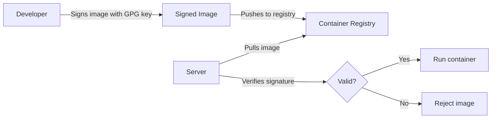

# How to Sign and Verify Container Images with Podman on RHEL

Author: [nawazdhandala](https://www.github.com/nawazdhandala)

Tags: RHEL, Podman, Image Signing, Security, Linux

Description: Learn how to sign container images with GPG keys and verify image signatures with Podman on RHEL to ensure image integrity and authenticity in your container supply chain.

---

Container image signing is one of those things that everyone knows they should do but few actually implement. On RHEL, Podman makes it straightforward to sign images with GPG keys and configure policies that require valid signatures before pulling or running images. This is a critical part of securing your container supply chain.

## Why Sign Container Images?

Without signature verification, you are trusting that the registry has not been compromised, that no one tampered with the image in transit, and that the image actually came from who you think it did. Signing helps address these risks by letting clients verify the image against a trusted signing key before accepting it.


```mermaid
graph LR
    A[Developer] -->|Signs image with GPG key| B[Signed Image]
    B -->|Pushes to registry| C[Container Registry]
    D[Server] -->|Pulls image| C
    D -->|Verifies signature| E{Valid?}
    E -->|Yes| F[Run container]
    E -->|No| G[Reject image]
```

## Prerequisites

You need a GPG key pair. For GPG signature verification, you also need a lookaside web server that verification hosts can use to read the detached signatures. If you do not have a key:

## Generate a GPG key pair
```bash
gpg --full-generate-key
```

Choose RSA, 4096 bits, and set an expiration. Once generated:

## List your GPG keys
```bash
gpg --list-keys
```

## Export the public key (you will distribute this to your servers)
```bash
gpg --armor --export your-email@example.com > my-signing-key.pub
```

## Signing Images During Push

When you push an image to a registry, you can sign it at the same time:

## First, configure where signatures should be written and read
```bash
sudo mkdir -p /var/lib/containers/sigstore
```

## Create a signature storage configuration
```bash
sudo tee /etc/containers/registries.d/registry.example.com.yaml > /dev/null << 'EOF'
docker:
  registry.example.com:
    lookaside: https://registry-lookaside.example.com
    lookaside-staging: file:///var/lib/containers/sigstore
  registry.access.redhat.com:
    lookaside: https://access.redhat.com/webassets/docker/content/sigstore
EOF
```

## Sign and push an image
```bash
podman push --sign-by your-email@example.com localhost/my-app:latest docker://registry.example.com/my-app:latest
```

Podman creates a detached GPG signature and stores it in the local lookaside staging directory. Copy the signatures from that directory to the configured lookaside web server so verification servers can read them.

## Configuring Signature Verification Policies

The trust policy file at `/etc/containers/policy.json` controls what images are allowed:

## View the current policy
```bash
cat /etc/containers/policy.json
```

The default policy on RHEL looks like:

```json
{
    "default": [
        {
            "type": "insecureAcceptAnything"
        }
    ],
    "transports": {
        "docker-daemon": {
            "": [
                {
                    "type": "insecureAcceptAnything"
                }
            ]
        }
    }
}
```

To require signatures from your registry, update the policy:

```bash
sudo tee /etc/containers/policy.json > /dev/null << 'EOF'
{
    "default": [
        {
            "type": "reject"
        }
    ],
    "transports": {
        "docker": {
            "registry.example.com": [
                {
                    "type": "signedBy",
                    "keyType": "GPGKeys",
                    "keyPath": "/etc/pki/containers/my-signing-key.pub"
                }
            ],
            "registry.access.redhat.com": [
                {
                    "type": "signedBy",
                    "keyType": "GPGKeys",
                    "keyPath": "/etc/pki/rpm-gpg/RPM-GPG-KEY-redhat-release"
                }
            ],
            "docker.io": [
                {
                    "type": "insecureAcceptAnything"
                }
            ]
        }
    }
}
EOF
```

This policy:
- Rejects unsigned images by default
- Requires GPG signature for images from `registry.example.com`
- Trusts Red Hat signed images when the Red Hat signature lookaside locations are also configured under `/etc/containers/registries.d/`
- Allows Docker Hub images without signatures

## Distributing the Public Key

Copy your public key to the servers that need to verify signatures:

## Install the public key on the verification server
```bash
sudo mkdir -p /etc/pki/containers/
sudo cp my-signing-key.pub /etc/pki/containers/
```

## Verifying Image Signatures

Once the policy is configured, Podman automatically verifies signatures on pull:

## This will check the signature before pulling
```bash
podman pull registry.example.com/my-app:latest
```

If the signature is invalid or missing, Podman will refuse to pull the image.

## Using Sigstore (Cosign) Signatures

Modern container signing often uses Sigstore/Cosign instead of GPG:

## Install cosign
```bash
LATEST_VERSION=$(curl -s https://api.github.com/repos/sigstore/cosign/releases/latest | grep tag_name | cut -d : -f2 | tr -d 'v", ')
curl -O -L "https://github.com/sigstore/cosign/releases/latest/download/cosign-${LATEST_VERSION}-1.x86_64.rpm"
sudo rpm -ivh "cosign-${LATEST_VERSION}-1.x86_64.rpm"
```

## Generate a cosign key pair
```bash
cosign generate-key-pair
```

## Sign an image with cosign
```bash
cosign sign --key cosign.key registry.example.com/my-app:latest
```

## Verify a cosign signature
```bash
cosign verify --key cosign.pub registry.example.com/my-app:latest
```

## Configuring Sigstore in Policy

For cosign/sigstore signatures, update the policy:

```bash
sudo tee /etc/containers/registries.d/registry.example.com.yaml > /dev/null << 'EOF'
docker:
  registry.example.com:
    use-sigstore-attachments: true
EOF
```

```json
{
    "transports": {
        "docker": {
            "registry.example.com": [
                {
                    "type": "sigstoreSigned",
                    "keyPath": "/etc/pki/containers/cosign.pub",
                    "signedIdentity": {
                        "type": "matchRepository"
                    }
                }
            ]
        }
    }
}
```

## Checking Image Trust

Use `podman image trust` to manage trust policies:

## View the current trust settings
```bash
podman image trust show
```

## Set trust for a specific registry
```bash
sudo podman image trust set --signature-policy /etc/containers/policy.json --type signedBy --pubkeysfile /etc/pki/containers/my-signing-key.pub registry.example.com
```

## Automating Image Signing in CI/CD

```bash
#!/bin/bash
# CI/CD script to build, sign, and push images

IMAGE="registry.example.com/my-app"
TAG="${BUILD_NUMBER:-latest}"

# Build the image

podman build -t ${IMAGE}:${TAG} .

# Push and sign in one step
podman push --sign-by ci-signing@example.com ${IMAGE}:${TAG}

echo "Image ${IMAGE}:${TAG} built, signed, and pushed"
```

## Troubleshooting Signature Issues

This section covers troubleshooting signature issues.

## Check if an image has a signature
```bash
find /var/lib/containers/sigstore -type f -name 'signature-*' -print
```

## Debug signature verification failures
```bash
podman --log-level debug pull registry.example.com/my-app:latest 2>&1 | grep -i sign
```

## List signatures in the local sigstore
```bash
ls -la /var/lib/containers/sigstore/
```

## Summary

Image signing on RHEL with Podman gives you cryptographic proof that your container images are authentic and untampered. Start with GPG signing for simplicity, or use Cosign/Sigstore for a more modern approach. Either way, configure your policy.json to reject unsigned images in production. It is one of those security measures that costs very little to implement but provides significant protection.
