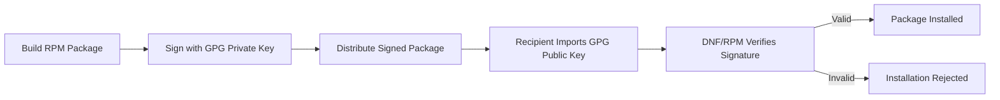

# How to Sign and Verify RPM Packages with GPG on RHEL

Author: [nawazdhandala](https://www.github.com/nawazdhandala)

Tags: RHEL, GPG, RPM, Package Signing, Security, Linux

Description: Sign RPM packages with GPG keys and verify package signatures on RHEL to ensure package integrity and authenticity in your software distribution pipeline.

---

Signing RPM packages with GPG keys ensures that packages have not been tampered with and that they come from a trusted source. RHEL uses GPG signatures extensively for its own packages, and you should do the same for any custom RPMs you build and distribute. This guide covers the complete workflow.

## How RPM Package Signing Works



## Step 1: Generate a GPG Key for Package Signing

If you do not already have a GPG key for signing:

```bash
# Generate a new key pair
gpg --full-generate-key

# Choose:
# - RSA and RSA (for maximum compatibility with older RPM tools)
# - 4096 bits
# - Appropriate expiration
# - Your name and email for the package signing identity
```

For automated environments, use batch generation:

```bash
cat > /tmp/rpm-sign-key.conf << 'EOF'
Key-Type: RSA
Key-Length: 4096
Key-Usage: sign
Name-Real: My Organization Package Signing
Name-Email: packages@example.com
Expire-Date: 3y
Passphrase: your-signing-passphrase
%commit
EOF

gpg --batch --generate-key /tmp/rpm-sign-key.conf
rm /tmp/rpm-sign-key.conf
```

## Step 2: Export the Public Key

Export the public key so recipients can verify your packages:

```bash
# Export the public key in ASCII format
gpg --armor --export packages@example.com > RPM-GPG-KEY-myorg

# This file will be distributed to systems that need to verify your packages
```

## Step 3: Configure RPM to Use Your Key

Create or edit the RPM macros file to tell RPM which key to use for signing:

```bash
# Create the macros file
cat >> ~/.rpmmacros << 'EOF'
# GPG signing configuration
%_signature gpg
%_gpg_path ~/.gnupg
%_gpg_name packages@example.com
%_gpgbin /usr/bin/gpg2
%__gpg_sign_cmd %{__gpg} gpg --force-v3-sigs --batch --verbose --no-armor --no-secmem-warning -u "%{_gpg_name}" -sbo %{__signature_filename} --digest-algo sha256 %{__plaintext_filename}'
EOF
```

## Step 4: Sign an RPM Package

### Sign a Single Package

```bash
# Sign an RPM package
rpm --addsign mypackage-1.0-1.el9.x86_64.rpm

# You will be prompted for the GPG passphrase
```

### Sign Multiple Packages

```bash
# Sign all RPMs in a directory
rpm --addsign /path/to/rpms/*.rpm
```

### Re-sign a Package (Replace Existing Signature)

```bash
# Replace any existing signatures
rpm --resign mypackage-1.0-1.el9.x86_64.rpm
```

### Non-Interactive Signing

For automated build pipelines where you cannot enter a passphrase interactively:

```bash
# Using gpg-agent with a pre-cached passphrase
# First, cache the passphrase
echo "your-passphrase" | gpg --batch --passphrase-fd 0 --pinentry-mode loopback \
    --sign --armor /dev/null 2>/dev/null

# Then sign the RPM (gpg-agent will use the cached passphrase)
rpm --addsign mypackage-1.0-1.el9.x86_64.rpm
```

Or configure gpg-agent for non-interactive use:

```bash
# Configure gpg-agent to allow loopback pinentry
echo "allow-loopback-pinentry" >> ~/.gnupg/gpg-agent.conf
gpg-connect-agent reloadagent /bye

# Sign with passphrase from a file
echo "your-passphrase" | rpm --addsign mypackage-1.0-1.el9.x86_64.rpm
```

## Step 5: Verify Package Signatures

### Verify a Single Package

```bash
# Check the signature of an RPM
rpm --checksig mypackage-1.0-1.el9.x86_64.rpm

# Detailed verification
rpm -K --verbose mypackage-1.0-1.el9.x86_64.rpm
```

Expected output for a properly signed package:

```
mypackage-1.0-1.el9.x86_64.rpm: digests signatures OK
```

### Verify All Installed Packages

```bash
# Verify signatures of all installed packages
rpm -Va --nofiles --nodigest 2>/dev/null

# Check a specific installed package
rpm -V mypackage
```

## Step 6: Import the Public Key for Verification

On systems that need to verify your packages:

```bash
# Import the public key into RPM's keyring
sudo rpm --import RPM-GPG-KEY-myorg

# Verify the key was imported
rpm -qa gpg-pubkey* --qf '%{NAME}-%{VERSION}-%{RELEASE}\t%{SUMMARY}\n'
```

## Step 7: Configure DNF to Require Signatures

Set up a repository that requires GPG verification:

```bash
sudo tee /etc/yum.repos.d/myorg.repo << 'EOF'
[myorg]
name=My Organization Packages
baseurl=https://packages.example.com/rhel9/
enabled=1
gpgcheck=1
gpgkey=file:///etc/pki/rpm-gpg/RPM-GPG-KEY-myorg
EOF

# Copy the public key to the standard location
sudo cp RPM-GPG-KEY-myorg /etc/pki/rpm-gpg/RPM-GPG-KEY-myorg
```

## Verifying Red Hat Package Signatures

RHEL packages are signed by Red Hat. You can verify them:

```bash
# Check Red Hat's signing key
rpm -qa gpg-pubkey* --qf '%{NAME}-%{VERSION}-%{RELEASE}\t%{SUMMARY}\n' | grep -i "red hat"

# Verify a Red Hat package
rpm --checksig /path/to/redhat-package.rpm

# Verify all installed Red Hat packages
rpm -qa --qf '%{NAME}-%{VERSION}-%{RELEASE}.%{ARCH} %{SIGPGP:pgpsig}\n' | head -20
```

## Signing Packages in a Build Pipeline

Here is an example script for a CI/CD pipeline:

```bash
#!/bin/bash
# sign-rpms.sh - Sign all RPMs in a build directory

BUILD_DIR="${1:-.}"
GPG_NAME="packages@example.com"

echo "Signing RPMs in $BUILD_DIR..."

for rpm_file in "$BUILD_DIR"/*.rpm; do
    if [ -f "$rpm_file" ]; then
        echo "Signing: $rpm_file"
        rpm --addsign "$rpm_file"
        if [ $? -eq 0 ]; then
            echo "  Signed successfully"
            # Verify the signature
            rpm --checksig "$rpm_file"
        else
            echo "  ERROR: Failed to sign $rpm_file"
            exit 1
        fi
    fi
done

echo "All RPMs signed successfully"
```

## Summary

GPG signing of RPM packages is essential for software supply chain security on RHEL. Generate a dedicated signing key, configure RPM to use it, sign your packages during the build process, and distribute your public key to verification systems. Configure repositories with `gpgcheck=1` to enforce signature verification and prevent tampered packages from being installed.
