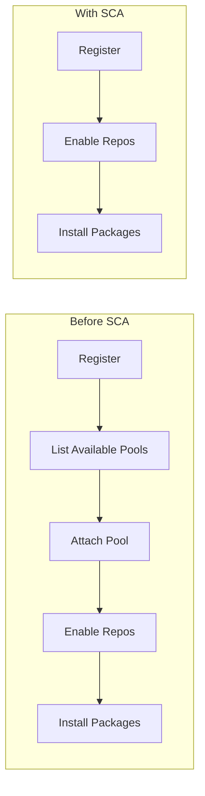
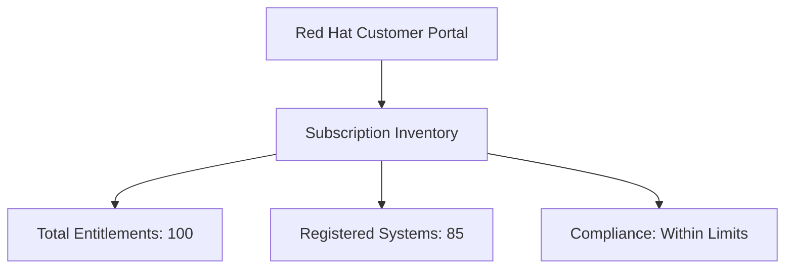

# How to Use Simple Content Access (SCA) for RHEL Subscription Management

Author: [nawazdhandala](https://www.github.com/nawazdhandala)

Tags: RHEL, SCA, Subscription Management, Red Hat, Linux

Description: A comprehensive guide to using Simple Content Access (SCA) to streamline RHEL subscription management, covering how it works, its benefits, and how to manage your fleet with it.

---

Simple Content Access, commonly known as SCA, fundamentally changes how RHEL systems consume subscriptions. Instead of the old model where each system needs a specific subscription attached, SCA gives registered systems automatic access to content. If you have been managing RHEL subscriptions for a while, SCA removes a lot of the friction you are used to dealing with. This guide covers how to work with SCA day-to-day and get the most out of it.

## The Problem SCA Solves

Traditional RHEL subscription management worked like this: register the system, find the right subscription pool, attach it, then enable repos. If you had a mix of subscriptions (Server, Workstation, Developer, etc.), picking the right pool was a manual decision. Multiply that by hundreds of systems, add in subscription renewals and expirations, and you had a management headache.

SCA eliminates the attachment step entirely. Register, and you are done.



## How SCA Works Under the Hood

When SCA is enabled, the `subscription-manager` client receives a content access certificate instead of individual entitlement certificates. This certificate grants access to all content in your subscription portfolio without specifying which subscription covers which system.

```bash
# View the content access certificate
ls -la /etc/pki/entitlement/

# With SCA, you will see a single certificate rather than multiple per-subscription certs
```

The certificate is refreshed automatically by `subscription-manager` during regular check-ins. The default check-in interval is every 4 hours, controlled by the `rhsmcertd` daemon:

```bash
# Check the certificate daemon status
sudo systemctl status rhsmcertd

# View the check-in configuration
sudo grep -E "certCheckInterval|autoAttachInterval" /etc/rhsm/rhsm.conf
```

## Day-to-Day Operations with SCA

Most of your daily workflow does not change with SCA. You still register systems, enable repos, and install packages the same way.

### Registering a New System

```bash
# Register - no attach step needed
sudo subscription-manager register --username=your_username --password=your_password
```

### Managing Repositories

```bash
# List enabled repos
sudo subscription-manager repos --list-enabled

# Enable a specific repo
sudo subscription-manager repos --enable=codeready-builder-for-rhel-9-x86_64-rpms

# Disable a repo
sudo subscription-manager repos --disable=rhel-9-for-x86_64-supplementary-rpms
```

### Installing Packages

```bash
# Install packages as usual
sudo dnf install -y httpd postgresql

# Update the system
sudo dnf update -y
```

## Checking SCA Status

Verify that SCA is active on your system:

```bash
# Check subscription status
sudo subscription-manager status
```

With SCA active, you will see:

```bash
Overall Status: Disabled
Content Access Mode is set to Simple Content Access.
```

The "Disabled" status is expected. It means traditional entitlement compliance checking is turned off.

## SCA and Subscription Tracking

A common concern with SCA is: "If we are not attaching specific subscriptions, how do we know if we are compliant?"

Red Hat tracks subscription consumption at the account level. You can view this in the Customer Portal:

1. Log in to access.redhat.com
2. Go to Subscriptions
3. View the subscription inventory

The inventory shows total subscription quantities, how many systems are registered, and whether you are within your entitlement limits.



## SCA with Different Registration Methods

SCA works with all registration methods:

**Username/Password**:

```bash
sudo subscription-manager register --username=user --password=pass
```

**Activation Key**:

```bash
sudo subscription-manager register --activationkey=my-key --org=my-org
```

**Token**:

```bash
sudo subscription-manager register --token=my-token
```

In all cases, the system gets content access immediately after registration.

## SCA with Satellite Server

If you use Red Hat Satellite, SCA is configured at the manifest level:

1. In Satellite, go to Content, then Subscriptions
2. Click "Manage Manifest"
3. Enable Simple Content Access

Systems registered to Satellite will automatically use SCA. Content views and lifecycle environments still control what content is available, but subscription attachment is not needed.

## SCA and System Purpose

System purpose attributes (role, SLA, usage) are still valuable with SCA. While they no longer drive auto-attach decisions, they help with:

- Reporting on system usage across your organization
- Planning subscription renewals
- Understanding your infrastructure composition

```bash
# Set system purpose even with SCA
sudo subscription-manager syspurpose role --set="Red Hat Enterprise Linux Server"
sudo subscription-manager syspurpose service-level --set="Premium"
sudo subscription-manager syspurpose usage --set="Production"
```

## Migrating from Traditional Entitlements to SCA

When you enable SCA on an account that previously used traditional entitlements:

1. Existing registered systems will transition on their next check-in
2. Individual entitlement certificates are replaced with the content access certificate
3. No system re-registration is required
4. No downtime or service interruption occurs

Force an immediate transition on a specific system:

```bash
# Force the system to pick up the SCA change
sudo subscription-manager refresh
```

## Handling Mixed Environments

If your organization has multiple Red Hat accounts, some with SCA and some without, each system follows the setting of the account it is registered to. There is no system-level SCA toggle.

## Troubleshooting SCA

**Content access certificate not refreshing**: Restart the certificate daemon:

```bash
# Restart the certificate management daemon
sudo systemctl restart rhsmcertd
```

**System shows "Invalid" status with SCA**: This should not happen with SCA. If it does, refresh and check:

```bash
sudo subscription-manager refresh
sudo subscription-manager status
```

**Cannot access repos after enabling SCA**: Clean the dnf cache:

```bash
sudo dnf clean all
sudo subscription-manager refresh
sudo dnf repolist
```

## Automation Best Practices with SCA

With SCA, your automation scripts become simpler. Here is an Ansible example:

```yaml
# Minimal registration playbook with SCA
- name: Register and configure RHEL systems
  hosts: all
  become: true
  tasks:
    - name: Register system
      community.general.redhat_subscription:
        activationkey: rhel9-prod
        org_id: my-org
        state: present

    - name: Enable required repositories
      community.general.rhsm_repository:
        name:
          - rhel-9-for-x86_64-baseos-rpms
          - rhel-9-for-x86_64-appstream-rpms
          - codeready-builder-for-rhel-9-x86_64-rpms
        state: enabled

    - name: Update all packages
      dnf:
        name: "*"
        state: latest
```

No attach step, no pool ID lookups, no subscription matching. Just register and go.

## Summary

SCA is the current standard for RHEL subscription management, and for good reason. It removes the most tedious parts of subscription management while maintaining compliance tracking at the account level. If your organization has not enabled SCA yet, there is little reason to stay with traditional entitlements unless you have very specific compliance requirements that need per-system tracking. The switch is non-disruptive, and the simplification in day-to-day operations and automation makes it well worth the change.
