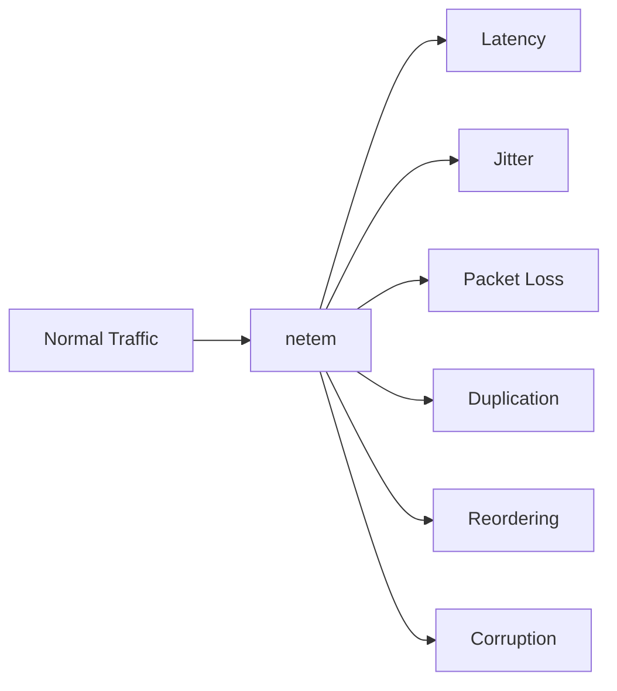

# How to Simulate Network Latency and Packet Loss with tc netem on RHEL

Author: [nawazdhandala](https://www.github.com/nawazdhandala)

Tags: RHEL, tc netem, Latency, Packet Loss, Linux

Description: Learn how to use tc netem on RHEL to simulate real-world network conditions like latency, jitter, packet loss, duplication, and reordering for application testing and chaos engineering.

---

Testing how your applications handle poor network conditions is critical, but you can't just wait for the network to misbehave. netem (network emulator) is a tc qdisc that lets you artificially introduce latency, packet loss, jitter, corruption, and other impairments. It's essential for testing distributed systems, VoIP quality, and application resilience.

## What netem Can Simulate



## Adding Latency

```bash
# Add 100ms of latency to all outbound packets
sudo tc qdisc add dev ens192 root netem delay 100ms

# Verify with ping
ping -c 10 8.8.8.8
# You'll see ~100ms added to the normal latency
```

## Adding Latency with Jitter

Real networks don't have perfectly consistent latency. Add variation:

```bash
# 100ms delay with 20ms jitter (uniform distribution)
sudo tc qdisc add dev ens192 root netem delay 100ms 20ms

# 100ms delay with 20ms jitter, normal distribution (more realistic)
sudo tc qdisc add dev ens192 root netem delay 100ms 20ms distribution normal

# Other distributions available: pareto, paretonormal
sudo tc qdisc add dev ens192 root netem delay 100ms 20ms distribution pareto
```

## Adding Correlation

Network issues often persist over time. Correlation makes consecutive packets likely to have similar impairments.

```bash
# 100ms delay with 20ms jitter and 25% correlation
sudo tc qdisc add dev ens192 root netem delay 100ms 20ms 25%
# The 25% means each packet's delay is 25% correlated to the previous one
```

## Simulating Packet Loss

```bash
# 5% random packet loss
sudo tc qdisc add dev ens192 root netem loss 5%

# 5% loss with 25% correlation (bursty loss, more realistic)
sudo tc qdisc add dev ens192 root netem loss 5% 25%

# Gilbert-Elliott model for bursty loss (more realistic for wireless)
sudo tc qdisc add dev ens192 root netem loss gemodel 1% 10% 70% 0.1%
```

## Combining Latency and Packet Loss

You can stack multiple impairments:

```bash
# 50ms latency with 10ms jitter AND 2% packet loss
sudo tc qdisc add dev ens192 root netem delay 50ms 10ms loss 2%
```

## Simulating Packet Duplication

```bash
# 1% of packets get duplicated
sudo tc qdisc add dev ens192 root netem duplicate 1%
```

## Simulating Packet Reordering

```bash
# 25% of packets are reordered with 50ms delay
sudo tc qdisc add dev ens192 root netem delay 50ms reorder 25% 50%
```

## Simulating Packet Corruption

```bash
# 0.1% of packets get a random bit flipped
sudo tc qdisc add dev ens192 root netem corrupt 0.1%
```

## Simulating Specific Network Conditions

### Satellite Link
```bash
# High latency, low jitter, occasional loss
sudo tc qdisc add dev ens192 root netem delay 600ms 50ms loss 0.5%
```

### Mobile 3G Connection
```bash
# Variable latency, some loss
sudo tc qdisc add dev ens192 root netem delay 150ms 50ms distribution normal loss 1.5% 25%
```

### Poor WiFi
```bash
# Moderate latency, significant jitter, noticeable loss
sudo tc qdisc add dev ens192 root netem delay 20ms 30ms distribution pareto loss 3% 50%
```

### Intercontinental Link
```bash
# High latency, low loss
sudo tc qdisc add dev ens192 root netem delay 200ms 10ms distribution normal loss 0.1%
```

## Modifying Existing Rules

You can change netem rules without removing them first:

```bash
# Change the delay
sudo tc qdisc change dev ens192 root netem delay 200ms 30ms

# Add loss to existing delay rule
sudo tc qdisc change dev ens192 root netem delay 200ms 30ms loss 5%
```

## Applying netem to Specific Traffic

Use HTB with netem to impair only certain traffic:

```bash
# Set up HTB
sudo tc qdisc add dev ens192 root handle 1: htb default 10

# Default class (no impairment)
sudo tc class add dev ens192 parent 1: classid 1:10 htb rate 1gbit

# Impaired class
sudo tc class add dev ens192 parent 1: classid 1:20 htb rate 1gbit

# Add netem to the impaired class
sudo tc qdisc add dev ens192 parent 1:20 handle 20: netem delay 100ms loss 5%

# Filter: traffic to port 5432 (PostgreSQL) gets impaired
sudo tc filter add dev ens192 parent 1: protocol ip prio 1 u32 match ip dport 5432 0xffff flowid 1:20
```

## Monitoring the Effects

```bash
# Show current netem statistics
tc -s qdisc show dev ens192

# Watch packet counts
watch -n 1 'tc -s qdisc show dev ens192'

# Use ping to see latency
ping -c 100 TARGET_IP | tail -5
```

## Using netem with Network Namespaces

For isolated testing, combine with namespaces:

```bash
# Apply netem inside a namespace
sudo ip netns exec testns tc qdisc add dev eth0 root netem delay 100ms loss 2%

# Run your test inside the namespace
sudo ip netns exec testns your-application
```

## Removing Impairments

```bash
# Remove netem and restore normal networking
sudo tc qdisc del dev ens192 root

# Verify
tc qdisc show dev ens192
```

## Practical Testing Script

```bash
#!/bin/bash
# Test application under various network conditions

TARGET="your-app-server"

echo "=== Testing Normal Conditions ==="
curl -o /dev/null -s -w "Time: %{time_total}s, Code: %{http_code}\n" http://$TARGET/health

echo "=== Testing with 100ms Latency ==="
sudo tc qdisc add dev ens192 root netem delay 100ms
curl -o /dev/null -s -w "Time: %{time_total}s, Code: %{http_code}\n" http://$TARGET/health
sudo tc qdisc del dev ens192 root

echo "=== Testing with 5% Packet Loss ==="
sudo tc qdisc add dev ens192 root netem loss 5%
curl -o /dev/null -s -w "Time: %{time_total}s, Code: %{http_code}\n" http://$TARGET/health
sudo tc qdisc del dev ens192 root

echo "=== Testing with 500ms Latency + 10% Loss ==="
sudo tc qdisc add dev ens192 root netem delay 500ms loss 10%
curl -o /dev/null -s -w "Time: %{time_total}s, Code: %{http_code}\n" --max-time 30 http://$TARGET/health
sudo tc qdisc del dev ens192 root
```

## Wrapping Up

tc netem on RHEL is the standard tool for simulating network impairments. Start with simple latency tests, add jitter for realism, and include packet loss for resilience testing. Use the normal distribution for latency jitter, add correlation for bursty patterns, and always remove the rules when done. Combined with network namespaces, you can create isolated test environments that simulate any network condition without affecting your production traffic.
