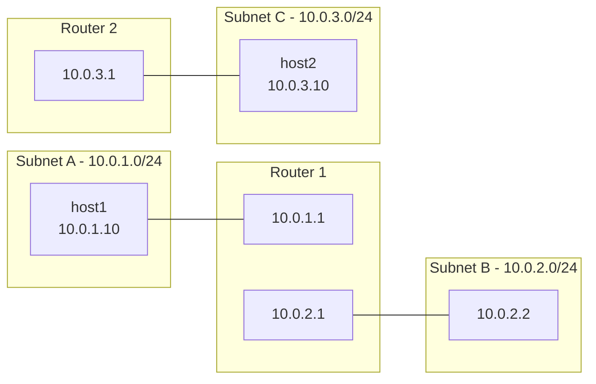

# How to Simulate Complex Network Topologies with Namespaces on RHEL

Author: [nawazdhandala](https://www.github.com/nawazdhandala)

Tags: RHEL, Network Namespaces, Network Simulation, Linux

Description: Learn how to use network namespaces on RHEL to simulate multi-router, multi-subnet network topologies for testing, training, and development without any additional hardware.

---

You don't need a rack full of routers and switches to test complex network scenarios. Network namespaces on RHEL let you build entire network topologies on a single machine. Each namespace acts as an independent host or router, complete with its own interfaces, routing table, and firewall. This is perfect for testing routing configurations, firewall rules, or training exercises.

## What We'll Build

A three-subnet network with two routers:



Host1 in Subnet A reaches Host2 in Subnet C by going through both routers.

## Step 1: Create the Namespaces

```bash
# Create namespaces for hosts and routers
sudo ip netns add host1
sudo ip netns add router1
sudo ip netns add router2
sudo ip netns add host2

# Bring up loopback in all namespaces
for ns in host1 router1 router2 host2; do
    sudo ip netns exec $ns ip link set lo up
done
```

## Step 2: Create the Connections

```bash
# Connect host1 to router1 (Subnet A)
sudo ip link add h1-eth0 type veth peer name r1-eth0
sudo ip link set h1-eth0 netns host1
sudo ip link set r1-eth0 netns router1

# Connect router1 to router2 (Subnet B)
sudo ip link add r1-eth1 type veth peer name r2-eth0
sudo ip link set r1-eth1 netns router1
sudo ip link set r2-eth0 netns router2

# Connect router2 to host2 (Subnet C)
sudo ip link add r2-eth1 type veth peer name h2-eth0
sudo ip link set r2-eth1 netns router2
sudo ip link set h2-eth0 netns host2
```

## Step 3: Configure IP Addresses

```bash
# Host1 (Subnet A)
sudo ip netns exec host1 ip addr add 10.0.1.10/24 dev h1-eth0
sudo ip netns exec host1 ip link set h1-eth0 up

# Router1 - Subnet A side
sudo ip netns exec router1 ip addr add 10.0.1.1/24 dev r1-eth0
sudo ip netns exec router1 ip link set r1-eth0 up

# Router1 - Subnet B side
sudo ip netns exec router1 ip addr add 10.0.2.1/24 dev r1-eth1
sudo ip netns exec router1 ip link set r1-eth1 up

# Router2 - Subnet B side
sudo ip netns exec router2 ip addr add 10.0.2.2/24 dev r2-eth0
sudo ip netns exec router2 ip link set r2-eth0 up

# Router2 - Subnet C side
sudo ip netns exec router2 ip addr add 10.0.3.1/24 dev r2-eth1
sudo ip netns exec router2 ip link set r2-eth1 up

# Host2 (Subnet C)
sudo ip netns exec host2 ip addr add 10.0.3.10/24 dev h2-eth0
sudo ip netns exec host2 ip link set h2-eth0 up
```

## Step 4: Enable IP Forwarding on Routers

```bash
# Enable forwarding on both routers
sudo ip netns exec router1 sysctl -w net.ipv4.ip_forward=1
sudo ip netns exec router2 sysctl -w net.ipv4.ip_forward=1
```

## Step 5: Configure Routing

```bash
# Host1 default route via Router1
sudo ip netns exec host1 ip route add default via 10.0.1.1

# Router1 knows about Subnet C via Router2
sudo ip netns exec router1 ip route add 10.0.3.0/24 via 10.0.2.2

# Router2 knows about Subnet A via Router1
sudo ip netns exec router2 ip route add 10.0.1.0/24 via 10.0.2.1

# Host2 default route via Router2
sudo ip netns exec host2 ip route add default via 10.0.3.1
```

## Step 6: Test End-to-End Connectivity

```bash
# Host1 to Host2 (traverses both routers)
sudo ip netns exec host1 ping -c 4 10.0.3.10

# Host2 to Host1
sudo ip netns exec host2 ping -c 4 10.0.1.10

# Traceroute shows the path
sudo ip netns exec host1 tracepath -n 10.0.3.10
```

## Adding Firewall Rules for Testing

You can test firewall configurations in this simulated environment.

```bash
# Block traffic on router1 and see if host1 can still reach host2
sudo ip netns exec router1 iptables -A FORWARD -s 10.0.1.0/24 -d 10.0.3.0/24 -j DROP

# Test - this should fail now
sudo ip netns exec host1 ping -c 2 10.0.3.10

# Remove the rule
sudo ip netns exec router1 iptables -D FORWARD -s 10.0.1.0/24 -d 10.0.3.0/24 -j DROP
```

## Simulating Network Issues

Add latency or packet loss to test application resilience:

```bash
# Add 50ms latency on the link between routers
sudo ip netns exec router1 tc qdisc add dev r1-eth1 root netem delay 50ms

# Add 5% packet loss
sudo ip netns exec router1 tc qdisc change dev r1-eth1 root netem delay 50ms loss 5%

# Test the impact
sudo ip netns exec host1 ping -c 20 10.0.3.10

# Remove the impairment
sudo ip netns exec router1 tc qdisc del dev r1-eth1 root
```

## Running Services in the Simulation

```bash
# Start a web server on host2
sudo ip netns exec host2 python3 -m http.server 80 &

# Access it from host1
sudo ip netns exec host1 curl http://10.0.3.10

# Run tcpdump on a router to watch traffic
sudo ip netns exec router1 tcpdump -i r1-eth1 -nn
```

## Automation Script

Here's a script that sets up the entire topology:

```bash
#!/bin/bash
# setup-topology.sh - Create a multi-router test network

set -e

# Create namespaces
for ns in host1 router1 router2 host2; do
    ip netns add $ns
    ip netns exec $ns ip link set lo up
done

# Create links
ip link add h1-eth0 type veth peer name r1-eth0
ip link add r1-eth1 type veth peer name r2-eth0
ip link add r2-eth1 type veth peer name h2-eth0

# Place interfaces
ip link set h1-eth0 netns host1
ip link set r1-eth0 netns router1
ip link set r1-eth1 netns router1
ip link set r2-eth0 netns router2
ip link set r2-eth1 netns router2
ip link set h2-eth0 netns host2

# Configure addresses and bring up
ip netns exec host1 ip addr add 10.0.1.10/24 dev h1-eth0
ip netns exec host1 ip link set h1-eth0 up
ip netns exec router1 ip addr add 10.0.1.1/24 dev r1-eth0
ip netns exec router1 ip link set r1-eth0 up
ip netns exec router1 ip addr add 10.0.2.1/24 dev r1-eth1
ip netns exec router1 ip link set r1-eth1 up
ip netns exec router2 ip addr add 10.0.2.2/24 dev r2-eth0
ip netns exec router2 ip link set r2-eth0 up
ip netns exec router2 ip addr add 10.0.3.1/24 dev r2-eth1
ip netns exec router2 ip link set r2-eth1 up
ip netns exec host2 ip addr add 10.0.3.10/24 dev h2-eth0
ip netns exec host2 ip link set h2-eth0 up

# Enable forwarding
ip netns exec router1 sysctl -w net.ipv4.ip_forward=1
ip netns exec router2 sysctl -w net.ipv4.ip_forward=1

# Routes
ip netns exec host1 ip route add default via 10.0.1.1
ip netns exec router1 ip route add 10.0.3.0/24 via 10.0.2.2
ip netns exec router2 ip route add 10.0.1.0/24 via 10.0.2.1
ip netns exec host2 ip route add default via 10.0.3.1

echo "Topology ready. Test: ip netns exec host1 ping 10.0.3.10"
```

## Cleaning Up

```bash
# Delete all namespaces (interfaces are cleaned up automatically)
for ns in host1 router1 router2 host2; do
    sudo ip netns del $ns
done
```

## Wrapping Up

Network namespaces on RHEL give you a full network lab on a single machine. You can simulate multi-router topologies, test routing configurations, experiment with firewall rules, and add network impairments, all without any additional hardware. Script the setup for repeatability, and you have a powerful environment for testing and learning.
