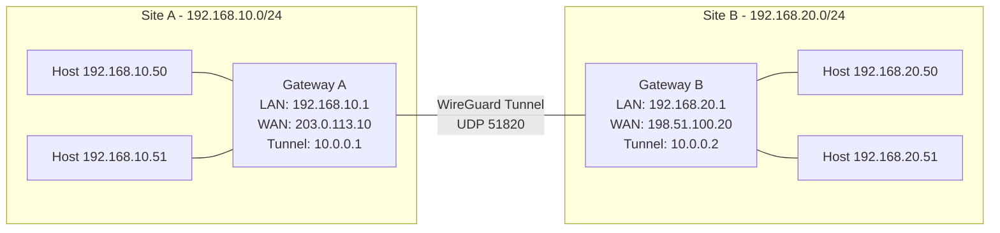
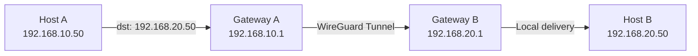

# How to Set Up Site-to-Site VPN with WireGuard on RHEL 9

Author: [nawazdhandala](https://www.github.com/nawazdhandala)

Tags: RHEL, WireGuard, Site-to-Site VPN, Linux

Description: A complete guide to building a site-to-site VPN between two RHEL 9 gateways using WireGuard, connecting two remote LANs securely without client software on individual machines.

---

A site-to-site VPN connects two entire networks through a tunnel between their gateways. Every machine on Site A can reach machines on Site B transparently, without needing VPN client software. WireGuard makes this setup surprisingly clean on RHEL 9.

## Architecture Overview



## Prerequisites

On both RHEL 9 gateways:
- Root or sudo access
- Public IP address (or at least one side needs to be reachable)
- WireGuard tools installed
- Two non-overlapping LAN subnets

## Step 1: Install WireGuard on Both Gateways

Run this on both Site A and Site B gateways.

```bash
# Install WireGuard tools
sudo dnf install -y epel-release
sudo dnf install -y wireguard-tools
```

## Step 2: Generate Keys on Both Sides

On Gateway A:

```bash
# Generate keys for Gateway A
sudo mkdir -p /etc/wireguard && sudo chmod 700 /etc/wireguard
wg genkey | sudo tee /etc/wireguard/private.key | wg pubkey | sudo tee /etc/wireguard/public.key
sudo chmod 600 /etc/wireguard/private.key
```

On Gateway B:

```bash
# Generate keys for Gateway B
sudo mkdir -p /etc/wireguard && sudo chmod 700 /etc/wireguard
wg genkey | sudo tee /etc/wireguard/private.key | wg pubkey | sudo tee /etc/wireguard/public.key
sudo chmod 600 /etc/wireguard/private.key
```

Exchange public keys between the two gateways securely (via SSH, encrypted email, etc.).

## Step 3: Configure Gateway A

```bash
# Read Gateway A's private key
GW_A_PRIVKEY=$(sudo cat /etc/wireguard/private.key)

# Create the WireGuard config for Gateway A
sudo tee /etc/wireguard/wg0.conf > /dev/null << EOF
[Interface]
PrivateKey = ${GW_A_PRIVKEY}
Address = 10.0.0.1/30
ListenPort = 51820

[Peer]
# Gateway B's public key
PublicKey = GATEWAY_B_PUBLIC_KEY_HERE
# Gateway B's public IP
Endpoint = 198.51.100.20:51820
# Route Site B's LAN and the tunnel subnet
AllowedIPs = 10.0.0.2/32, 192.168.20.0/24
PersistentKeepalive = 25
EOF

sudo chmod 600 /etc/wireguard/wg0.conf
```

## Step 4: Configure Gateway B

```bash
# Read Gateway B's private key
GW_B_PRIVKEY=$(sudo cat /etc/wireguard/private.key)

# Create the WireGuard config for Gateway B
sudo tee /etc/wireguard/wg0.conf > /dev/null << EOF
[Interface]
PrivateKey = ${GW_B_PRIVKEY}
Address = 10.0.0.2/30
ListenPort = 51820

[Peer]
# Gateway A's public key
PublicKey = GATEWAY_A_PUBLIC_KEY_HERE
# Gateway A's public IP
Endpoint = 203.0.113.10:51820
# Route Site A's LAN and the tunnel subnet
AllowedIPs = 10.0.0.1/32, 192.168.10.0/24
PersistentKeepalive = 25
EOF

sudo chmod 600 /etc/wireguard/wg0.conf
```

## Step 5: Enable IP Forwarding on Both Gateways

Both gateways need to forward packets between their LAN and the tunnel.

```bash
# Enable forwarding immediately and persistently
sudo sysctl -w net.ipv4.ip_forward=1
echo "net.ipv4.ip_forward = 1" | sudo tee /etc/sysctl.d/99-wireguard-forward.conf
```

## Step 6: Configure Firewall on Both Gateways

```bash
# Allow WireGuard port
sudo firewall-cmd --permanent --add-port=51820/udp

# Allow forwarding between the LAN interface and WireGuard
sudo firewall-cmd --permanent --add-interface=wg0 --zone=trusted

# Reload
sudo firewall-cmd --reload
```

## Step 7: Bring Up the Tunnel on Both Sides

```bash
# Start WireGuard
sudo wg-quick up wg0

# Enable on boot
sudo systemctl enable wg-quick@wg0
```

## Step 8: Verify the Tunnel

From Gateway A:

```bash
# Check WireGuard status
sudo wg show

# Ping Gateway B's tunnel address
ping -c 4 10.0.0.2

# Ping a host on Site B's LAN
ping -c 4 192.168.20.50
```

From Gateway B:

```bash
# Ping Gateway A's tunnel address
ping -c 4 10.0.0.1

# Ping a host on Site A's LAN
ping -c 4 192.168.10.50
```

## Step 9: Configure LAN Hosts to Use the Tunnel

Hosts on each LAN need to know how to reach the remote network. There are two approaches.

**Option 1: Static routes on each host**

On a host at Site A (192.168.10.50):

```bash
# Add a route to Site B's network via the gateway
sudo ip route add 192.168.20.0/24 via 192.168.10.1
```

**Option 2: Add the route on the gateway's DHCP server**

If your DHCP server supports it, push the route to clients via DHCP option 121 (classless static routes). This is the better approach for production.

## Routing Overview



## Troubleshooting

**Handshake not completing:**

```bash
# Check that both sides can reach each other on UDP 51820
# From Gateway A:
ss -ulnp | grep 51820

# Verify public keys match
sudo wg show wg0
```

**Tunnel up but LAN hosts can't reach the remote network:**

```bash
# Check IP forwarding
sysctl net.ipv4.ip_forward

# Check that wg0 is in the trusted zone
sudo firewall-cmd --get-active-zones

# Verify AllowedIPs includes the remote LAN subnet
sudo wg show wg0 allowed-ips

# Check routing on the LAN host
ip route show
```

**Asymmetric routing issues:**

Make sure both gateways have the peer's LAN subnet in `AllowedIPs`. If Gateway A's config doesn't include `192.168.20.0/24` in AllowedIPs for the Gateway B peer, return traffic won't be routed through the tunnel.

## Adding More Sites

To connect a third site, add a new `[Peer]` section on each gateway that needs to reach it. In a hub-and-spoke model, only the hub needs peers for all sites. In a full mesh, every gateway needs a peer entry for every other gateway.

## Wrapping Up

Site-to-site VPN with WireGuard on RHEL 9 is one of those setups that, once running, you barely think about. The configuration is minimal, the performance is excellent, and it just works. The key things to get right are: non-overlapping subnets, correct AllowedIPs that include the remote LAN, IP forwarding enabled, and proper firewall rules on both gateways.
