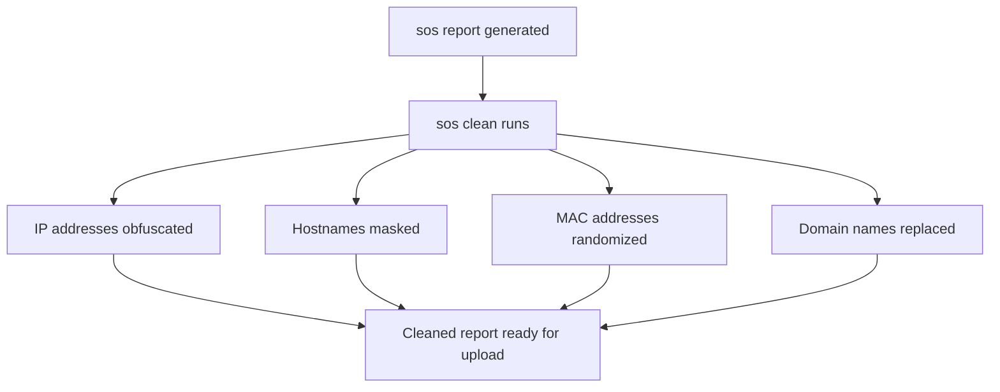

# How to Use the sosreport Tool for Red Hat Support Cases on RHEL

Author: [nawazdhandala](https://www.github.com/nawazdhandala)

Tags: RHEL, sosreport, Red Hat Support, Troubleshooting, Linux

Description: Learn how to use the sos report tool on RHEL to collect system diagnostic data for Red Hat support cases, including plugin selection, sensitive data filtering, and uploading to Red Hat.

---

## What Is sosreport?

When you open a support case with Red Hat, one of the first things they will ask for is an sosreport. It is a diagnostic data collection tool that gathers system configuration, logs, hardware info, and the state of running services into a compressed archive. Think of it as a snapshot of your system's health that support engineers can analyze without needing SSH access to your box.

I have worked with Red Hat support on dozens of cases over the years, and having a good sosreport ready before you even open the ticket saves a lot of back-and-forth.

## Installing sos

On RHEL, the sos package should be installed by default. If it is not, install it.

```bash
# Install the sos package
sudo dnf install sos -y

# Verify the installation
rpm -q sos
```

Note that the command changed from `sosreport` (the old name) to `sos report` (with a space) in newer versions. On RHEL, both work, but `sos report` is the current syntax.

## Running a Basic sos report

The simplest invocation collects everything using default plugins.

```bash
# Run a standard sos report
sudo sos report
```

The tool will prompt you with some questions:

1. Your first and last name (optional but helps Red Hat match it to a case)
2. The case ID (if you already have a support case open)

After answering, it collects data, which takes a few minutes depending on your system. The output is saved as a compressed tarball.

```
Your sosreport has been generated and saved in:
    /var/tmp/sosreport-hostname-2026-03-04-abc1234.tar.xz

Size   23.45MB
Owner  root

The checksum is: a1b2c3d4e5f6...

Please send this file to your support representative.
```

## Non-Interactive Mode

For scripting or when you want to skip the prompts, use the batch flag.

```bash
# Run without interactive prompts
sudo sos report --batch

# Include a case ID directly
sudo sos report --batch --case-id=03456789

# Set a custom temporary directory (useful if /var/tmp is small)
sudo sos report --batch --tmp-dir=/opt/tmp
```

## Understanding Plugins

The sos report tool is modular. It uses plugins to collect data from different subsystems. Each plugin gathers information about a specific area like networking, storage, systemd, or a specific application.

```bash
# List all available plugins
sudo sos report --list-plugins

# List only enabled plugins
sudo sos report --list-plugins | grep -E "^\s+\w+" | head -30
```

### Running Specific Plugins Only

If you know what area the problem is in, you can run only the relevant plugins. This makes the report smaller and faster to generate.

```bash
# Only collect networking information
sudo sos report --batch --only-plugins=networking

# Collect only kernel and storage data
sudo sos report --batch --only-plugins=kernel,block,devicemapper,lvm2

# Collect data related to a specific service
sudo sos report --batch --only-plugins=systemd,logs,networking
```

### Enabling Additional Plugins

Some plugins are disabled by default. You can enable them explicitly.

```bash
# Enable a specific plugin that is not on by default
sudo sos report --batch --enable-plugins=nfs,iscsi

# Combine with only-plugins for targeted collection
sudo sos report --batch --only-plugins=networking --enable-plugins=ovs
```

### Disabling Plugins

If a plugin is causing problems or collecting data you do not want to include, disable it.

```bash
# Skip the yum and rpm plugins (can be slow on systems with many packages)
sudo sos report --batch --skip-plugins=yum,rpm

# Skip plugins that collect sensitive data
sudo sos report --batch --skip-plugins=passwords
```

## Plugin Options

Some plugins accept additional options for more control over what gets collected.

```bash
# List options for a specific plugin
sudo sos report --list-plugins | grep -A5 "networking"

# Pass options to a plugin
sudo sos report --batch --plugin-option=logs.all_logs=true

# Increase the log size limit (default is 25MB per log)
sudo sos report --batch --plugin-option=logs.log_size=100
```

## Filtering Sensitive Data

Production systems often contain sensitive information - passwords in config files, API keys, database credentials. The sos tool has built-in mechanisms to handle this.

```bash
# Run with the clean/mask option to obfuscate sensitive data
sudo sos report --batch --clean

# Or use the dedicated clean command on an existing report
sudo sos clean /var/tmp/sosreport-hostname-2026-03-04-abc1234.tar.xz
```

The `--clean` option obfuscates:
- IP addresses (replaced with consistent dummy addresses)
- Hostnames
- MAC addresses
- Domain names



For additional sensitive data that sos does not automatically catch, review the report before sending it.

```bash
# Extract the report to review contents before sending
mkdir /tmp/sos-review
cd /tmp/sos-review
tar xf /var/tmp/sosreport-hostname-2026-03-04-abc1234.tar.xz

# Search for potential passwords or keys in the extracted data
grep -ri "password" /tmp/sos-review/ --include="*.conf" | head -20
grep -ri "api_key\|secret\|token" /tmp/sos-review/ --include="*.conf" | head -20
```

## Uploading to Red Hat

Once you have the report, there are several ways to get it to Red Hat.

### Using the Red Hat Customer Portal

The most common method is uploading through the support case on the customer portal at `access.redhat.com`. Navigate to your case and use the file attachment option.

### Using redhat-support-tool

RHEL provides a command-line tool for interacting with support cases.

```bash
# Install the support tool
sudo dnf install redhat-support-tool -y

# Upload the sosreport to an existing case
redhat-support-tool addattachment -c 03456789 /var/tmp/sosreport-hostname-2026-03-04-abc1234.tar.xz
```

### Using sos report with Direct Upload

The sos tool can upload directly to Red Hat's SFTP server.

```bash
# Generate and upload in one step
sudo sos report --batch --case-id=03456789 --upload

# Upload an existing report
sudo sos report --upload /var/tmp/sosreport-hostname-2026-03-04-abc1234.tar.xz
```

## Collecting from Multiple Systems

For cluster issues or problems that span multiple servers, `sos collect` gathers reports from multiple nodes at once.

```bash
# Collect from multiple servers via SSH
sudo sos collect --nodes=server1,server2,server3 --batch

# Collect from all nodes in a cluster
sudo sos collect --cluster-type=kubernetes --batch

# Specify SSH credentials
sudo sos collect --nodes=server1,server2 --ssh-user=admin --batch
```

The output is a single archive containing individual reports from each node, making it easy to send everything to Red Hat in one file.

## Controlling Report Size

On systems with large log files or many packages, the sosreport can get very large. Here are ways to control the size.

```bash
# Limit log file collection size (per file, in MB)
sudo sos report --batch --plugin-option=logs.log_size=10

# Skip large, less-useful plugins
sudo sos report --batch --skip-plugins=rpm,yum,dnf

# Set overall size limit with compression
sudo sos report --batch --compression-type=xz
```

## What Gets Collected?

Here is a rough overview of what a default sos report includes:

- System information: hostname, kernel version, hardware details
- Installed packages list
- Network configuration: interfaces, routes, firewall rules, DNS
- Storage configuration: disk layout, LVM, mount points, fstab
- Service status: systemd unit states, failed services
- Log files: /var/log/messages, journal, audit log, application logs
- Kernel parameters: sysctl settings, loaded modules
- SELinux: status, booleans, denials
- Authentication: PAM configuration, SSSD, LDAP
- Hardware: dmidecode, lspci, lsblk

It does NOT collect:
- User data or application databases
- File contents from user home directories (by default)
- Core dumps (unless specifically configured)

## Practical Tips

**Generate the report before opening a case.** This saves time in the support process. Red Hat engineers can start analyzing while you describe the issue.

**Include the case ID.** When you specify `--case-id`, it gets embedded in the report metadata, making it easier for Red Hat to match the report to your case.

**Run it during or right after the issue.** System state changes over time. A sosreport from three days after the problem might not contain the relevant log entries or error conditions.

**Check the report size.** If the report is over 250MB, consider using `--skip-plugins` to reduce it, or use the portal's file upload which handles large files better than email.

```bash
# Check the report size before uploading
ls -lh /var/tmp/sosreport-*.tar.xz
```

## Summary

The sos report tool is indispensable when working with Red Hat support on RHEL. It collects comprehensive system diagnostic data in a standardized format that support engineers know how to analyze. Use plugins to target specific subsystems, clean sensitive data before uploading, and always have a report ready when you open a case. It is one of those tools that turns a multi-day support interaction into something that gets resolved much faster.
