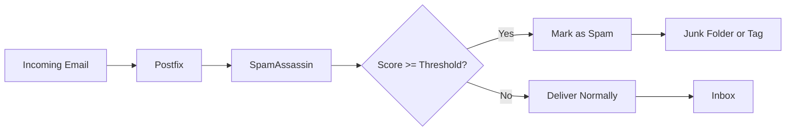

# How to Set Up SpamAssassin for Email Filtering on RHEL 9

Author: [nawazdhandala](https://www.github.com/nawazdhandala)

Tags: RHEL, SpamAssassin, Email, Anti-Spam, Linux

Description: Install and configure SpamAssassin with Postfix on RHEL 9 to automatically score and filter incoming spam email.

---

## What SpamAssassin Does

SpamAssassin is a server-side spam filter that examines incoming email and assigns a spam score based on hundreds of rules. Each rule tests for things like suspicious headers, known spam phrases, Bayesian analysis, DNS blocklists, and more. If the total score exceeds a threshold, the message is flagged as spam. It does not delete mail by default - it marks it, and you decide what to do with flagged messages.

## How It Works



## Prerequisites

- RHEL 9 with Postfix installed and running
- Sufficient RAM (SpamAssassin uses about 50-100 MB per spamd child process)

## Installing SpamAssassin

```bash
# Install SpamAssassin
sudo dnf install -y spamassassin
```

## Basic Configuration

The main configuration file is `/etc/mail/spamassassin/local.cf`. Edit it:

```bash
sudo vi /etc/mail/spamassassin/local.cf
```

```
# Required score to be classified as spam (default is 5.0)
required_score 5.0

# Rewrite the subject line for spam messages
rewrite_header Subject [SPAM]

# Report spam score in headers
report_safe 0

# Enable Bayes learning
use_bayes 1
bayes_auto_learn 1
bayes_auto_learn_threshold_spam 6.0
bayes_auto_learn_threshold_nonspam 0.1

# Skip RBL checks if you handle them in Postfix already
# skip_rbl_checks 1

# Trusted networks (do not scan internal mail)
trusted_networks 127.0.0.0/8 10.0.0.0/8 172.16.0.0/12 192.168.0.0/16

# Whitelist specific senders
# whitelist_from boss@example.com
# whitelist_from *@trusted-partner.com

# Blacklist specific senders
# blacklist_from spammer@bad-domain.com
```

## Integrating with Postfix

There are two main ways to connect SpamAssassin with Postfix: using spamass-milter or using a content filter.

### Method 1: Using spamass-milter (Recommended)

```bash
# Install the milter interface
sudo dnf install -y spamass-milter
```

Configure the milter. Edit `/etc/sysconfig/spamass-milter`:

```
# Pass messages to spamc for scanning
EXTRA_FLAGS="-m -r 15"
```

The `-m` flag tells the milter to modify messages (add headers), and `-r 15` rejects messages with a score above 15.

Add the milter to Postfix. Edit `/etc/postfix/main.cf`:

```
# SpamAssassin milter
smtpd_milters = unix:/run/spamass-milter/postfix/sock
non_smtpd_milters = unix:/run/spamass-milter/postfix/sock
milter_default_action = accept
```

Start the services:

```bash
# Start SpamAssassin daemon
sudo systemctl enable --now spamassassin

# Start the milter
sudo systemctl enable --now spamass-milter
```

### Method 2: Content Filter

Add to `/etc/postfix/master.cf`:

```
# SpamAssassin content filter
smtp      inet  n       -       n       -       -       smtpd
    -o content_filter=spamassassin

spamassassin unix -     n       n       -       -       pipe
    user=spamd argv=/usr/bin/spamc -f -e /usr/sbin/sendmail -oi -f ${sender} ${recipient}
```

Start SpamAssassin:

```bash
sudo systemctl enable --now spamassassin
```

## Updating SpamAssassin Rules

SpamAssassin rules need regular updates to catch new spam patterns:

```bash
# Update rules manually
sudo sa-update

# Check if updates are available
sudo sa-update --checkonly
```

Set up automatic daily updates:

```bash
# Enable the automatic update timer
sudo systemctl enable --now spamassassin-update.timer
```

Or add a cron job:

```
# Update SpamAssassin rules daily at 3 AM
0 3 * * * /usr/bin/sa-update && systemctl reload spamassassin
```

## Training the Bayesian Filter

SpamAssassin's Bayesian filter learns from examples. Train it with known spam and ham (good mail):

```bash
# Train with known spam messages
sudo sa-learn --spam /path/to/spam/folder/

# Train with known good messages
sudo sa-learn --ham /path/to/ham/folder/

# Check Bayes database statistics
sudo sa-learn --dump magic
```

For ongoing training, users can move messages to their Junk folder, and you can process those periodically:

```bash
# Learn from users' Junk folders
sudo sa-learn --spam /var/mail/vhosts/*/Junk/cur/
sudo sa-learn --ham /var/mail/vhosts/*/INBOX/cur/
```

## Testing SpamAssassin

### Test with a Sample Message

```bash
# Test with the GTUBE test string (guaranteed to trigger spam detection)
echo "XJS*C4JDBQADN1.NSBN3*2IDNEN*GTUBE-STANDARD-ANTI-UBE-TEST-EMAIL*C.34X" | spamc
```

### Test a Real Message

```bash
# Scan a saved message file
spamc < /tmp/test-message.eml

# Or use spamassassin directly for verbose output
spamassassin -t < /tmp/test-message.eml
```

### Check Headers on Delivered Mail

Look for SpamAssassin headers in delivered messages:

```
X-Spam-Status: No, score=-1.0 required=5.0 tests=ALL_TRUSTED,BAYES_00 autolearn=ham
X-Spam-Score: -1.0
```

## Performance Tuning

### Spamd Configuration

Edit `/etc/sysconfig/spamassassin`:

```
# Number of child processes
SPAMDOPTIONS="-d -c -m5 -H --max-conn-per-child=200"
```

- `-m5` - Maximum 5 child processes
- `--max-conn-per-child=200` - Recycle children after 200 connections to prevent memory leaks

### Skip Expensive Checks

If SpamAssassin is too slow, disable some checks in `local.cf`:

```
# Disable network-based checks for speed
skip_rbl_checks 1
dns_available no
```

## Custom Rules

Add custom rules to `/etc/mail/spamassassin/local.cf`:

```
# Custom rule: penalize mail with "lottery" in subject
header LOCAL_LOTTERY Subject =~ /lottery/i
score LOCAL_LOTTERY 3.0
describe LOCAL_LOTTERY Subject contains lottery

# Custom rule: trust mail from your domain
header LOCAL_INTERNAL From =~ /@example\.com$/
score LOCAL_INTERNAL -2.0
describe LOCAL_INTERNAL Mail from internal domain
```

## Monitoring

```bash
# Check SpamAssassin service status
sudo systemctl status spamassassin

# View spam processing logs
sudo grep "spamd" /var/log/maillog | tail -20

# Check how many messages were flagged
sudo grep "identified spam" /var/log/maillog | wc -l
```

## Wrapping Up

SpamAssassin does a solid job of catching spam when properly configured and trained. Start with the default rules and a score threshold of 5.0, then adjust based on false positives and false negatives. Feed it examples of spam and legitimate mail to improve the Bayesian filter over time. Combined with Postfix's built-in restrictions and RBL checks, you will block the vast majority of junk mail.
