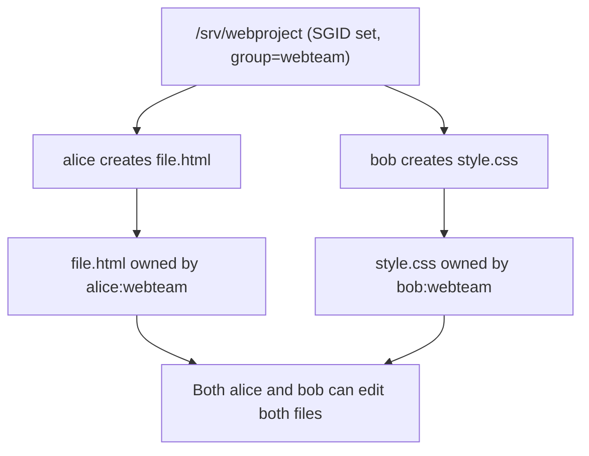

# How to Use Special Permissions (SUID, SGID, Sticky Bit) on RHEL

Author: [nawazdhandala](https://www.github.com/nawazdhandala)

Tags: RHEL, Permissions, SUID, SGID, Sticky Bit, Security, Linux

Description: A practical guide to understanding and using SUID, SGID, and the sticky bit on RHEL, covering both their legitimate uses and the security risks they introduce.

---

## Beyond the Basic rwx

Most Linux users know about read, write, and execute permissions. But there are three additional permission bits that change how files and directories behave: SUID (Set User ID), SGID (Set Group ID), and the sticky bit. These bits solve real problems, but they also introduce security risks if misused. Here is how they work on RHEL.

## SUID - Set User ID

When the SUID bit is set on an executable file, the program runs with the permissions of the file's owner, not the user who launched it.

The classic example is the `passwd` command:

```bash
# Check the permissions on passwd - notice the 's' in the owner execute position
ls -l /usr/bin/passwd
# -rwsr-xr-x. 1 root root 32656 ... /usr/bin/passwd
```

That `s` in place of the owner's `x` means SUID is set. When a regular user runs `passwd`, the process runs as root because the file is owned by root. This is necessary because `passwd` needs to write to `/etc/shadow`, which only root can modify.

### Setting SUID

```bash
# Set SUID using symbolic notation
sudo chmod u+s /path/to/binary

# Set SUID using octal notation (4 in the leading position)
sudo chmod 4755 /path/to/binary
```

### Removing SUID

```bash
# Remove SUID
sudo chmod u-s /path/to/binary
```

### When to Use SUID

Honestly, almost never. The programs that need SUID already have it set by their packages. If you find yourself setting SUID on something, there is probably a better way (capabilities, sudo rules, polkit). SUID programs are a major attack surface.

## SGID - Set Group ID

SGID behaves differently on files versus directories.

### SGID on Files

When set on an executable, the program runs with the permissions of the file's group.

```bash
# Check for SGID on a file - notice the 's' in the group execute position
ls -l /usr/bin/wall
# -r-xr-sr-x. 1 root tty 15344 ... /usr/bin/wall
```

The `wall` command has SGID set for the `tty` group, so it can write to all terminals.

### SGID on Directories

This is where SGID gets genuinely useful. When SGID is set on a directory, new files and subdirectories created inside it inherit the directory's group ownership instead of the creating user's primary group.

```bash
# Create a shared project directory
sudo mkdir /srv/project

# Set the group ownership
sudo chgrp developers /srv/project

# Set SGID on the directory
sudo chmod g+s /srv/project

# Verify - the 's' in the group execute position
ls -ld /srv/project
# drwxr-sr-x. 2 root developers 4096 ... /srv/project
```

Now when any member of the `developers` group creates a file in `/srv/project`, the file is automatically owned by the `developers` group:

```bash
# As user jsmith (member of developers group)
touch /srv/project/newfile.txt
ls -l /srv/project/newfile.txt
# -rw-r--r--. 1 jsmith developers 0 ... /srv/project/newfile.txt
```

Without SGID, the file would be owned by jsmith's primary group instead.

### Setting SGID

```bash
# Set SGID using symbolic notation
sudo chmod g+s /path/to/directory

# Set SGID using octal notation (2 in the leading position)
sudo chmod 2775 /path/to/directory
```

### A Complete Shared Directory Setup

Here is the full recipe for a shared project directory:

```bash
# Create the group
sudo groupadd webteam

# Add users to the group
sudo usermod -aG webteam alice
sudo usermod -aG webteam bob

# Create the shared directory
sudo mkdir -p /srv/webproject

# Set ownership
sudo chown root:webteam /srv/webproject

# Set permissions: owner rwx, group rwx with SGID, others nothing
sudo chmod 2770 /srv/webproject
```



## Sticky Bit

The sticky bit on a directory prevents users from deleting or renaming files they do not own, even if they have write permission on the directory.

The classic example is `/tmp`:

```bash
# Check /tmp permissions - notice the 't' at the end
ls -ld /tmp
# drwxrwxrwt. 18 root root 4096 ... /tmp
```

That `t` in the others execute position is the sticky bit. Everyone can create files in `/tmp`, but you can only delete your own files.

### Setting the Sticky Bit

```bash
# Set sticky bit using symbolic notation
sudo chmod +t /path/to/directory

# Set sticky bit using octal notation (1 in the leading position)
sudo chmod 1777 /path/to/directory
```

### Removing the Sticky Bit

```bash
# Remove the sticky bit
sudo chmod -t /path/to/directory
```

### When to Use the Sticky Bit

- Shared directories where multiple users create files but should not delete each other's work
- Temporary directories
- Drop-box style directories where users submit files

## Combining Special Permissions

You can combine all three special bits in the octal notation:

```bash
# SUID + SGID + Sticky bit = 7 in the leading position
# 4 = SUID, 2 = SGID, 1 = Sticky
sudo chmod 6770 /path/to/dir   # SUID + SGID
sudo chmod 3770 /path/to/dir   # SGID + Sticky
```

In practice, you will rarely combine SUID with directory permissions. The most common combination is SGID + sticky on shared directories.

## Identifying Special Permissions in ls Output

Here is how to read the permission string:

| Position | Normal | Special |
|----------|--------|---------|
| Owner execute | `x` | `s` (SUID + execute) or `S` (SUID, no execute) |
| Group execute | `x` | `s` (SGID + execute) or `S` (SGID, no execute) |
| Others execute | `x` | `t` (sticky + execute) or `T` (sticky, no execute) |

Capital `S` or `T` means the special bit is set but the underlying execute permission is not. This is usually a misconfiguration.

## Finding SUID and SGID Files (Security Auditing)

On any server, you should periodically check for unexpected SUID/SGID files. An attacker who gains write access might plant a SUID binary for privilege escalation.

```bash
# Find all files with SUID set
sudo find / -perm -4000 -type f 2>/dev/null

# Find all files with SGID set
sudo find / -perm -2000 -type f 2>/dev/null

# Find files with either SUID or SGID set
sudo find / -perm /6000 -type f 2>/dev/null
```

Save a baseline and compare periodically:

```bash
# Create a baseline of SUID/SGID files
sudo find / -perm /6000 -type f 2>/dev/null | sort > /root/suid-sgid-baseline.txt

# Later, compare against the baseline
sudo find / -perm /6000 -type f 2>/dev/null | sort | diff /root/suid-sgid-baseline.txt -
```

Any new entries in the diff deserve investigation.

## SUID and SELinux

On RHEL, SELinux adds another layer of protection. Even if a file has SUID set, SELinux policies can prevent it from executing in an unintended context. This is one reason you should never disable SELinux - it limits the damage from misconfigured SUID binaries.

```bash
# Check the SELinux context of a SUID binary
ls -lZ /usr/bin/passwd
```

## Security Best Practices

1. **Never set SUID on shell scripts.** The kernel ignores SUID on scripts for security reasons, and workarounds are dangerous.

2. **Audit SUID files regularly.** Compare against a known-good baseline.

3. **Use capabilities instead of SUID when possible.** Linux capabilities let you grant specific privileges without full root access.

```bash
# Example: give a binary the ability to bind to privileged ports without SUID
sudo setcap 'cap_net_bind_service=+ep' /usr/local/bin/myapp
```

4. **Mount filesystems with nosuid when possible.** This prevents any SUID binaries on that filesystem from working.

```bash
# Mount with nosuid to block SUID execution
sudo mount -o nosuid /dev/sdb1 /mnt/data
```

Or in `/etc/fstab`:

```
/dev/sdb1  /mnt/data  xfs  defaults,nosuid  0 0
```

5. **Use SGID on shared directories instead of world-writable permissions.** SGID + proper group membership is much safer than `chmod 777`.

## Wrapping Up

SUID, SGID, and the sticky bit are old Unix features that still matter on RHEL. SGID on directories is genuinely useful for team collaboration. The sticky bit protects shared directories from accidental deletions. SUID is necessary for a handful of system binaries but should never be added to new files without a very good reason. Audit your SUID files regularly, use the `nosuid` mount option on data filesystems, and prefer capabilities over SUID when building new applications.
