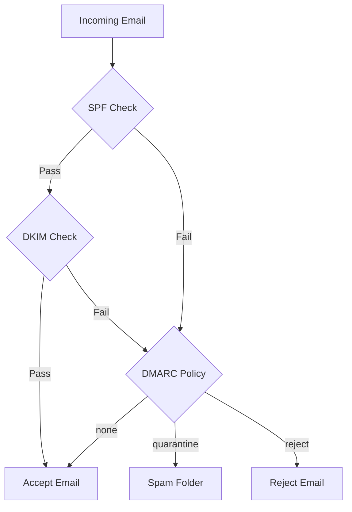

# How to Set Up SPF, DKIM, and DMARC with Postfix on RHEL

Author: [nawazdhandala](https://www.github.com/nawazdhandala)

Tags: RHEL, Postfix, SPF, DKIM, DMARC, Email Security, Linux

Description: Implement SPF, DKIM, and DMARC email authentication mechanisms with Postfix on RHEL to improve deliverability and prevent spoofing.

---

## Why You Need All Three

SPF, DKIM, and DMARC work together as a layered defense against email spoofing. Without them, anyone can send email pretending to be from your domain. Major email providers like Gmail and Outlook now require these for reliable delivery. If your domain lacks these records, expect your mail to land in spam or get rejected outright.

Here is what each one does:

- **SPF** - Tells receiving servers which IP addresses are allowed to send mail for your domain
- **DKIM** - Adds a cryptographic signature to each outgoing message, proving it came from your server
- **DMARC** - Ties SPF and DKIM together with a policy that tells receivers what to do when checks fail

## Authentication Flow



## Part 1: Setting Up SPF

SPF is purely a DNS record. No server-side configuration needed for outgoing mail.

### Create the SPF DNS Record

Add a TXT record to your domain's DNS:

```
example.com.  IN  TXT  "v=spf1 mx a ip4:203.0.113.10 -all"
```

This record says:
- `mx` - Allow servers listed in MX records
- `a` - Allow the IP from the domain's A record
- `ip4:203.0.113.10` - Explicitly allow this IP
- `-all` - Reject everything else (hard fail)

Use `~all` (soft fail) during testing, then switch to `-all` when you are confident.

### Verify SPF with Incoming Mail

To check SPF on incoming mail, install pypolicyd-spf:

```bash
# Install SPF policy daemon
sudo dnf install -y pypolicyd-spf
```

Add to `/etc/postfix/main.cf`:

```
# SPF checking for incoming mail
policy-spf_time_limit = 3600s
smtpd_recipient_restrictions =
    permit_mynetworks,
    permit_sasl_authenticated,
    reject_unauth_destination,
    check_policy_service unix:private/policy-spf
```

Add to `/etc/postfix/master.cf`:

```
policy-spf  unix  -       n       n       -       0       spawn
    user=nobody argv=/usr/libexec/postfix/policyd-spf
```

## Part 2: Setting Up DKIM

DKIM requires both DNS records and server-side signing software.

### Install OpenDKIM

```bash
# Install OpenDKIM
sudo dnf install -y opendkim opendkim-tools
```

### Generate DKIM Keys

```bash
# Create the key directory
sudo mkdir -p /etc/opendkim/keys/example.com

# Generate a 2048-bit DKIM key pair
sudo opendkim-genkey -b 2048 -d example.com -D /etc/opendkim/keys/example.com -s default -v

# Set ownership
sudo chown -R opendkim:opendkim /etc/opendkim/keys/
```

This creates two files:
- `default.private` - The private key (stays on the server)
- `default.txt` - The DNS record to publish

### Configure OpenDKIM

Edit `/etc/opendkim.conf`:

```
# Logging
Syslog          yes
SyslogSuccess   yes
LogWhy          yes

# Signing and verification
Mode            sv
Canonicalization relaxed/simple
Domain          example.com
Selector        default
KeyFile         /etc/opendkim/keys/example.com/default.private

# Socket for Postfix communication
Socket          inet:8891@localhost

# Trusted hosts that we sign for
ExternalIgnoreList  refile:/etc/opendkim/TrustedHosts
InternalHosts       refile:/etc/opendkim/TrustedHosts

# Key and signing tables for multiple domains
KeyTable        refile:/etc/opendkim/KeyTable
SigningTable     refile:/etc/opendkim/SigningTable
```

### Create Supporting Files

Create `/etc/opendkim/TrustedHosts`:

```
127.0.0.1
localhost
::1
*.example.com
```

Create `/etc/opendkim/KeyTable`:

```
default._domainkey.example.com example.com:default:/etc/opendkim/keys/example.com/default.private
```

Create `/etc/opendkim/SigningTable`:

```
*@example.com default._domainkey.example.com
```

### Publish the DKIM DNS Record

View the DNS record:

```bash
# Display the DKIM DNS record
sudo cat /etc/opendkim/keys/example.com/default.txt
```

Add this as a TXT record in DNS for `default._domainkey.example.com`.

### Integrate OpenDKIM with Postfix

Add to `/etc/postfix/main.cf`:

```
# DKIM signing via OpenDKIM
milter_default_action = accept
milter_protocol = 6
smtpd_milters = inet:localhost:8891
non_smtpd_milters = inet:localhost:8891
```

### Start OpenDKIM

```bash
# Enable and start opendkim
sudo systemctl enable --now opendkim
```

## Part 3: Setting Up DMARC

### Create the DMARC DNS Record

Add a TXT record for `_dmarc.example.com`:

```
_dmarc.example.com.  IN  TXT  "v=DMARC1; p=none; rua=mailto:dmarc-reports@example.com; ruf=mailto:dmarc-forensic@example.com; pct=100"
```

Start with `p=none` to monitor without affecting delivery. The parameters:
- `p=none` - Take no action (monitor only)
- `rua` - Address for aggregate reports
- `ruf` - Address for forensic reports
- `pct=100` - Apply to 100% of messages

### DMARC Policy Progression

Move through these stages:

1. `p=none` - Monitor for a few weeks, review reports
2. `p=quarantine` - Failed messages go to spam
3. `p=reject` - Failed messages are rejected

### Install OpenDMARC for Verification

To verify DMARC on incoming mail:

```bash
# Install OpenDMARC
sudo dnf install -y opendmarc
```

Edit `/etc/opendmarc.conf`:

```
AuthservID          mail.example.com
FailureReports      false
Socket              inet:8893@localhost
SPFSelfValidate     true
SPFIgnoreResults    true
```

Add to `/etc/postfix/main.cf` (append to existing milters):

```
smtpd_milters = inet:localhost:8891, inet:localhost:8893
non_smtpd_milters = inet:localhost:8891, inet:localhost:8893
```

Start OpenDMARC:

```bash
sudo systemctl enable --now opendmarc
```

## Testing Everything

### Test SPF

```bash
# Query your SPF record
dig TXT example.com +short
```

### Test DKIM

```bash
# Verify the DKIM DNS record
dig TXT default._domainkey.example.com +short

# Test the key
sudo opendkim-testkey -d example.com -s default -vvv
```

### Test DMARC

```bash
# Query your DMARC record
dig TXT _dmarc.example.com +short
```

### Send a Test Email

Send a test to a Gmail address and check the headers. Look for:

```
Authentication-Results: mx.google.com;
    dkim=pass header.d=example.com;
    spf=pass (google.com: domain of test@example.com designates 203.0.113.10 as permitted sender);
    dmarc=pass (p=NONE)
```

## Reload Everything

```bash
# Reload all services after configuration changes
sudo systemctl reload postfix
sudo systemctl restart opendkim
sudo systemctl restart opendmarc
```

## Troubleshooting

**DKIM signature not appearing in headers:**

Check that OpenDKIM is running and the milter is connected:

```bash
sudo systemctl status opendkim
sudo ss -tlnp | grep 8891
```

**SPF failing for legitimate mail:**

Your SPF record might be missing an authorized IP. Check what IP the mail originates from and add it.

**DMARC reports showing failures:**

Review the aggregate reports. Common causes include forwarding services and mailing lists that modify the From header.

## Wrapping Up

SPF, DKIM, and DMARC are table stakes for running a mail server today. Set them up in that order, start DMARC in monitor mode, review the reports, and gradually tighten the policy. Your deliverability will improve and your domain will be protected from spoofing.
