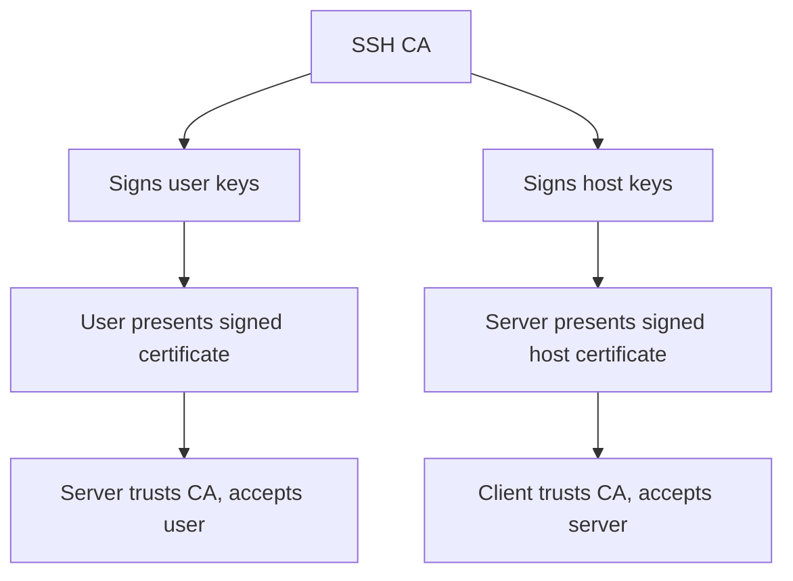

# How to Set Up SSH Certificate-Based Authentication on RHEL

Author: [nawazdhandala](https://www.github.com/nawazdhandala)

Tags: RHEL, SSH, Certificates, Authentication, Linux

Description: Configure SSH certificate-based authentication on RHEL using a certificate authority to sign user and host keys, eliminating the need to distribute authorized_keys files.

---

Managing authorized_keys files across hundreds of servers is a nightmare. SSH certificates solve this by introducing a certificate authority (CA) that signs user keys. Servers trust the CA, and any key signed by that CA is automatically accepted. No more distributing public keys to every server.

## How SSH Certificates Work



Instead of checking authorized_keys, the server verifies that:
1. The user's key was signed by a trusted CA.
2. The certificate has not expired.
3. The user's principal (username) is allowed.

## Setting Up the Certificate Authority

Pick a secure machine to act as your CA. This could be a dedicated box or your existing secrets management system.

### Generate the CA key pair

```bash
# Generate the user CA key
ssh-keygen -t ed25519 -f /etc/ssh/ca/user_ca -C "User CA"

# Generate the host CA key
ssh-keygen -t ed25519 -f /etc/ssh/ca/host_ca -C "Host CA"
```

Protect these keys carefully. Anyone with the CA private key can grant SSH access to your entire infrastructure.

```bash
sudo mkdir -p /etc/ssh/ca
sudo chmod 700 /etc/ssh/ca
```

## Signing User Keys

When a user needs SSH access, they generate their key pair normally, then submit the public key to the CA for signing.

### Sign a user's public key

```bash
# Sign the key with the user CA, granting access as "jsmith"
ssh-keygen -s /etc/ssh/ca/user_ca \
    -I "jsmith-workstation" \
    -n jsmith \
    -V +52w \
    /home/jsmith/.ssh/id_ed25519.pub
```

Options explained:
- `-s` - Path to the CA private key
- `-I` - Certificate identity (for logging)
- `-n` - Principals (usernames) this certificate is valid for
- `-V +52w` - Valid for 52 weeks

This creates `/home/jsmith/.ssh/id_ed25519-cert.pub`.

### View the certificate details

```bash
ssh-keygen -L -f /home/jsmith/.ssh/id_ed25519-cert.pub
```

## Configuring Servers to Trust the CA

Copy the user CA public key to each server:

```bash
sudo cp user_ca.pub /etc/ssh/user_ca.pub
```

Configure sshd to trust it:

```bash
sudo vi /etc/ssh/sshd_config.d/30-certificates.conf
```

```bash
# Trust user certificates signed by this CA
TrustedUserCAKeys /etc/ssh/user_ca.pub
```

```bash
sudo sshd -t && sudo systemctl restart sshd
```

Now any user with a certificate signed by this CA can log in, without needing an entry in authorized_keys.

## Signing Host Keys

Host certificates let clients verify that they are connecting to a legitimate server, eliminating "unknown host" warnings.

### Sign the server's host key

```bash
# On the CA, sign the server's public host key
ssh-keygen -s /etc/ssh/ca/host_ca \
    -I "server01.example.com" \
    -h \
    -n server01.example.com,server01,10.0.1.10 \
    -V +52w \
    /etc/ssh/ssh_host_ed25519_key.pub
```

The `-h` flag indicates this is a host certificate.

### Configure sshd to present the host certificate

```bash
sudo vi /etc/ssh/sshd_config.d/30-certificates.conf
```

Add:

```bash
# Present this host certificate to clients
HostCertificate /etc/ssh/ssh_host_ed25519_key-cert.pub
```

### Configure clients to trust the host CA

On each client, add to the known_hosts file:

```bash
echo "@cert-authority *.example.com $(cat host_ca.pub)" >> ~/.ssh/known_hosts
```

Now clients will automatically trust any server whose host key was signed by the CA.

## Restricting Certificate Access

### Limit which principals a user can use

```bash
# Allow this certificate only for the "jsmith" and "deploy" users
ssh-keygen -s /etc/ssh/ca/user_ca \
    -I "jsmith-cert" \
    -n jsmith,deploy \
    -V +30d \
    /home/jsmith/.ssh/id_ed25519.pub
```

### Map principals to local usernames

Create an authorized principals file:

```bash
sudo vi /etc/ssh/auth_principals/jsmith
```

```bash
jsmith
developers
```

Configure sshd:

```bash
AuthorizedPrincipalsFile /etc/ssh/auth_principals/%u
```

Now jsmith can log in with a certificate that has either the "jsmith" or "developers" principal.

### Short-lived certificates

For maximum security, issue certificates with short lifetimes:

```bash
# Certificate valid for only 8 hours
ssh-keygen -s /etc/ssh/ca/user_ca \
    -I "jsmith-temp" \
    -n jsmith \
    -V +8h \
    /home/jsmith/.ssh/id_ed25519.pub
```

## Revoking Certificates

### Create a revocation list

```bash
# Revoke a specific certificate
ssh-keygen -k -f /etc/ssh/revoked_keys -s /etc/ssh/ca/user_ca /path/to/compromised-cert.pub
```

Configure sshd to check the revocation list:

```bash
RevokedKeys /etc/ssh/revoked_keys
```

## Testing

```bash
# Connect using the certificate
ssh -i ~/.ssh/id_ed25519 jsmith@server.example.com

# Verbose mode to see certificate authentication
ssh -vvv -i ~/.ssh/id_ed25519 jsmith@server.example.com 2>&1 | grep -i cert
```

## Wrapping Up

SSH certificates are the scalable way to manage SSH access. They eliminate the need to distribute authorized_keys files, support expiration and revocation, and make onboarding and offboarding straightforward. The trade-off is the operational overhead of running a CA and signing keys. For small environments, authorized_keys works fine. For anything beyond a dozen servers, certificates are worth the investment.
