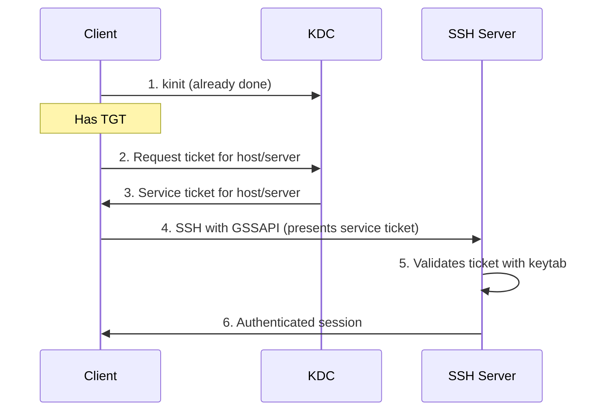

# How to Configure SSH with Kerberos GSSAPI Authentication on RHEL

Author: [nawazdhandala](https://www.github.com/nawazdhandala)

Tags: RHEL, SSH, Kerberos, GSSAPI, Linux

Description: A step-by-step guide to configuring SSH with Kerberos GSSAPI authentication on RHEL, enabling password-less SSH login using Kerberos tickets.

---

GSSAPI (Generic Security Services Application Programming Interface) authentication lets SSH use Kerberos tickets for authentication. Once you have a valid Kerberos TGT, you can SSH to any properly configured server without entering a password. This is Kerberos SSO in action, and it is one of the most practical benefits of running a Kerberos infrastructure.

## How SSH GSSAPI Authentication Works



## Prerequisites

- A working Kerberos realm (IdM, AD, or standalone KDC)
- The SSH server has a `host/` principal and keytab
- The SSH client has a valid TGT
- DNS forward and reverse resolution works for both client and server

## Step 1 - Configure the SSH Server

On the server you want to SSH into, enable GSSAPI authentication.

```bash
# Edit the SSH server configuration
sudo vi /etc/ssh/sshd_config
```

Enable these settings:

```bash
# Enable GSSAPI authentication
GSSAPIAuthentication yes

# Clean up credentials when the session ends
GSSAPICleanupCredentials yes

# Strict acceptor mode (uses the host keytab to verify)
GSSAPIStrictAcceptorCheck yes
```

Restart sshd:

```bash
sudo systemctl restart sshd
```

## Step 2 - Verify the Server Has a Host Keytab

The SSH server needs a keytab with the `host/` principal to validate incoming GSSAPI authentications.

```bash
# Check if the keytab exists and has the host principal
sudo klist -kt /etc/krb5.keytab

# Expected output includes something like:
# host/server.example.com@EXAMPLE.COM
```

If the keytab is missing or does not have the host principal:

For IdM-enrolled systems:

```bash
# The keytab is created during ipa-client-install
# If needed, re-retrieve it
sudo ipa-getkeytab -s idm.example.com -p host/server.example.com -k /etc/krb5.keytab
```

For standalone KDC:

```bash
# On the KDC, create the principal and export the keytab
sudo kadmin.local
kadmin.local: addprinc -randkey host/server.example.com@EXAMPLE.COM
kadmin.local: ktadd -k /tmp/server.keytab host/server.example.com@EXAMPLE.COM
kadmin.local: quit

# Copy the keytab to the server
scp /tmp/server.keytab root@server.example.com:/etc/krb5.keytab
```

Set proper permissions:

```bash
sudo chmod 600 /etc/krb5.keytab
sudo chown root:root /etc/krb5.keytab
```

## Step 3 - Configure the SSH Client

On the client side, enable GSSAPI authentication.

```bash
# Create or edit the SSH client configuration
sudo vi /etc/ssh/ssh_config.d/gssapi.conf
```

```bash
Host *.example.com
  GSSAPIAuthentication yes
  GSSAPIDelegateCredentials yes
```

`GSSAPIDelegateCredentials yes` forwards your Kerberos ticket to the remote server, allowing you to SSH from there to another server without authenticating again (ticket forwarding).

Alternatively, enable GSSAPI per-connection:

```bash
ssh -o GSSAPIAuthentication=yes -o GSSAPIDelegateCredentials=yes server.example.com
```

## Step 4 - Test GSSAPI Authentication

```bash
# Make sure you have a valid TGT
kinit jsmith@EXAMPLE.COM
klist

# SSH to the server - should not ask for a password
ssh server.example.com

# If it asks for a password, add -v for debugging
ssh -v server.example.com 2>&1 | grep -i gssapi
```

## Step 5 - Verify Ticket Forwarding

If you enabled credential delegation, check that tickets are forwarded to the remote host.

```bash
# SSH to the server
ssh server.example.com

# On the remote server, check for a forwarded ticket
klist

# You should see both the TGT and any service tickets
# This allows you to SSH further without re-authenticating
ssh another-server.example.com
```

## Step 6 - Configure SSH for Multiple Kerberos Realms

If you work with multiple Kerberos realms:

```bash
# ~/.ssh/config
Host *.example.com
  GSSAPIAuthentication yes
  GSSAPIDelegateCredentials yes

Host *.other.com
  GSSAPIAuthentication yes
  GSSAPIDelegateCredentials no
```

## Troubleshooting

### SSH Still Asks for Password

Work through these checks in order:

```bash
# 1. Verify you have a valid TGT
klist
# If no ticket, run: kinit jsmith@EXAMPLE.COM

# 2. Verify DNS forward resolution
host server.example.com

# 3. Verify DNS reverse resolution (critical for GSSAPI)
host <server-ip>

# 4. Check the SSH server has GSSAPI enabled
ssh -v server.example.com 2>&1 | grep "Offering GSSAPI"

# 5. Check the server has a valid keytab
# On the server:
sudo klist -kt /etc/krb5.keytab

# 6. Check for clock skew
timedatectl
```

### Reverse DNS Is Critical

GSSAPI authentication relies on reverse DNS to determine the correct service principal name. If reverse DNS does not match forward DNS, authentication fails silently.

```bash
# Check forward and reverse DNS consistency
host server.example.com
# Returns: 10.0.0.50

host 10.0.0.50
# Must return: server.example.com
```

If reverse DNS is not available or incorrect, you can disable reverse DNS lookups in `/etc/krb5.conf`:

```ini
[libdefaults]
  rdns = false
```

### Debug with SSH Verbose Output

```bash
# Use -vvv for maximum verbosity
ssh -vvv server.example.com 2>&1 | grep -i -E "gssapi|kerberos|auth"
```

Look for lines like:
- `Offering GSSAPI proposal` - client is trying GSSAPI
- `GSSAPI Error` - something went wrong
- `Accepted GSSAPI key exchange` - success

### Debug with Kerberos Tracing

```bash
# Enable Kerberos trace output
KRB5_TRACE=/dev/stderr ssh server.example.com
```

This shows every Kerberos operation, including ticket requests and validations.

### SELinux Issues

```bash
# Check for SELinux denials related to SSH and keytabs
sudo ausearch -m avc -ts recent | grep -i ssh
sudo ausearch -m avc -ts recent | grep -i krb5

# If SELinux is blocking access to the keytab
sudo restorecon -v /etc/krb5.keytab
```

## Security Considerations

- Only enable `GSSAPIDelegateCredentials` to trusted servers. Forwarded credentials can be used by anyone with root access on the remote server.
- Use `GSSAPIStrictAcceptorCheck yes` on servers to prevent principal name spoofing.
- Consider disabling password authentication on servers that only need GSSAPI access, reducing the attack surface.

```bash
# On servers that should only accept GSSAPI (be careful with this)
# In sshd_config:
# PasswordAuthentication no
# GSSAPIAuthentication yes
```

SSH with GSSAPI is the easiest way to get password-less, SSO-enabled remote access across your infrastructure. The configuration is minimal, and once DNS and keytabs are set up correctly, it works transparently for every user with a valid Kerberos ticket.
