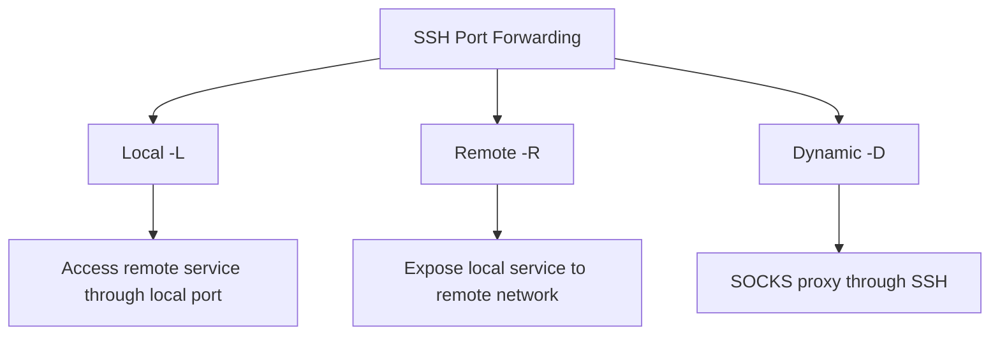

# How to Configure SSH Tunneling and Port Forwarding on RHEL

Author: [nawazdhandala](https://www.github.com/nawazdhandala)

Tags: RHEL, SSH, Tunneling, Port Forwarding, Linux

Description: Set up SSH local, remote, and dynamic port forwarding on RHEL to securely access services behind firewalls and encrypt network traffic.

---

SSH tunneling lets you forward network traffic through an encrypted SSH connection. Need to access a database that only listens on localhost? Want to reach a web admin panel behind a firewall? SSH port forwarding gets you there without opening additional firewall ports or setting up a VPN.

## Types of SSH Port Forwarding



## Local Port Forwarding (-L)

Local forwarding makes a remote service available on your local machine. This is the most common type.

### Access a remote database through SSH

```bash
# Forward local port 5432 to the remote PostgreSQL on db.internal:5432
ssh -L 5432:db.internal:5432 admin@bastion.example.com
```

Now connect to `localhost:5432` on your workstation, and the traffic goes through the SSH tunnel to `db.internal:5432`.

### Access a remote web admin panel

```bash
# Forward local port 8080 to a web panel on the remote server
ssh -L 8080:localhost:9090 admin@server.example.com
```

Open `http://localhost:8080` in your browser to access the Cockpit panel running on port 9090 on the remote server.

### Forward to a different host on the remote network

```bash
# Access an internal service through the bastion
ssh -L 3306:mysql.internal:3306 admin@bastion.example.com
```

The bastion connects to `mysql.internal:3306` on your behalf.

### Run the tunnel in the background

```bash
# -N means no remote command, -f puts it in background
ssh -fNL 5432:db.internal:5432 admin@bastion.example.com
```

## Remote Port Forwarding (-R)

Remote forwarding exposes a local service to the remote network. Useful when someone on the remote side needs to access something on your local network.

### Expose a local web server to the remote machine

```bash
# Make local port 3000 available as port 8080 on the remote server
ssh -R 8080:localhost:3000 admin@server.example.com
```

Now someone on the remote server can access `localhost:8080` and reach your local web server on port 3000.

### Allow remote forwarding on the server

By default, remote forwarded ports only listen on localhost on the remote side. To bind to all interfaces:

```bash
sudo vi /etc/ssh/sshd_config.d/25-forwarding.conf
```

```
GatewayPorts yes
```

```bash
sudo sshd -t && sudo systemctl restart sshd
```

## Dynamic Port Forwarding (-D)

Dynamic forwarding creates a SOCKS proxy. Any application that supports SOCKS can route its traffic through the SSH tunnel.

```bash
# Create a SOCKS proxy on local port 1080
ssh -D 1080 admin@server.example.com
```

Configure your browser or application to use `localhost:1080` as a SOCKS5 proxy. All traffic will be routed through the SSH server.

### Background SOCKS proxy

```bash
ssh -fND 1080 admin@server.example.com
```

## Practical Examples

### Access Cockpit through a bastion

```bash
ssh -L 9090:target-server:9090 admin@bastion.example.com
# Open https://localhost:9090 in your browser
```

### Access a Redis instance in a private subnet

```bash
ssh -L 6379:redis.internal:6379 admin@bastion.example.com
redis-cli -h localhost -p 6379
```

### Chain tunnels through multiple hops

```bash
# First tunnel: workstation to bastion
ssh -L 2222:internal-server:22 admin@bastion.example.com

# Second tunnel: through the first tunnel to the internal server
ssh -L 5432:db.internal:5432 -p 2222 admin@localhost
```

Or use ProxyJump for a cleaner approach:

```bash
ssh -J admin@bastion.example.com -L 5432:db.internal:5432 admin@internal-server
```

## Server-Side SSH Configuration

### Control who can use tunneling

```bash
sudo vi /etc/ssh/sshd_config.d/25-forwarding.conf
```

```
# Allow TCP forwarding (default is yes)
AllowTcpForwarding yes

# Or restrict to local forwarding only
AllowTcpForwarding local

# Disable forwarding entirely
# AllowTcpForwarding no

# Allow remote port forwarding to bind to non-loopback addresses
# GatewayPorts no

# Allow stream-local (Unix socket) forwarding
AllowStreamLocalForwarding yes
```

### Restrict forwarding for specific users

```
# Disable tunneling for most users
AllowTcpForwarding no

# But allow it for the admin group
Match Group admins
    AllowTcpForwarding yes
```

## Managing Active Tunnels

### Find running SSH tunnels

```bash
# List SSH processes with port forwarding
ps aux | grep "ssh -[fNL]\|ssh -[fND]\|ssh -[fNR]"

# Check which ports are being forwarded
sudo ss -tlnp | grep ssh
```

### Close a background tunnel

```bash
# Find the PID
ps aux | grep "ssh -fN"

# Kill it
kill <PID>
```

## Wrapping Up

SSH tunneling is one of those tools every sysadmin should have in their back pocket. Local forwarding for reaching internal services, remote forwarding for exposing local services, and dynamic forwarding for a quick SOCKS proxy. It is simpler and more targeted than a full VPN. On the server side, control who can use tunneling with `AllowTcpForwarding` and `Match` blocks to prevent abuse.
