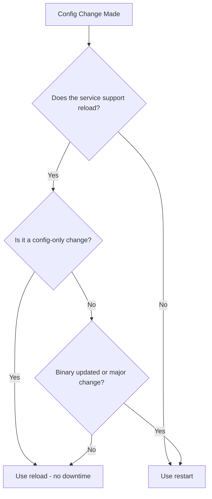

# How to Start, Stop, Restart, and Reload Services with systemctl on RHEL

Author: [nawazdhandala](https://www.github.com/nawazdhandala)

Tags: RHEL, systemctl, Services, systemd, Linux

Description: A practical guide to managing services with systemctl on RHEL, covering start, stop, restart, reload, and understanding when to use each one.

---

If you work with RHEL servers, `systemctl` is the command you probably type more than anything else. It is the main interface to systemd, which manages every service on the system. Whether you are starting a web server, stopping a database for maintenance, or reloading a config file without downtime, systemctl is the tool.

This guide covers the everyday operations you will use constantly, along with some nuances that trip people up.

---

## Starting a Service

Starting a service brings it up right now, in the current session. It does not affect whether the service starts at boot (that is a separate operation with `enable`).

```bash
# Start the httpd service
sudo systemctl start httpd
```

If the command returns with no output, it worked. systemctl is the quiet type - silence means success. If something goes wrong, you will get an error message.

To confirm it is actually running:

```bash
# Check if the service is running
sudo systemctl is-active httpd
```

This prints `active` or `inactive`, which is useful in scripts:

```bash
# Use is-active in a script to check before proceeding
if systemctl is-active --quiet httpd; then
    echo "httpd is running"
else
    echo "httpd is not running, starting it now"
    sudo systemctl start httpd
fi
```

---

## Stopping a Service

Stopping a service shuts it down immediately. Any active connections or processes managed by that service will be terminated.

```bash
# Stop the httpd service
sudo systemctl stop httpd
```

Again, no output means success. You can verify:

```bash
# Confirm the service is stopped
sudo systemctl is-active httpd
```

Keep in mind that stopping a service does not prevent it from starting at the next boot. If the service is enabled, it will come back after a reboot. To prevent that, you need to disable it as well.

---

## Restarting a Service

Restart stops the service and starts it again. This is the approach when you have made changes that require a full process restart, like updating a binary or changing settings that are only read at startup.

```bash
# Restart httpd - stops it, then starts it again
sudo systemctl restart httpd
```

There is a useful variant called `try-restart` that only restarts the service if it is currently running. If the service is stopped, it stays stopped:

```bash
# Only restart if the service is already running
sudo systemctl try-restart httpd
```

This is handy in update scripts where you do not want to accidentally start a service that was intentionally stopped.

---

## Reloading a Service

Reload tells the service to re-read its configuration files without stopping. The process keeps running, active connections stay alive, and the new configuration takes effect. Not every service supports reload.

```bash
# Reload httpd configuration without stopping the service
sudo systemctl reload httpd
```

If you are not sure whether a service supports reload, you can use `reload-or-restart`. This tries to reload first, and falls back to a full restart if reload is not supported:

```bash
# Reload if possible, restart if not
sudo systemctl reload-or-restart httpd
```

---

## Restart vs. Reload: When to Use Which

This is a common source of confusion, so here is the breakdown:



**Use reload when:**
- You changed a configuration file (like adding a new virtual host in Apache)
- You want zero downtime
- The service supports it

**Use restart when:**
- You updated the service binary
- The service does not support reload
- The configuration change requires a full restart (some services have settings that are only read at startup)
- You want a clean slate

To check if a service supports reload, look at its unit file:

```bash
# Check if the unit file defines an ExecReload command
systemctl cat httpd | grep ExecReload
```

If `ExecReload` is defined, the service supports reload. If it is not there, reload will fail.

---

## Checking Service Status

The `status` command gives you a full picture of what a service is doing:

```bash
# Get detailed status information
sudo systemctl status httpd
```

The output shows you:
- Whether the service is active (running) or inactive (dead)
- The process ID
- Memory and CPU usage
- The last several log entries from the journal

Here is what a healthy service looks like:

```
httpd.service - The Apache HTTP Server
     Loaded: loaded (/usr/lib/systemd/system/httpd.service; enabled; preset: disabled)
     Active: active (running) since Tue 2026-03-04 10:15:30 UTC; 2h ago
       Docs: man:httpd.service(8)
   Main PID: 1234 (httpd)
     Status: "Total requests: 547; Idle/Busy workers 100/0;..."
      Tasks: 213 (limit: 23456)
     Memory: 45.2M
        CPU: 1.234s
     CGroup: /system.slice/httpd.service
             ├─1234 /usr/sbin/httpd -DFOREGROUND
             ├─1235 /usr/sbin/httpd -DFOREGROUND
```

And here is what a failed service looks like - pay attention to the "Active" line and the log entries at the bottom:

```bash
# Show status of a failed service - the logs at the bottom are your first clue
sudo systemctl status --no-pager -l someservice
```

The `--no-pager` flag prevents piping through less, and `-l` shows full log lines without truncation. Both are useful when you are troubleshooting.

---

## Working with Multiple Services

You can operate on multiple services in a single command:

```bash
# Start multiple services at once
sudo systemctl start httpd mariadb php-fpm
```

```bash
# Stop multiple services
sudo systemctl stop httpd mariadb php-fpm
```

```bash
# Restart multiple services
sudo systemctl restart httpd mariadb php-fpm
```

The services are processed in the order you list them, but systemd will handle dependencies automatically. If mariadb needs to be running before your app, and you have set that up in the unit file, systemd takes care of the ordering.

---

## Checking Exit Codes in Scripts

When scripting, you can use systemctl's exit codes to make decisions:

```bash
# systemctl returns 0 on success, non-zero on failure
sudo systemctl restart httpd
if [ $? -eq 0 ]; then
    echo "Restart successful"
else
    echo "Restart failed, check logs"
    sudo journalctl -u httpd --no-pager -n 20
fi
```

There are also specific check commands that return clean exit codes:

```bash
# Returns 0 if active, non-zero if not
systemctl is-active httpd

# Returns 0 if enabled, non-zero if not
systemctl is-enabled httpd

# Returns 0 if the service has failed
systemctl is-failed httpd
```

---

## Quick Reference

Here is a summary of the commands covered in this guide:

| Command | What It Does |
|---------|-------------|
| `systemctl start <service>` | Start a service now |
| `systemctl stop <service>` | Stop a service now |
| `systemctl restart <service>` | Stop then start a service |
| `systemctl try-restart <service>` | Restart only if already running |
| `systemctl reload <service>` | Re-read config without stopping |
| `systemctl reload-or-restart <service>` | Reload if supported, otherwise restart |
| `systemctl status <service>` | Show detailed service status |
| `systemctl is-active <service>` | Check if a service is running |
| `systemctl is-failed <service>` | Check if a service has failed |

---

## Wrapping Up

These are the systemctl commands you will use every single day on RHEL. The key takeaway is understanding the difference between restart and reload, and knowing that start/stop only affects the current session while enable/disable affects boot behavior. Master these basics and you will handle most service management tasks without breaking a sweat.
