# How to Configure Sticky Bit, SUID, and SGID Permissions on RHEL 9

Author: [nawazdhandala](https://www.github.com/nawazdhandala)

Tags: RHEL, Sticky Bit, SUID, SGID, Linux

Description: Understand and configure the special permission bits - sticky bit, SUID, and SGID - on RHEL 9 for secure shared directories and controlled privilege escalation.

---

Beyond the standard read, write, and execute permissions, Linux has three special permission bits that serve specific purposes: SUID, SGID, and the sticky bit. Each one has legitimate uses, but they can also be security risks if applied carelessly. This guide covers what they do, when to use them, and how to audit them.

## Understanding the Three Special Bits

| Bit | Numeric | Effect on Files | Effect on Directories |
|-----|---------|----------------|----------------------|
| SUID | 4000 | Runs as file owner | No effect |
| SGID | 2000 | Runs as file group | New files inherit directory group |
| Sticky | 1000 | No effect | Only file owner can delete their files |

## SUID - Set User ID

When SUID is set on an executable, it runs with the permissions of the file owner, not the user who launched it. The classic example is `passwd`:

```bash
# passwd has SUID set - it runs as root so users can change their password
ls -l /usr/bin/passwd
# -rwsr-xr-x. 1 root root 32648 ... /usr/bin/passwd
```

The `s` in the owner execute position indicates SUID.

### Setting SUID

```bash
# Set SUID on an executable
sudo chmod u+s /usr/local/bin/my-tool

# Or using numeric notation (add 4000)
sudo chmod 4755 /usr/local/bin/my-tool

# Verify
ls -l /usr/local/bin/my-tool
# -rwsr-xr-x
```

### Removing SUID

```bash
# Remove SUID
sudo chmod u-s /usr/local/bin/my-tool

# Or set permissions without SUID
sudo chmod 0755 /usr/local/bin/my-tool
```

### SUID Security Risks

SUID binaries are one of the most common privilege escalation vectors. A vulnerability in a SUID root program can give an attacker root access.

```bash
# Find all SUID files on the system
sudo find / -xdev -type f -perm -4000 2>/dev/null
```

On a default RHEL 9 system, legitimate SUID files include:

- `/usr/bin/passwd`
- `/usr/bin/su`
- `/usr/bin/sudo`
- `/usr/bin/mount`
- `/usr/bin/umount`
- `/usr/bin/newgrp`
- `/usr/sbin/pam_timestamp_check`

Any SUID file not on this list deserves investigation.

## SGID - Set Group ID

### SGID on Files

When set on an executable, it runs with the permissions of the file's group:

```bash
# Set SGID on a file
sudo chmod g+s /usr/local/bin/team-tool

# Or numeric (add 2000)
sudo chmod 2755 /usr/local/bin/team-tool
```

The `s` appears in the group execute position.

### SGID on Directories (The Useful One)

SGID on directories is much more commonly used. When set, new files and subdirectories created inside inherit the directory's group instead of the creator's primary group:

```bash
# Create a shared directory
sudo mkdir /opt/teamshare
sudo chgrp developers /opt/teamshare

# Set SGID so new files inherit the "developers" group
sudo chmod 2770 /opt/teamshare

# Verify - the 's' in group execute
ls -ld /opt/teamshare
# drwxrws--- 2 root developers 4096 ... /opt/teamshare
```

Now test it:

```bash
# Any user in the developers group creates a file
touch /opt/teamshare/newfile.txt

# The file's group is "developers", not the user's primary group
ls -l /opt/teamshare/newfile.txt
# -rw-rw---- 1 alice developers ...
```

This is essential for shared directories where multiple users need to access each other's files.

## Sticky Bit

The sticky bit on a directory prevents users from deleting or renaming files they do not own:

```bash
# Set sticky bit
sudo chmod +t /opt/shared-upload

# Or numeric (add 1000)
sudo chmod 1777 /opt/shared-upload

# Verify - the 't' in other execute
ls -ld /opt/shared-upload
# drwxrwxrwt 2 root root 4096 ... /opt/shared-upload
```

The classic example is `/tmp`:

```bash
ls -ld /tmp
# drwxrwxrwt. 10 root root 4096 ... /tmp
```

Everyone can create files in `/tmp`, but you can only delete your own files.

## Practical Example: Shared Project Directory

Combine SGID and sticky bit for a perfect shared directory:

```bash
# Create the directory
sudo mkdir /opt/project
sudo chgrp projectteam /opt/project

# Set SGID (inherit group) and sticky bit (protect files)
sudo chmod 3770 /opt/project
# 3 = sticky(1) + SGID(2), 770 = rwxrwx---

# Verify
ls -ld /opt/project
# drwxrws--T 2 root projectteam 4096 ... /opt/project
```

The capital `T` means the sticky bit is set but the "other" execute bit is not (since permissions are 770, not 771).

## Permission Bit Combinations

```mermaid
flowchart TD
    subgraph "Shared Directory Setup"
        A[mkdir /opt/shared] --> B[chgrp team /opt/shared]
        B --> C[chmod 2770 - SGID]
        C --> D[New files inherit 'team' group]
    end

    subgraph "Public Directory Setup"
        E[mkdir /opt/upload] --> F[chmod 1777 - Sticky]
        F --> G[Users can only delete own files]
    end

    subgraph "Combined Setup"
        H[mkdir /opt/project] --> I[chgrp team /opt/project]
        I --> J[chmod 3770 - SGID + Sticky]
        J --> K[Group inherited + Delete protection]
    end
```



## Auditing Special Permissions

Regularly audit SUID, SGID, and sticky bit usage:

```bash
# Find all SUID files
echo "=== SUID Files ==="
sudo find / -xdev -type f -perm -4000 2>/dev/null

# Find all SGID files
echo "=== SGID Files ==="
sudo find / -xdev -type f -perm -2000 2>/dev/null

# Find all SGID directories
echo "=== SGID Directories ==="
sudo find / -xdev -type d -perm -2000 2>/dev/null

# Find all sticky bit directories
echo "=== Sticky Bit Directories ==="
sudo find / -xdev -type d -perm -1000 2>/dev/null
```

## Removing Unnecessary Special Bits

If you find SUID or SGID files that should not have them:

```bash
# Remove SUID
sudo chmod u-s /path/to/suspicious-file

# Remove SGID
sudo chmod g-s /path/to/suspicious-file

# Remove both at once
sudo chmod 0755 /path/to/suspicious-file
```

## Common Pitfalls

1. **SUID on scripts** - Linux ignores SUID on shell scripts for security reasons. It only works on compiled binaries.

2. **Capital S vs lowercase s** - A capital `S` in `ls -l` means the special bit is set but the underlying execute bit is not. This usually indicates a misconfiguration.

3. **SGID not working** - Make sure users are members of the directory's group. SGID sets the group on new files, but access still depends on group membership.

4. **Sticky bit on files** - The sticky bit on files has no effect on modern Linux. It is only useful on directories.

Understanding these special bits is fundamental to Linux file security. Use SGID and sticky bit liberally on shared directories. Use SUID sparingly and audit it regularly.
