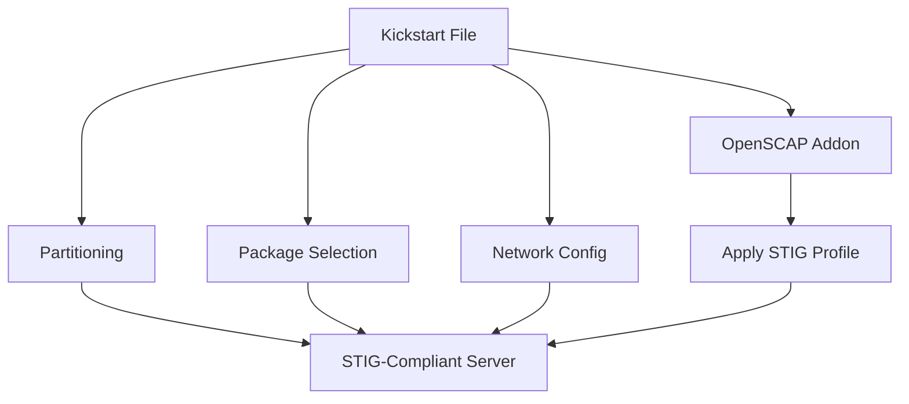

# How to Build a STIG-Compliant RHEL 9 Image Using Kickstart

Author: [nawazdhandala](https://www.github.com/nawazdhandala)

Tags: RHEL, STIG, Kickstart, Compliance, Linux

Description: Build STIG-compliant RHEL 9 images from the start using Kickstart automation, ensuring every server meets compliance requirements before it even boots.

---

The most efficient way to achieve STIG compliance is to build it into the image from the start. Retrofitting STIG controls onto a running system is messy and error-prone. With Kickstart, you can define a STIG-compliant configuration that gets applied during installation, so every server comes out of the box meeting your compliance requirements.

## Why Kickstart for STIG Compliance

Kickstart files are RHEL's native answer to automated installation. They define everything from disk layout to package selection to post-installation scripts. Combined with the OpenSCAP addon for Anaconda, you can apply an entire STIG profile during installation.



## Start with the SSG Kickstart Template

The scap-security-guide includes a Kickstart file for STIG:

```bash
# Install the SSG on your build server
dnf install -y scap-security-guide

# Find the STIG Kickstart template
ls /usr/share/scap-security-guide/kickstart/ssg-rhel9-stig*

# Copy it as your starting point
cp /usr/share/scap-security-guide/kickstart/ssg-rhel9-stig-ks.cfg \
  /var/www/html/ks/rhel9-stig.cfg
```

## Build a Complete STIG Kickstart File

Here is a full Kickstart file with STIG-compliant settings:

```bash
# RHEL 9 STIG-Compliant Kickstart
# Use text-based installer
text

# Installation source
url --url=http://repo.example.com/rhel9/BaseOS/

# Accept EULA
eula --agreed

# System language and keyboard
lang en_US.UTF-8
keyboard us

# Network configuration
network --bootproto=dhcp --device=link --activate --hostname=stig-server

# Root password (hashed)
rootpw --iscrypted $6$randomsalt$hashedpasswordhere

# Create a non-root admin user
user --name=sysadmin --groups=wheel --iscrypted --password=$6$salt$hash

# Timezone
timezone America/New_York --utc

# Disable kdump (STIG requirement for minimal services)
%addon com_redhat_kdump --disable
%end

# Disk partitioning - STIG requires separate partitions
clearpart --all --initlabel
part /boot/efi --fstype=efi --size=600
part /boot --fstype=xfs --size=1024
part pv.01 --size=1 --grow

volgroup rhel pv.01
logvol / --vgname=rhel --fstype=xfs --size=20480 --name=root
logvol /tmp --vgname=rhel --fstype=xfs --size=5120 --name=tmp --fsoptions="nodev,nosuid,noexec"
logvol /var --vgname=rhel --fstype=xfs --size=15360 --name=var --fsoptions="nodev,nosuid"
logvol /var/log --vgname=rhel --fstype=xfs --size=10240 --name=var_log --fsoptions="nodev,nosuid,noexec"
logvol /var/log/audit --vgname=rhel --fstype=xfs --size=5120 --name=var_log_audit --fsoptions="nodev,nosuid,noexec"
logvol /var/tmp --vgname=rhel --fstype=xfs --size=5120 --name=var_tmp --fsoptions="nodev,nosuid,noexec"
logvol /home --vgname=rhel --fstype=xfs --size=10240 --name=home --fsoptions="nodev,nosuid"
logvol swap --vgname=rhel --fstype=swap --size=4096 --name=swap

# Enable FIPS mode during installation (STIG CAT I)
fips --enable

# SELinux enforcing (STIG requirement)
selinux --enforcing

# Firewall
firewall --enabled --ssh

# Disable unused services
services --disabled=bluetooth,cups,avahi-daemon

# Minimal package selection
%packages
@^minimal-environment
openscap-scanner
scap-security-guide
aide
audit
rsyslog
chrony
libpwquality
-iwl*
-wireless-tools
-wpa_supplicant
%end

# Apply STIG profile via OpenSCAP addon
%addon org_fedora_oscap
  content-type = scap-security-guide
  profile = xccdf_org.ssgproject.content_profile_stig
%end

# Post-installation hardening
%post --log=/root/ks-post.log

# Initialize AIDE database
/usr/sbin/aide --init
mv /var/lib/aide/aide.db.new.gz /var/lib/aide/aide.db.gz

# Set correct permissions on critical files
chmod 600 /etc/ssh/sshd_config
chmod 000 /etc/shadow
chmod 000 /etc/gshadow

# Configure audit log size
sed -i 's/^max_log_file .*/max_log_file = 50/' /etc/audit/auditd.conf
sed -i 's/^space_left_action.*/space_left_action = email/' /etc/audit/auditd.conf

# Set login banner
cat > /etc/issue << 'BANNER'
You are accessing a U.S. Government information system. By using this system, you consent to monitoring and recording.
BANNER
cp /etc/issue /etc/issue.net

# Configure SSH banner
echo "Banner /etc/issue.net" >> /etc/ssh/sshd_config.d/stig.conf

# Set crypto policy to FIPS
update-crypto-policies --set FIPS

# Run initial compliance scan
mkdir -p /var/log/compliance
oscap xccdf eval \
  --profile xccdf_org.ssgproject.content_profile_stig \
  --results /var/log/compliance/initial-stig-scan.xml \
  --report /var/log/compliance/initial-stig-report.html \
  /usr/share/xml/scap/ssg/content/ssg-rhel9-ds.xml || true

%end

# Reboot after installation
reboot
```

## Serve the Kickstart File

Make the Kickstart file available to servers during installation:

```bash
# Via HTTP (most common)
dnf install -y httpd
systemctl enable --now httpd
cp /var/www/html/ks/rhel9-stig.cfg /var/www/html/ks/

# Boot the server with the Kickstart URL
# At the boot menu, press Tab and add:
# inst.ks=http://buildserver.example.com/ks/rhel9-stig.cfg
```

## Test the Kickstart File

Before deploying to production, validate and test:

```bash
# Validate the Kickstart syntax
dnf install -y pykickstart
ksvalidator /var/www/html/ks/rhel9-stig.cfg
```

## Verify STIG Compliance After Installation

Once the server is built, verify compliance:

```bash
# Check that FIPS mode is enabled
fips-mode-setup --check

# Check SELinux status
getenforce

# Check partition layout
findmnt -l | grep -E "tmp|var|home|audit"

# Run a full STIG scan
oscap xccdf eval \
  --profile xccdf_org.ssgproject.content_profile_stig \
  --results /tmp/stig-verify.xml \
  --report /tmp/stig-verify.html \
  /usr/share/xml/scap/ssg/content/ssg-rhel9-ds.xml || true

echo "Pass: $(grep -c 'result="pass"' /tmp/stig-verify.xml)"
echo "Fail: $(grep -c 'result="fail"' /tmp/stig-verify.xml)"
```

## Handle Remaining Findings

The Kickstart and OpenSCAP addon will catch most STIG controls, but some require post-installation action:

```bash
# Items that usually need post-install attention:
# - Configuring remote syslog destination
# - Setting up centralized authentication (SSSD/IPA)
# - Configuring specific audit rules for your environment
# - Network-specific firewall rules
# - Application-specific configurations
```

## Version Control Your Kickstart Files

Store your Kickstart files in a Git repository so changes are tracked:

```bash
# Initialize a repo for your Kickstart files
cd /var/www/html/ks/
git init
git add rhel9-stig.cfg
git commit -m "Initial STIG-compliant Kickstart for RHEL 9"
```

Building STIG compliance into the installation process means every server starts its life in a hardened state. There is no gap between deployment and compliance, and no risk that someone forgets to run the hardening playbook. Make the Kickstart file your single source of truth for server configuration.
