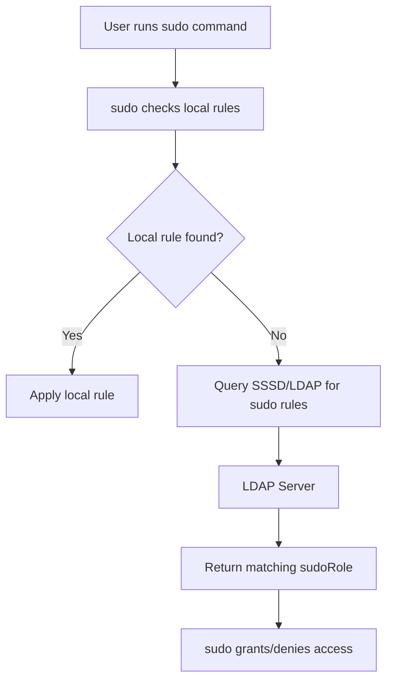

# How to Set Up Sudo Access Control with LDAP on RHEL

Author: [nawazdhandala](https://www.github.com/nawazdhandala)

Tags: RHEL, Sudo, LDAP, Access Control, Linux

Description: A guide to managing sudo privileges centrally through LDAP on RHEL, enabling consistent access control across multiple servers.

---

Managing sudo rules across dozens or hundreds of servers by editing local sudoers files is tedious and error-prone. Storing sudo rules in LDAP lets you manage access centrally, and changes take effect across all connected systems without touching individual machines.

## How LDAP-Based Sudo Works



## Prerequisites

You need a working SSSD + LDAP setup (see the LDAP authentication guide) and an LDAP server that supports the sudoers schema.

## Adding the Sudo Schema to LDAP

First, add the sudo schema to your LDAP server. On an OpenLDAP server:

```bash
# Download the sudo schema if not already present
sudo cp /usr/share/doc/sudo/schema.OpenLDAP /etc/openldap/schema/sudo.schema

# Convert to LDIF format and add to the server
cat > /tmp/sudo_schema.ldif << 'EOF'
dn: cn=sudo,cn=schema,cn=config
objectClass: olcSchemaConfig
cn: sudo
olcAttributeTypes: ( 1.3.6.1.4.1.15953.9.1.1 NAME 'sudoUser' SUP name )
olcAttributeTypes: ( 1.3.6.1.4.1.15953.9.1.2 NAME 'sudoHost' SUP name )
olcAttributeTypes: ( 1.3.6.1.4.1.15953.9.1.3 NAME 'sudoCommand' SUP name )
olcAttributeTypes: ( 1.3.6.1.4.1.15953.9.1.4 NAME 'sudoRunAs' SUP name )
olcAttributeTypes: ( 1.3.6.1.4.1.15953.9.1.5 NAME 'sudoOption' SUP name )
olcObjectClasses: ( 1.3.6.1.4.1.15953.9.2.1 NAME 'sudoRole' SUP top STRUCTURAL MUST cn MAY ( sudoUser $ sudoHost $ sudoCommand $ sudoRunAs $ sudoOption ) )
EOF

sudo ldapadd -Y EXTERNAL -H ldapi:/// -f /tmp/sudo_schema.ldif
```

## Creating Sudo Rules in LDAP

Create the sudo OU and add rules:

```bash
# Create the organizational unit for sudo rules
cat > /tmp/sudo_ou.ldif << 'EOF'
dn: ou=SUDOers,dc=example,dc=com
objectClass: organizationalUnit
ou: SUDOers
EOF

sudo ldapadd -x -D "cn=admin,dc=example,dc=com" -W -f /tmp/sudo_ou.ldif

# Create a sudo rule allowing the sysadmins group to run all commands
cat > /tmp/sudo_rule.ldif << 'EOF'
dn: cn=sysadmins,ou=SUDOers,dc=example,dc=com
objectClass: sudoRole
cn: sysadmins
sudoUser: %sysadmins
sudoHost: ALL
sudoCommand: ALL
sudoRunAs: ALL
sudoOption: !authenticate

dn: cn=webadmins,ou=SUDOers,dc=example,dc=com
objectClass: sudoRole
cn: webadmins
sudoUser: %webadmins
sudoHost: ALL
sudoCommand: /usr/bin/systemctl restart httpd
sudoCommand: /usr/bin/systemctl reload httpd
sudoCommand: /usr/bin/systemctl status httpd
sudoRunAs: root
EOF

sudo ldapadd -x -D "cn=admin,dc=example,dc=com" -W -f /tmp/sudo_rule.ldif
```

## Configuring SSSD for Sudo Lookups

Update the SSSD configuration to include sudo:

```bash
sudo tee /etc/sssd/sssd.conf > /dev/null << 'EOF'
[sssd]
# Add sudo to the list of services
services = nss, pam, sudo
domains = example.com

[domain/example.com]
id_provider = ldap
auth_provider = ldap
# Enable sudo provider
sudo_provider = ldap

ldap_uri = ldaps://ldap.example.com
ldap_search_base = dc=example,dc=com
ldap_tls_cacert = /etc/pki/tls/certs/ca-bundle.crt

# Specify where sudo rules are stored in LDAP
ldap_sudo_search_base = ou=SUDOers,dc=example,dc=com

# How often to refresh the full sudo rule set (seconds)
ldap_sudo_full_refresh_interval = 86400

# How often to check for changed sudo rules (seconds)
ldap_sudo_smart_refresh_interval = 900

cache_credentials = true
EOF

sudo chmod 600 /etc/sssd/sssd.conf
```

## Configuring sudo to Use SSSD

Tell sudo to look up rules through SSSD:

```bash
# Add SSSD as a sudo rule source
echo "sudoers: files sss" | sudo tee -a /etc/nsswitch.conf
```

Restart SSSD:

```bash
sudo systemctl restart sssd
```

## Testing Sudo Rules

```bash
# Check what sudo commands a user can run
sudo -l -U ldapuser1

# Verify a specific user in the sysadmins group
sudo -l -U sysadmin1
```

## Troubleshooting

```bash
# Enable debug logging for sudo in SSSD
# Add to the domain section: debug_level = 9
sudo sss_cache -E
sudo systemctl restart sssd

# Check SSSD sudo logs
sudo tail -f /var/log/sssd/sssd_sudo.log

# Verify the LDAP sudo entries directly
ldapsearch -x -H ldaps://ldap.example.com -b "ou=SUDOers,dc=example,dc=com" -D "cn=admin,dc=example,dc=com" -W
```

## Summary

Centralizing sudo rules in LDAP eliminates the need to maintain individual sudoers files on every server. Combined with SSSD caching, this approach gives you consistent, auditable access control with resilience against temporary network issues.

