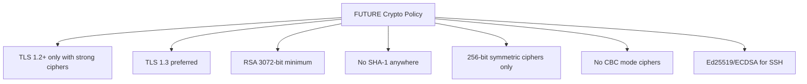

# How to Switch RHEL 9 to the FUTURE Crypto Policy for Stronger Security

Author: [nawazdhandala](https://www.github.com/nawazdhandala)

Tags: RHEL, Crypto Policies, FUTURE Policy, TLS, Security, Linux

Description: Switch RHEL 9 to the FUTURE crypto policy to enforce stronger encryption standards, disable legacy algorithms, and prepare for upcoming cryptographic requirements.

---

The FUTURE crypto policy on RHEL 9 enforces the strongest cryptographic standards available, disabling algorithms that are still considered safe today but may become vulnerable in the near future. This forward-looking policy is designed for environments that prioritize maximum security over backward compatibility. This guide covers how to switch to it and what to expect.

## What the FUTURE Policy Enforces



## Detailed Policy Comparison

| Setting | DEFAULT | FUTURE |
|---------|---------|--------|
| TLS versions | 1.2, 1.3 | 1.2 (restricted), 1.3 |
| Minimum RSA key | 2048 bits | 3072 bits |
| Minimum DH parameter | 2048 bits | 3072 bits |
| SHA-1 | Allowed for some uses | Completely disabled |
| 128-bit ciphers | Allowed | Disabled |
| CBC mode | Allowed | Disabled |
| SSH RSA keys | 2048+ bits | Disabled (only ECDSA/Ed25519) |
| 3DES | Disabled | Disabled |
| DSA keys | Disabled | Disabled |

## Checking Your Current Policy

```bash
# View the current policy
update-crypto-policies --show

# View what would change
diff <(update-crypto-policies --show --no-reload) <(echo "FUTURE")
```

## Pre-Switch Assessment

Before switching, check for potential compatibility issues:

### Check SSH Key Types

```bash
# Check what SSH host keys are available
ls -la /etc/ssh/ssh_host_*_key

# FUTURE policy only allows Ed25519 and ECDSA
# RSA keys will be rejected
# Ensure Ed25519 host keys exist
ls /etc/ssh/ssh_host_ed25519_key

# If missing, generate them
sudo ssh-keygen -t ed25519 -f /etc/ssh/ssh_host_ed25519_key -N ""
```

### Check User SSH Keys

```bash
# Users with RSA keys smaller than 3072 bits will be affected
# Check all authorized_keys files
find /home -name authorized_keys -exec echo "=== {} ===" \; -exec ssh-keygen -l -f {} \; 2>/dev/null
```

### Check TLS Certificates

```bash
# Check certificate key sizes
# Find certificates with RSA keys smaller than 3072 bits
for cert in /etc/pki/tls/certs/*.pem; do
    if [ -f "$cert" ]; then
        KEY_SIZE=$(openssl x509 -in "$cert" -noout -text 2>/dev/null | grep "Public-Key:" | grep -oP '\d+')
        if [ -n "$KEY_SIZE" ] && [ "$KEY_SIZE" -lt 3072 ]; then
            echo "WARNING: $cert has ${KEY_SIZE}-bit key (need 3072+)"
        fi
    fi
done
```

### Check Existing Connections

```bash
# Test connectivity to critical services
openssl s_client -connect internal-service:443 < /dev/null 2>/dev/null | \
    grep -E "Protocol|Cipher|Verify"
```

## Switching to the FUTURE Policy

```bash
# Apply the FUTURE policy
sudo update-crypto-policies --set FUTURE

# Verify the change
update-crypto-policies --show
# Output: FUTURE
```

### Restart Affected Services

```bash
# Restart SSH
sudo systemctl restart sshd

# Restart web servers
sudo systemctl restart httpd 2>/dev/null
sudo systemctl restart nginx 2>/dev/null

# Restart any TLS-dependent services
sudo systemctl restart postfix 2>/dev/null
sudo systemctl restart dovecot 2>/dev/null

# Or simply reboot for a clean state
sudo systemctl reboot
```

## Verifying the FUTURE Policy

### Check SSH

```bash
# Verify allowed SSH algorithms
ssh -Q cipher
# Should show only AES-256-GCM and ChaCha20-Poly1305

ssh -Q kex
# Should show ECDH and limited DHE

ssh -Q key
# Should show Ed25519 and ECDSA (no RSA)
```

### Check TLS

```bash
# Verify OpenSSL cipher list
openssl ciphers -v 2>/dev/null | head -20

# Test a TLS connection
openssl s_client -connect localhost:443 < /dev/null 2>/dev/null | \
    grep -E "Protocol|Cipher"
```

## Handling Compatibility Issues

### SSH Connections to Older Servers

If you need to connect to a server that only supports RSA:

```bash
# Per-connection override (not recommended for regular use)
ssh -o PubkeyAcceptedAlgorithms=+ssh-rsa \
    -o HostKeyAlgorithms=+ssh-rsa \
    user@old-server
```

### Application-Specific Overrides

Some applications can override the system policy:

```bash
# For a specific application that needs weaker crypto
# Create an environment variable override
# This is NOT recommended but may be necessary as a temporary measure
OPENSSL_CONF=/path/to/custom/openssl.cnf /usr/bin/legacy-app
```

### Partial Rollback

If the FUTURE policy causes too many issues, use a sub-policy for a softer version:

```bash
# FUTURE but allow RSA 2048 (compromise)
sudo tee /etc/crypto-policies/policies/modules/ALLOW-RSA2048.pmod << 'EOF'
min_rsa_size = 2048
EOF

sudo update-crypto-policies --set FUTURE:ALLOW-RSA2048
```

## Monitoring for Issues After Switch

```bash
# Watch for SSH connection failures
sudo journalctl -u sshd -f

# Watch for TLS errors
sudo journalctl | grep -i "ssl\|tls\|crypto\|cipher" | tail -20

# Check for authentication failures
sudo journalctl | grep -i "auth\|denied\|failed" | tail -20
```

## Rolling Back to DEFAULT

If you need to revert:

```bash
# Switch back to DEFAULT
sudo update-crypto-policies --set DEFAULT

# Restart services
sudo systemctl restart sshd
```

## When to Use the FUTURE Policy

The FUTURE policy is appropriate when:

- Your environment has no legacy systems or applications
- You are building a new deployment from scratch
- Your security requirements demand the strongest possible encryption
- You want to proactively prepare for cryptographic deprecations
- Compliance requirements specify modern-only algorithms

It is not recommended when:

- You need to communicate with older systems (RHEL 7, Windows Server 2012, etc.)
- Applications depend on RSA keys smaller than 3072 bits
- Third-party services only support TLS 1.0/1.1

## Summary

The FUTURE crypto policy on RHEL 9 provides the strongest available cryptographic protections by disabling SHA-1, requiring 3072-bit minimum key sizes, and preferring TLS 1.3. Before switching, audit your SSH keys, TLS certificates, and application dependencies. Apply with `update-crypto-policies --set FUTURE`, restart services, and monitor for compatibility issues. Keep the DEFAULT policy as a fallback if problems arise.
