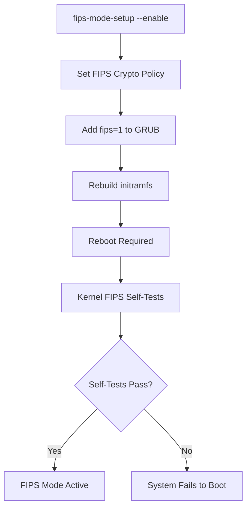

# How to Switch an Existing RHEL System to FIPS Mode Post-Installation

Author: [nawazdhandala](https://www.github.com/nawazdhandala)

Tags: RHEL, FIPS, Post-Installation, Security, Linux

Description: Enable FIPS mode on an already-running RHEL system, including key regeneration and application compatibility checks.

---

Ideally, you enable FIPS during installation. But real life does not always work that way. Sometimes you inherit a system, sometimes requirements change, and sometimes FIPS was simply missed during the build process. The good news is that RHEL makes it straightforward to switch to FIPS mode post-installation. The bad news is that you need to do some extra work afterward to make sure everything is using FIPS-compliant cryptography.

## Check Current FIPS Status

```bash
# Check if FIPS is currently enabled
fips-mode-setup --check

# Check the kernel parameter
cat /proc/sys/crypto/fips_enabled

# Check the current crypto policy
update-crypto-policies --show
```

## Enable FIPS Mode

```bash
# Enable FIPS mode using the fips-mode-setup tool
fips-mode-setup --enable

# This command does several things:
# 1. Sets the crypto policy to FIPS
# 2. Adds fips=1 to the kernel boot parameters
# 3. Rebuilds the initramfs with FIPS support
# 4. Installs the crypto-policies-scripts package if needed
```

The command will output something like:

```
Setting system policy to FIPS
FIPS mode will be enabled.
Please reboot the system for the setting to take effect.
```

## Reboot the System

A reboot is mandatory for FIPS mode to take full effect:

```bash
# Reboot the system
systemctl reboot
```

## Verify FIPS Is Active After Reboot

```bash
# Verify FIPS is enabled
fips-mode-setup --check
# Expected: FIPS mode is enabled.

# Verify the kernel parameter
cat /proc/sys/crypto/fips_enabled
# Expected: 1

# Verify the crypto policy
update-crypto-policies --show
# Expected: FIPS

# Check kernel boot parameters
cat /proc/cmdline | grep fips
```



## Regenerate SSH Host Keys

SSH host keys generated before FIPS was enabled may use non-FIPS algorithms:

```bash
# Check existing SSH host keys
ls -la /etc/ssh/ssh_host_*

# Remove old keys
rm -f /etc/ssh/ssh_host_*

# Regenerate keys (only FIPS-approved algorithms will be used)
ssh-keygen -A

# Verify the new keys use FIPS algorithms
for key in /etc/ssh/ssh_host_*_key.pub; do
    echo "$(basename $key): $(ssh-keygen -l -f $key)"
done

# Restart SSH
systemctl restart sshd
```

## Regenerate TLS Certificates

Any TLS certificates generated with non-FIPS algorithms need to be replaced:

```bash
# Check if existing certificates use FIPS-approved algorithms
openssl x509 -in /etc/pki/tls/certs/your-cert.pem -text -noout | grep "Signature Algorithm"
# FIPS-approved: sha256WithRSAEncryption, sha384WithRSAEncryption, etc.
# Not FIPS-approved: md5WithRSAEncryption, sha1WithRSAEncryption

# Generate a new self-signed certificate with FIPS-approved algorithms
openssl req -x509 -nodes \
  -days 365 \
  -newkey rsa:2048 \
  -keyout /etc/pki/tls/private/server.key \
  -out /etc/pki/tls/certs/server.crt \
  -subj "/CN=$(hostname)"
```

## Update Application Configurations

### Apache/Nginx

```bash
# Apache - update SSL configuration
# Ensure only FIPS-approved ciphers are configured
cat > /etc/httpd/conf.d/ssl-fips.conf << 'EOF'
SSLProtocol -all +TLSv1.2 +TLSv1.3
SSLCipherSuite PROFILE=SYSTEM
SSLCryptoDevice builtin
EOF

systemctl restart httpd
```

### Database Connections

```bash
# PostgreSQL - verify it connects with FIPS ciphers
psql -h localhost -U postgres -c "SHOW ssl_cipher;"

# MariaDB - check SSL status
mysql -e "SHOW GLOBAL STATUS LIKE 'Ssl_cipher';"
```

## Handle Common Post-FIPS Issues

### Java Applications

Java applications may fail if they use non-FIPS algorithms:

```bash
# Check Java's security configuration
cat /etc/crypto-policies/back-ends/java.config

# If using a custom Java installation, ensure FIPS providers are configured
# Check java.security file for FIPS provider settings
```

### Python Applications

```bash
# Test that Python's hashlib works in FIPS mode
python3 -c "import hashlib; hashlib.sha256(b'test').hexdigest()"
# This should work

python3 -c "import hashlib; hashlib.md5(b'test').hexdigest()" 2>&1
# This may fail or require usedforsecurity=False parameter
```

### Docker/Podman

```bash
# Containers inherit the host's FIPS mode
podman run --rm rhel9-based-image cat /proc/sys/crypto/fips_enabled
# Should output: 1
```

## Verify /boot Is on a Separate Partition

FIPS mode requires `/boot` to be on a separate, unencrypted partition for integrity verification:

```bash
# Check if /boot is a separate mount
findmnt /boot

# If /boot is not separate, FIPS may not work correctly
# You would need to repartition, which is a major operation on a running system
```

If `/boot` is not on a separate partition, you have a problem. This is one of the main reasons why enabling FIPS during installation is preferred.

## Reverting FIPS Mode

If you need to disable FIPS mode (for example, during testing):

```bash
# Disable FIPS mode
fips-mode-setup --disable

# Reboot
systemctl reboot

# Verify FIPS is disabled
fips-mode-setup --check
```

Switching to FIPS post-installation is entirely supported, but treat it as a significant change. Test your applications thoroughly, regenerate any cryptographic keys that were created before FIPS was enabled, and verify that all services come up cleanly after the reboot. The extra effort is worth it for the compliance assurance that FIPS provides.
