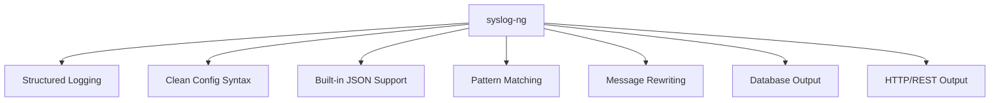

# How to Set Up Syslog-ng as an Alternative to rsyslog on RHEL 9

Author: [nawazdhandala](https://www.github.com/nawazdhandala)

Tags: RHEL, Syslog-ng, Logging, rsyslog, Linux

Description: Learn how to install and configure syslog-ng on RHEL 9 as an alternative to rsyslog, with structured logging, flexible filtering, and advanced message routing.

---

While rsyslog is the default syslog daemon on RHEL 9, syslog-ng offers a different approach with its own configuration language, built-in structured data support, and powerful message routing. Some administrators prefer syslog-ng for its cleaner configuration syntax and native support for output formats like JSON.

## Why Consider Syslog-ng



Key differences from rsyslog:

- Single configuration file with a consistent syntax
- Native JSON parsing and formatting
- Built-in pattern database for log classification
- Template functions with a more readable syntax
- Easier conditional routing with filter expressions

## Step 1: Install Syslog-ng

Syslog-ng is available from the EPEL repository:

```bash
# Enable EPEL if not already enabled
sudo dnf install epel-release -y

# Install syslog-ng
sudo dnf install syslog-ng -y
```

## Step 2: Stop and Disable rsyslog

You cannot run both rsyslog and syslog-ng on the same syslog socket. Stop rsyslog first:

```bash
# Stop rsyslog
sudo systemctl stop rsyslog

# Disable rsyslog so it does not start on boot
sudo systemctl disable rsyslog

# Verify rsyslog is stopped
sudo systemctl status rsyslog
```

## Step 3: Configure Syslog-ng

The main configuration file is `/etc/syslog-ng/syslog-ng.conf`:

```bash
# Back up the default configuration
sudo cp /etc/syslog-ng/syslog-ng.conf /etc/syslog-ng/syslog-ng.conf.bak

# Edit the configuration
sudo vi /etc/syslog-ng/syslog-ng.conf
```

Here is a complete configuration for a RHEL 9 server:

```bash
@version: 4.0
@include "scl.conf"

# Global options
options {
    # Flush logs to disk frequently
    flush_lines(0);

    # Time to wait before closing idle connections
    time_reopen(10);

    # Use DNS for hostname resolution
    use_dns(no);

    # Use FQDN in log messages
    use_fqdn(no);

    # Create directories as needed for log files
    create_dirs(yes);

    # Keep hostname from the original message
    keep_hostname(yes);

    # Chain hostnames when forwarding
    chain_hostnames(no);

    # Set file permissions for new log files
    perm(0640);
    dir_perm(0750);

    # Set ownership
    owner("root");
    group("root");
};

# =====================
# Sources
# =====================

# System log source - reads from journald on RHEL 9
source s_sys {
    system();
    internal();
};

# Network source - receive logs from remote hosts via TCP
source s_network_tcp {
    tcp(
        ip("0.0.0.0")
        port(514)
        max-connections(100)
    );
};

# Network source - receive logs via UDP
source s_network_udp {
    udp(
        ip("0.0.0.0")
        port(514)
    );
};

# =====================
# Destinations
# =====================

# Standard log files matching RHEL conventions
destination d_messages {
    file("/var/log/messages");
};

destination d_secure {
    file("/var/log/secure");
};

destination d_maillog {
    file("/var/log/maillog");
};

destination d_cron {
    file("/var/log/cron");
};

destination d_kern {
    file("/var/log/kern.log");
};

# Per-host remote logging
destination d_remote {
    file(
        "/var/log/remote/${HOST}/${PROGRAM}.log"
        create_dirs(yes)
        dir_perm(0750)
        perm(0640)
    );
};

# JSON file output
destination d_json {
    file(
        "/var/log/structured/all.json"
        template("$(format-json --scope rfc5424 --scope nv-pairs)\n")
        create_dirs(yes)
    );
};

# =====================
# Filters
# =====================

# Filter by facility
filter f_auth { facility(auth, authpriv); };
filter f_mail { facility(mail); };
filter f_cron { facility(cron); };
filter f_kern { facility(kern); };

# Filter by severity
filter f_emergency { level(emerg); };
filter f_error { level(err..emerg); };
filter f_warning { level(warning..emerg); };

# Filter for general messages (exclude auth, mail, cron)
filter f_messages {
    level(info..emerg)
    and not facility(auth, authpriv, mail, cron);
};

# Custom filter - SSH failed logins
filter f_ssh_failed {
    program("sshd") and match("Failed password" value("MESSAGE"));
};

# =====================
# Log Paths
# =====================

# Route system messages to /var/log/messages
log {
    source(s_sys);
    filter(f_messages);
    destination(d_messages);
};

# Route auth messages to /var/log/secure
log {
    source(s_sys);
    filter(f_auth);
    destination(d_secure);
};

# Route mail messages
log {
    source(s_sys);
    filter(f_mail);
    destination(d_maillog);
};

# Route cron messages
log {
    source(s_sys);
    filter(f_cron);
    destination(d_cron);
};

# Route kernel messages
log {
    source(s_sys);
    filter(f_kern);
    destination(d_kern);
};

# Route remote logs to per-host directories
log {
    source(s_network_tcp);
    source(s_network_udp);
    destination(d_remote);
};

# Write all logs in JSON format for structured analysis
log {
    source(s_sys);
    destination(d_json);
};
```

## Step 4: Validate and Start Syslog-ng

```bash
# Validate the configuration
sudo syslog-ng --syntax-only

# Start syslog-ng
sudo systemctl start syslog-ng

# Enable it to start on boot
sudo systemctl enable syslog-ng

# Check the status
sudo systemctl status syslog-ng
```

## Step 5: Open Firewall for Remote Logging

```bash
# Allow syslog traffic
sudo firewall-cmd --permanent --add-port=514/tcp
sudo firewall-cmd --permanent --add-port=514/udp
sudo firewall-cmd --reload
```

## Advanced Features

### JSON Parsing

Syslog-ng can parse JSON messages natively:

```bash
# Parse JSON messages from applications
source s_json_app {
    tcp(
        ip("0.0.0.0")
        port(5514)
        flags(no-parse)
    );
};

parser p_json {
    json-parser(prefix(".json."));
};

destination d_parsed_json {
    file(
        "/var/log/app-json/${.json.service}.log"
        template("${ISODATE} ${.json.level} ${.json.message}\n")
        create_dirs(yes)
    );
};

log {
    source(s_json_app);
    parser(p_json);
    destination(d_parsed_json);
};
```

### Message Rewriting

```bash
# Rewrite rules to modify messages before storing
rewrite r_anonymize_ip {
    subst("([0-9]{1,3}\.){3}[0-9]{1,3}", "X.X.X.X", value("MESSAGE") flags(global));
};

# Apply the rewrite in a log path
log {
    source(s_sys);
    rewrite(r_anonymize_ip);
    destination(d_messages);
};
```

### TLS Encrypted Remote Logging

```bash
# TLS source for encrypted log reception
source s_tls {
    tcp(
        ip("0.0.0.0")
        port(6514)
        tls(
            key-file("/etc/pki/syslog-ng/server-key.pem")
            cert-file("/etc/pki/syslog-ng/server-cert.pem")
            ca-dir("/etc/pki/syslog-ng/ca.d/")
            peer-verify(required-trusted)
        )
    );
};

# TLS destination for encrypted forwarding
destination d_tls_forward {
    tcp(
        "logserver.example.com"
        port(6514)
        tls(
            key-file("/etc/pki/syslog-ng/client-key.pem")
            cert-file("/etc/pki/syslog-ng/client-cert.pem")
            ca-dir("/etc/pki/syslog-ng/ca.d/")
            peer-verify(required-trusted)
        )
    );
};
```

## Step 6: Test the Configuration

```bash
# Send test messages
logger "Test message from syslog-ng setup"
logger -p auth.warning "Test auth warning"

# Check log files
tail -5 /var/log/messages
tail -5 /var/log/secure

# Check JSON output
tail -5 /var/log/structured/all.json | python3 -m json.tool

# Monitor incoming logs
tail -f /var/log/messages
```

## Switching Back to rsyslog

If you decide to switch back:

```bash
# Stop and disable syslog-ng
sudo systemctl stop syslog-ng
sudo systemctl disable syslog-ng

# Re-enable and start rsyslog
sudo systemctl enable rsyslog
sudo systemctl start rsyslog
```

## Summary

Syslog-ng on RHEL 9 provides an alternative to rsyslog with a cleaner configuration syntax and built-in structured logging support. Install it from EPEL, disable rsyslog, and configure sources, filters, destinations, and log paths in a single configuration file. Its native JSON support, message rewriting, and pattern matching make it particularly well-suited for environments that need advanced log processing.
