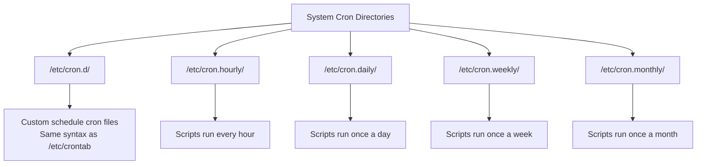

# How to Use System-Wide Cron Directories on RHEL

Author: [nawazdhandala](https://www.github.com/nawazdhandala)

Tags: RHEL, cron, System-Wide, Scheduling, Linux

Description: A practical guide to using system-wide cron directories on RHEL, including /etc/cron.d/, /etc/cron.daily/, hourly, weekly, and monthly directories, and how run-parts ties it all together.

---

## Beyond User Crontabs

Most sysadmins start with `crontab -e` and never look back. But RHEL provides a set of system-wide cron directories that are better suited for system maintenance scripts, package-managed tasks, and anything that needs to survive user account changes. Understanding these directories is essential for managing a RHEL system properly.

## The System-Wide Cron Directory Layout

RHEL provides several directories for different scheduling needs.



Each directory serves a different purpose. Let us walk through them one by one.

## The /etc/cron.d/ Directory

This directory holds cron files that use the same format as `/etc/crontab`, meaning they include a username field. This is where packages typically drop their cron jobs, and it is also a great place for system-level tasks that need custom schedules.

```bash
# List existing cron.d files
ls -la /etc/cron.d/
```

The format for files in `/etc/cron.d/` is:

```
# minute hour day-of-month month day-of-week user command
```

Here is a practical example. Create a file for database maintenance.

```bash
# Create a cron.d entry for nightly database vacuum
sudo tee /etc/cron.d/db-maintenance > /dev/null <<'EOF'
# Database maintenance - runs at 3:15 AM daily as the postgres user
SHELL=/bin/bash
PATH=/usr/local/bin:/usr/bin:/bin
MAILTO=dba@example.com

15 3 * * * postgres /usr/local/bin/db-vacuum.sh >> /var/log/db-maintenance.log 2>&1
EOF
```

Important rules for `/etc/cron.d/` files:

- The filename must not contain dots (.) in it, or crond will skip it
- The file must be owned by root
- Permissions should be 0644
- Each line must include the username field

```bash
# Set correct ownership and permissions
sudo chown root:root /etc/cron.d/db-maintenance
sudo chmod 644 /etc/cron.d/db-maintenance
```

## The Periodic Directories: hourly, daily, weekly, monthly

These four directories hold executable scripts (not cron-format files). The key difference is that scripts placed here do not need any time specification, they just need to be executable.

### /etc/cron.hourly/

Scripts here run once per hour. On RHEL, the `/etc/cron.d/0hourly` file triggers the hourly run via crond.

```bash
# Check what triggers hourly jobs
cat /etc/cron.d/0hourly
```

You will see something like:

```
SHELL=/bin/bash
PATH=/sbin:/bin:/usr/sbin:/usr/bin
MAILTO=root
01 * * * * root run-parts /etc/cron.hourly
```

The `run-parts` command is the mechanism that executes all scripts in these directories.

### Creating a Script for cron.daily

Let us create a practical script that cleans up temporary files older than 7 days.

```bash
# Create a daily cleanup script
sudo tee /etc/cron.daily/cleanup-tmp > /dev/null <<'SCRIPT'
#!/bin/bash
# Clean up files in /tmp older than 7 days
# Runs daily via cron.daily

find /tmp -type f -mtime +7 -delete 2>/dev/null
find /var/tmp -type f -mtime +30 -delete 2>/dev/null

# Log the cleanup
echo "$(date): tmp cleanup completed" >> /var/log/tmp-cleanup.log
SCRIPT

# Make it executable - this is required or run-parts will skip it
sudo chmod 755 /etc/cron.daily/cleanup-tmp
```

### Creating a Weekly Report Script

```bash
# Create a weekly disk usage report
sudo tee /etc/cron.weekly/disk-report > /dev/null <<'SCRIPT'
#!/bin/bash
# Weekly disk usage report
# Sends email to sysadmin team

REPORT="/tmp/disk-report-$(date +%Y%m%d).txt"

echo "=== Disk Usage Report - $(date) ===" > "$REPORT"
echo "" >> "$REPORT"
df -h >> "$REPORT"
echo "" >> "$REPORT"
echo "=== Top 20 Largest Directories ===" >> "$REPORT"
du -sh /var/log/* 2>/dev/null | sort -rh | head -20 >> "$REPORT"

mail -s "Weekly Disk Report - $(hostname)" sysadmin@example.com < "$REPORT"
rm -f "$REPORT"
SCRIPT

sudo chmod 755 /etc/cron.weekly/disk-report
```

### Creating a Monthly Log Rotation Check

```bash
# Create a monthly logrotate status check
sudo tee /etc/cron.monthly/logrotate-audit > /dev/null <<'SCRIPT'
#!/bin/bash
# Monthly check for log files that might not be rotated
# Flags any log file over 500MB

echo "=== Log Rotation Audit - $(date) ==="
find /var/log -name "*.log" -size +500M -exec ls -lh {} \;
SCRIPT

sudo chmod 755 /etc/cron.monthly/logrotate-audit
```

## How run-parts Works

The `run-parts` command is what actually executes scripts in these directories. Understanding its behavior will save you debugging time.

```bash
# Test which scripts run-parts would execute (dry run)
sudo run-parts --test /etc/cron.daily
```

Key rules for `run-parts`:

1. Scripts must be executable
2. Filenames must match a specific pattern - no dots, no extensions like `.sh`
3. Scripts must not have certain characters in their names

```bash
# These filenames WORK with run-parts
cleanup-tmp        # Good - letters and dashes
backup_db          # Good - letters and underscores
001-first-task     # Good - numbers, letters, dashes

# These filenames DO NOT WORK with run-parts
cleanup.sh         # Bad - contains a dot
backup~            # Bad - contains a tilde
.hidden-script     # Bad - starts with a dot
```

This is a common gotcha. If you name your script `backup.sh` and drop it in `/etc/cron.daily/`, it will never run. Rename it to `backup` or `backup-script` instead.

```bash
# Verify your script will be picked up by run-parts
run-parts --test /etc/cron.daily
```

## When Do Daily, Weekly, and Monthly Jobs Run?

On RHEL, the timing of daily, weekly, and monthly jobs is controlled by anacron via `/etc/anacrontab`.

```bash
# Check the anacron configuration
cat /etc/anacrontab
```

You will typically see:

```
SHELL=/bin/sh
PATH=/sbin:/bin:/usr/sbin:/usr/bin
MAILTO=root
RANDOM_DELAY=45
START_HOURS_RANGE=3-22

1   5   cron.daily    nice run-parts /etc/cron.daily
7   25  cron.weekly   nice run-parts /etc/cron.weekly
@monthly 45 cron.monthly nice run-parts /etc/cron.monthly
```

The numbers mean: period in days, delay in minutes, job identifier, and then the command. So `cron.daily` runs every 1 day, with a 5-minute delay after the `START_HOURS_RANGE` begins.

## Checking the /etc/crontab File

The system-wide crontab at `/etc/crontab` is another option, though on RHEL it is mostly a placeholder.

```bash
# View the system crontab
cat /etc/crontab
```

You can add entries here, but it is generally better to use `/etc/cron.d/` for custom jobs. That way each task is in its own file, making it easier to manage and track which package or admin added what.

## Debugging System Cron Jobs

When a system cron job is not running as expected, check these things.

```bash
# Check if crond is running
sudo systemctl status crond

# Look at cron logs for errors
sudo grep CRON /var/log/cron | tail -30

# Verify file permissions on your script
ls -la /etc/cron.daily/cleanup-tmp

# Run the script manually to check for errors
sudo /etc/cron.daily/cleanup-tmp

# Test with run-parts to see if the filename is valid
sudo run-parts --test /etc/cron.daily
```

## Best Practices

**Use /etc/cron.d/ for specific schedules.** If you need a job at 3:47 AM on Tuesdays, put it in `/etc/cron.d/`. The periodic directories only give you hourly, daily, weekly, or monthly granularity.

**Keep scripts self-contained.** Do not rely on environment variables being set. Define PATH and any other variables at the top of your scripts.

**Always test scripts manually first.** Run them by hand before dropping them into a cron directory. There is nothing worse than a broken script running silently every night.

**Use meaningful filenames.** Since filenames cannot have extensions, use descriptive names like `database-backup` or `ssl-cert-check` so it is obvious what each script does.

**Log your output.** Scripts in the periodic directories do not have a built-in logging mechanism. Either redirect output to a log file within the script, or rely on MAILTO in `/etc/anacrontab` to catch any output.

## Summary

System-wide cron directories on RHEL give you a clean, organized way to manage scheduled tasks. Use `/etc/cron.d/` for jobs that need specific timing, and the periodic directories (`cron.hourly`, `cron.daily`, `cron.weekly`, `cron.monthly`) for routine maintenance tasks. Just remember the `run-parts` naming rules, keep your scripts executable, and always test before deploying.
