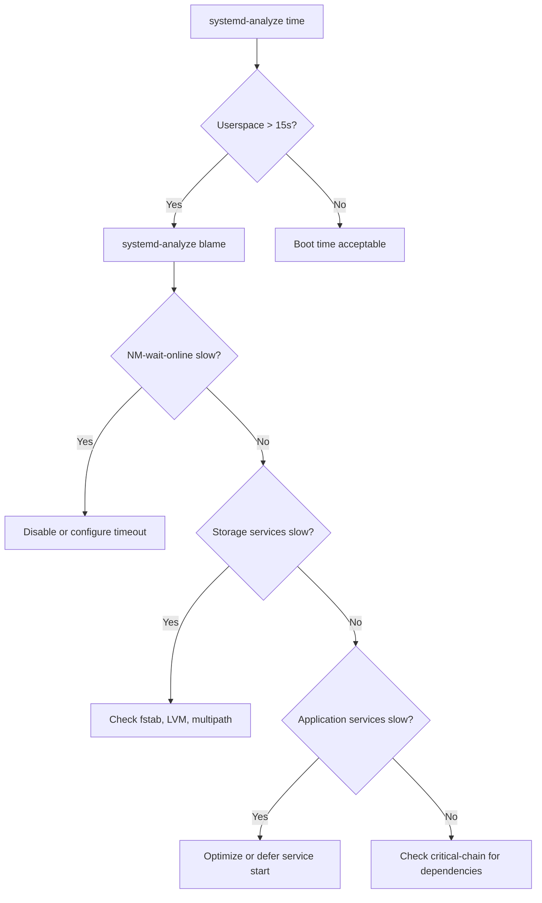

# How to Use systemd-analyze to Diagnose Slow Boot Times on RHEL

Author: [nawazdhandala](https://www.github.com/nawazdhandala)

Tags: RHEL, Systemd, Boot Performance, Diagnostics, Linux

Description: A hands-on guide to using systemd-analyze on RHEL to measure boot times, find bottleneck services, and generate visual boot charts for performance tuning.

---

## When Boot Takes Too Long

I have managed servers where a reboot took 15 seconds and servers where it took 4 minutes. The difference matters, especially when you are standing in front of a rack at 2 AM during an outage, waiting for a box to come back. RHEL ships with `systemd-analyze`, a built-in tool that breaks down exactly where your boot time goes. Here is how to use it.

## Getting the Big Picture

Start with the overall boot time summary.

```bash
# Show the total boot time broken down by phase
systemd-analyze time
```

You will see output like this:

```bash
Startup finished in 1.512s (kernel) + 2.347s (initrd) + 8.921s (userspace) = 12.781s
graphical.target reached after 8.103s in userspace.
```

The three phases are:
- **Kernel** - Time from the bootloader handing off to the kernel until the initrd starts. You cannot do much about this.
- **Initrd** - Time spent in the initial RAM disk, loading drivers and finding the root filesystem.
- **Userspace** - Time from when systemd takes over to when the default target is reached. This is where most of your optimization opportunities live.

## Finding the Slowest Services

The `blame` subcommand ranks every unit by how long it took to start, slowest first.

```bash
# List services sorted by startup time (slowest first)
systemd-analyze blame
```

Output looks like:

```bash
8.123s NetworkManager-wait-online.service
3.456s firewalld.service
2.891s dnf-makecache.service
1.234s sssd.service
0.987s tuned.service
0.654s chronyd.service
...
```

A few things to keep in mind:
- Services that start in parallel do not necessarily add to your total boot time. Two services that each take 3 seconds but run simultaneously only add 3 seconds, not 6.
- `NetworkManager-wait-online.service` is almost always at the top. It waits for a network connection, and on servers with slow DHCP or multiple interfaces, it can take a while. More on this later.

## Understanding the Critical Chain

The `blame` list shows wall clock time per service, but it does not show dependencies. The `critical-chain` subcommand shows the actual chain of units that determined your boot time, similar to finding the critical path in project management.

```bash
# Show the critical chain of dependencies that determined boot time
systemd-analyze critical-chain
```

Output:

```bash
graphical.target @8.103s
└─multi-user.target @8.102s
  └─NetworkManager-wait-online.service @3.245s +4.856s
    └─NetworkManager.service @2.987s +0.254s
      └─network-pre.target @2.984s
        └─firewalld.service @0.512s +2.471s
          └─basic.target @0.509s
            └─sockets.target @0.509s
              └─...
```

The `@` time is when the unit started (relative to boot), and the `+` time is how long it took. This tells you the actual bottleneck chain. In this example, `firewalld` took 2.4 seconds, then `NetworkManager` started, then `NetworkManager-wait-online` spent nearly 5 seconds waiting.

You can also check the critical chain for a specific target:

```bash
# Show the critical chain leading up to multi-user.target
systemd-analyze critical-chain multi-user.target
```

## Generating a Visual Boot Chart

This is my favorite feature. You can generate an SVG image showing every service as a bar on a timeline.

```bash
# Generate an SVG boot chart
systemd-analyze plot > /tmp/boot-chart.svg
```

Transfer the file to your workstation and open it in a browser. You will see a Gantt-style chart where each service is a horizontal bar. Services that started in parallel are stacked vertically. The critical path stands out because it is the longest unbroken chain from left to right.

This is especially useful when presenting to management or when you need to justify why a particular service should be disabled or optimized.

## Identifying Common Bottlenecks

Here is a flow for diagnosing and fixing the most common slow boot issues:



### NetworkManager-wait-online

This is the number one offender on almost every RHEL system. It blocks the `network-online.target`, and many services depend on having a network connection.

If your server has a static IP and you know the network will be up quickly:

```bash
# Reduce the timeout for NetworkManager-wait-online
sudo mkdir -p /etc/systemd/system/NetworkManager-wait-online.service.d/
sudo tee /etc/systemd/system/NetworkManager-wait-online.service.d/timeout.conf <<EOF
[Service]
ExecStart=
ExecStart=/usr/bin/nm-online -s -q --timeout=10
EOF
sudo systemctl daemon-reload
```

Or if nothing on your server actually needs to wait for the network to be fully online at boot:

```bash
# Disable the wait-online service entirely
sudo systemctl disable NetworkManager-wait-online.service
```

### Slow Storage Services

If `lvm2-monitor.service`, `multipathd.service`, or `systemd-udev-settle.service` are slow, you likely have storage configuration issues. Common fixes:
- Remove stale LVM entries for disks that no longer exist
- Clean up multipath configs for removed SAN paths
- Check `/etc/fstab` for entries referencing unavailable devices (add `nofail` option)

```bash
# Check for fstab entries that might cause boot delays
cat /etc/fstab

# Add nofail to prevent boot blocking on missing mounts
# Example: UUID=xxx /data xfs defaults,nofail 0 0
```

### Deferring Non-Critical Services

Some services do not need to start at boot. You can disable them and start them later or on-demand:

```bash
# Disable a service that does not need to start at boot
sudo systemctl disable dnf-makecache.timer

# Or mask it to prevent any activation
sudo systemctl mask dnf-makecache.timer
```

## Verifying Unit Files

`systemd-analyze` can also check your unit files for errors:

```bash
# Check all unit files for potential issues
systemd-analyze verify /etc/systemd/system/*.service
```

This catches things like missing dependencies, bad directives, and syntax errors. Run it after editing any unit file.

## Comparing Boot Times Over Time

A good habit is to record your boot times after changes so you can track improvement.

```bash
# Quick one-liner to log boot time with a timestamp
echo "$(date): $(systemd-analyze time | head -1)" >> /var/log/boot-times.log
```

Run this after each reboot and you will have a history of how your boot performance has changed over time.

## Checking Individual Service Performance

You can also profile how long a specific service takes during startup:

```bash
# Show detailed timing for a specific service
systemd-analyze blame | grep sshd

# Check what a service is waiting for
systemd-analyze critical-chain sshd.service
```

## Real-World Example

On one RHEL server I worked on, the boot time was 47 seconds. After running through this process:

1. `systemd-analyze blame` showed `NetworkManager-wait-online` at 22 seconds
2. `multipathd.service` was taking 8 seconds scanning for non-existent SAN paths
3. `dnf-makecache.service` was taking 6 seconds updating package caches

After reducing the NM-wait-online timeout to 10 seconds, cleaning up multipath configs, and disabling the dnf-makecache timer, boot dropped to 18 seconds. Not bad for 20 minutes of work.

## Wrapping Up

`systemd-analyze` is one of those tools that does not get enough attention. The `time`, `blame`, and `critical-chain` subcommands give you everything you need to figure out why a RHEL box is slow to boot. The SVG plot is useful for visual thinkers and for documentation. The fix is usually one of three things: taming `NetworkManager-wait-online`, cleaning up storage configs, or disabling services that do not need to run at boot.
