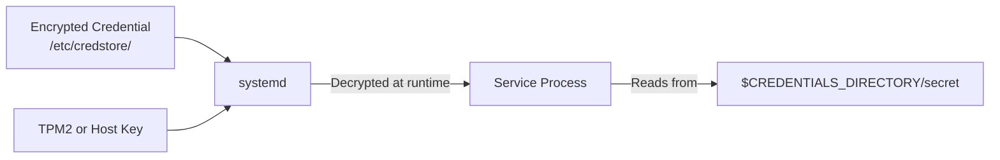

# How to Use systemd Credentials for Secure Secret Injection on RHEL 9

Author: [nawazdhandala](https://www.github.com/nawazdhandala)

Tags: RHEL, systemd, Credentials, Secrets, Security, Linux

Description: Learn how to use the systemd credentials framework on RHEL 9 to securely inject secrets into services without exposing them in unit files or environment variables.

---

systemd credentials provide a secure way to pass secrets (API keys, passwords, certificates) to services. Credentials are encrypted at rest, mounted read-only in a temporary filesystem, and automatically cleaned up when the service stops. This is far more secure than storing secrets in unit files or environment variables.

## How Credentials Work



## Step 1: Create Encrypted Credentials

```bash
# Create a credential encrypted with the host key
echo "my-secret-api-key-12345" | sudo systemd-creds encrypt - /etc/credstore/myapp.api-key

# Create a credential from a file
sudo systemd-creds encrypt /path/to/db-password.txt /etc/credstore/myapp.db-password

# List stored credentials
ls /etc/credstore/

# Verify a credential can be decrypted
sudo systemd-creds decrypt /etc/credstore/myapp.api-key -
```

## Step 2: Configure a Service to Use Credentials

```bash
# Create a service that receives credentials
sudo tee /etc/systemd/system/myapp.service << 'UNITEOF'
[Unit]
Description=My Application with Credentials

[Service]
ExecStart=/usr/local/bin/myapp
# Load credentials from the credential store
LoadCredentialEncrypted=api-key:/etc/credstore/myapp.api-key
LoadCredentialEncrypted=db-password:/etc/credstore/myapp.db-password
# The CREDENTIALS_DIRECTORY environment variable points to the secrets

[Install]
WantedBy=multi-user.target
UNITEOF

sudo systemctl daemon-reload
```

## Step 3: Read Credentials in Your Application

```python
#!/usr/bin/env python3
"""myapp.py - Application that reads systemd credentials"""
import os
import sys

def read_credential(name):
    """Read a credential from the systemd credentials directory."""
    cred_dir = os.environ.get('CREDENTIALS_DIRECTORY')
    if not cred_dir:
        print("No credentials directory available", file=sys.stderr)
        return None

    cred_path = os.path.join(cred_dir, name)
    try:
        with open(cred_path, 'r') as f:
            return f.read().strip()
    except FileNotFoundError:
        print(f"Credential '{name}' not found", file=sys.stderr)
        return None

def main():
    api_key = read_credential('api-key')
    db_password = read_credential('db-password')

    if api_key:
        print(f"API key loaded (length: {len(api_key)})")
    if db_password:
        print(f"DB password loaded (length: {len(db_password)})")

    # Use the secrets in your application logic
    # ...

if __name__ == '__main__':
    main()
```

```bash
# In a shell script, read credentials like this:
#!/bin/bash
API_KEY=$(cat "$CREDENTIALS_DIRECTORY/api-key")
DB_PASS=$(cat "$CREDENTIALS_DIRECTORY/db-password")
```

## Step 4: Use Plain-Text Credentials (Development)

```bash
# For development, you can use unencrypted credentials
sudo mkdir -p /etc/credstore.plain
echo "dev-api-key" | sudo tee /etc/credstore.plain/myapp.api-key

# Reference with LoadCredential (not LoadCredentialEncrypted)
# The service will look in /etc/credstore.plain/ automatically
```

## Step 5: TPM2-Bound Credentials

```bash
# Encrypt credentials bound to the TPM2 chip
# These can only be decrypted on this specific machine
echo "tpm-bound-secret" | sudo systemd-creds encrypt --with-key=tpm2 - /etc/credstore/myapp.tpm-secret

# Use in a service
# LoadCredentialEncrypted=tpm-secret:/etc/credstore/myapp.tpm-secret
```

## Summary

You have configured systemd credentials on RHEL 9 for secure secret injection. Credentials are encrypted at rest, decrypted only at service runtime, and automatically cleaned up when the service stops. This approach eliminates the need for secrets in environment variables, configuration files, or unit files.
