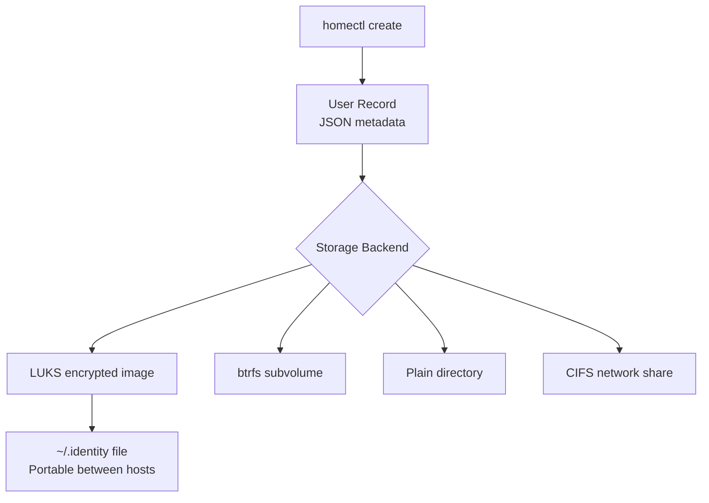

# How to Manage User Home Directories with systemd-homed on RHEL 9

Author: [nawazdhandala](https://www.github.com/nawazdhandala)

Tags: RHEL, systemd, systemd-homed, Home Directories, Linux

Description: Learn how to use systemd-homed on RHEL 9 to manage portable, encrypted user home directories with modern authentication.

---

systemd-homed is a service that manages user accounts and home directories as self-contained, portable, and optionally encrypted units. Unlike traditional user management with useradd, homed stores all user metadata inside the home directory itself, making accounts truly portable between machines.

## How systemd-homed Works



## Step 1: Enable systemd-homed

```bash
# Install and start systemd-homed
sudo systemctl enable --now systemd-homed

# Verify it is running
systemctl status systemd-homed
```

## Step 2: Create a User with homectl

```bash
# Create a user with LUKS-encrypted home directory
sudo homectl create devuser \
    --storage=luks \
    --disk-size=10G \
    --real-name="Developer User"

# You will be prompted to set a password
# The password is also the LUKS encryption passphrase

# Create a user with a plain directory (no encryption)
sudo homectl create testuser \
    --storage=directory \
    --real-name="Test User"
```

## Step 3: Manage Users

```bash
# List all homed-managed users
homectl list

# Show detailed information about a user
homectl inspect devuser

# Update user properties
sudo homectl update devuser --real-name="Senior Developer"

# Change password
sudo homectl passwd devuser

# Set disk size limit
sudo homectl update devuser --disk-size=20G

# Set resource limits
sudo homectl update devuser --nice=10 --memory-max=4G
```

## Step 4: Activate and Deactivate Home Directories

```bash
# Manually activate (mount/decrypt) a home directory
sudo homectl activate devuser

# Deactivate (unmount/lock) a home directory
sudo homectl deactivate devuser

# Check if a home directory is active
homectl inspect devuser | grep State

# Home directories are automatically activated on login
# and deactivated on logout
```

## Step 5: Portability

```bash
# The home directory image can be moved to another machine
# Copy the LUKS image file
sudo cp /home/devuser.home /media/usb/

# On the new machine, import the user
sudo homectl activate --identity=/media/usb/devuser.home

# The user record is stored inside the encrypted image
# No need to manually create the user on the new machine
```

## Step 6: Remove a User

```bash
# Remove a user and their home directory
sudo homectl remove devuser

# This completely destroys the home directory image
```

## Comparison with Traditional User Management

| Feature | useradd | homectl |
|---------|---------|---------|
| Encryption | Manual LUKS setup | Built-in |
| Portability | Not portable | Fully portable |
| Metadata storage | /etc/passwd, /etc/shadow | Inside home directory |
| Resource limits | Separate configuration | Embedded in user record |
| Authentication | PAM only | Password, FIDO2, PKCS#11 |

## Summary

You have learned to manage user home directories with systemd-homed on RHEL 9. This modern approach provides encrypted, portable home directories with embedded user metadata. It is particularly useful for laptop users, shared workstations, and environments where users need to move between machines.
