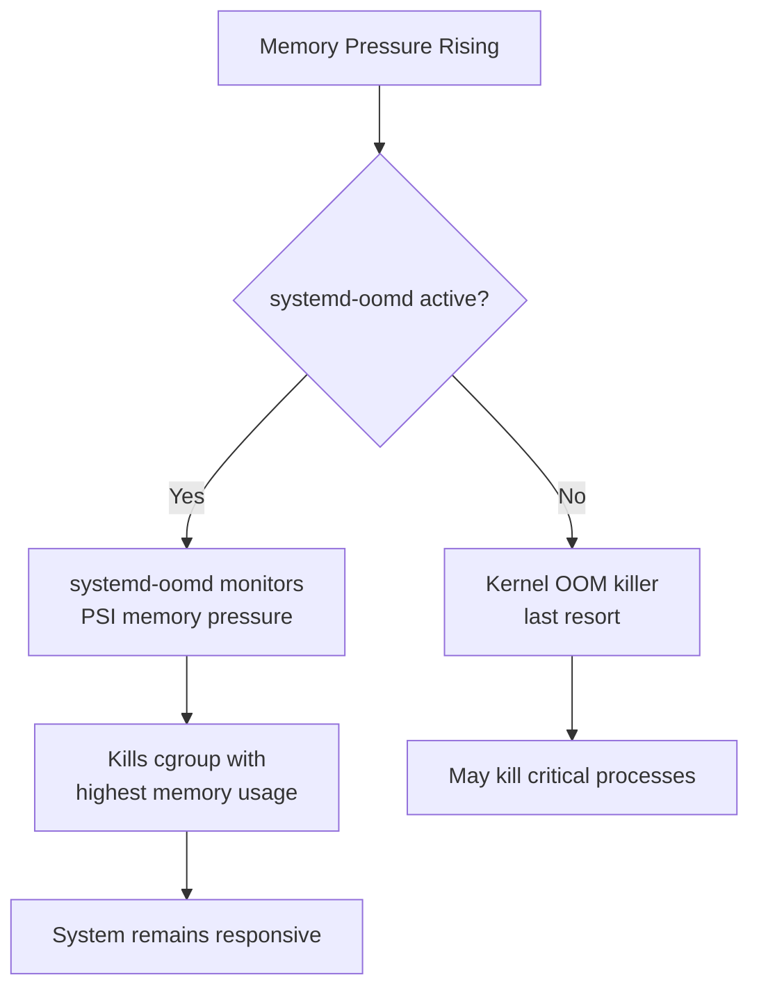

# How to Configure systemd-oomd for Proactive Out-of-Memory Management on RHEL

Author: [nawazdhandala](https://www.github.com/nawazdhandala)

Tags: RHEL, Systemd, OOM, Memory Management, Linux

Description: Learn how to configure systemd-oomd on RHEL for proactive out-of-memory killing before the kernel OOM killer intervenes.

---

systemd-oomd is a user-space out-of-memory daemon that monitors memory pressure and kills processes proactively before the system reaches a critical state. Unlike the kernel OOM killer, systemd-oomd uses cgroup-based memory pressure information and can be configured per-service.

## How systemd-oomd Differs from Kernel OOM



## Step 1: Enable systemd-oomd

```bash
# systemd-oomd is included in RHEL by default
# Enable and start the service
sudo systemctl enable --now systemd-oomd

# Check the status
systemctl status systemd-oomd

# View the default configuration
cat /etc/systemd/oomd.conf
```

## Step 2: Configure systemd-oomd

```bash
# Edit the main configuration file
sudo tee /etc/systemd/oomd.conf << 'CONFEOF'
[OOM]
# Kill when swap usage exceeds 90%
SwapUsedLimit=90%
# Kill when memory pressure exceeds 60% for the default duration
DefaultMemoryPressureLimit=60%
# Duration to measure pressure (default: 30s)
DefaultMemoryPressureDurationUSec=30s
CONFEOF

# Restart to apply changes
sudo systemctl restart systemd-oomd
```

## Step 3: Enable OOM Policy per Service

```bash
# Configure a specific service for oomd management
sudo mkdir -p /etc/systemd/system/myapp.service.d
sudo tee /etc/systemd/system/myapp.service.d/oomd.conf << 'UNITEOF'
[Service]
# Enable memory pressure monitoring for this service
ManagedOOMMemoryPressure=kill
# Set memory pressure threshold (0-100%)
ManagedOOMMemoryPressureLimit=80%
# Enable swap-based killing
ManagedOOMSwap=kill
UNITEOF

sudo systemctl daemon-reload
sudo systemctl restart myapp.service
```

## Step 4: Protect Critical Services

```bash
# Prevent oomd from killing critical services
sudo mkdir -p /etc/systemd/system/sshd.service.d
sudo tee /etc/systemd/system/sshd.service.d/oomd.conf << 'UNITEOF'
[Service]
# Disable oomd for this service
ManagedOOMMemoryPressure=auto
OOMPolicy=continue
UNITEOF

sudo systemctl daemon-reload
```

## Step 5: Monitor systemd-oomd

```bash
# View oomd logs
journalctl -u systemd-oomd --follow

# Check which cgroups are being monitored
oomctl
# Shows monitored cgroups and their current memory pressure

# Check system-wide memory pressure
cat /proc/pressure/memory

# View per-cgroup memory pressure
find /sys/fs/cgroup -name memory.pressure -exec sh -c 'echo "{}:"; cat {}' \;
```

## Step 6: Test the Configuration

```bash
# Create a memory stress test
sudo systemd-run --unit=stress-test --property=ManagedOOMMemoryPressure=kill \
    --property=MemoryMax=512M \
    stress-ng --vm 1 --vm-bytes 1G --timeout 60s

# Watch oomd react
journalctl -u systemd-oomd --follow
```

## Summary

You have configured systemd-oomd on RHEL for proactive memory management. Unlike the kernel OOM killer, systemd-oomd uses memory pressure signals to detect problems early and kills the most appropriate cgroup. This keeps the system responsive and prevents cascading failures during memory pressure events.
