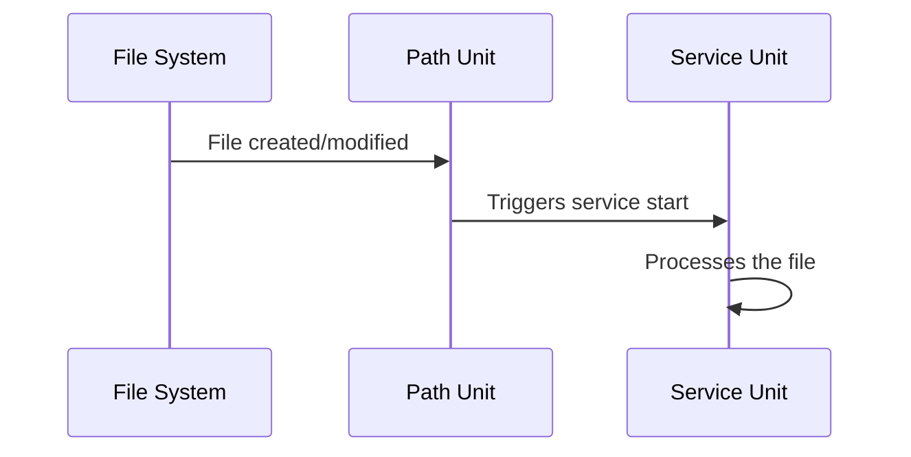

# How to Create systemd Path Units for File System Monitoring on RHEL

Author: [nawazdhandala](https://www.github.com/nawazdhandala)

Tags: RHEL, Systemd, Path Units, File Monitoring, Linux

Description: Learn how to use systemd path units on RHEL to trigger services automatically when files or directories change.

---

systemd path units watch files and directories for changes and trigger associated services when modifications occur. This is a simple, built-in alternative to inotifywait scripts for event-driven automation.

## How Path Units Work



## Step 1: Create a Path Unit

```bash
# Create a path unit that watches for new files in /var/spool/incoming
sudo tee /etc/systemd/system/process-uploads.path << 'UNITEOF'
[Unit]
Description=Watch for new uploaded files

[Path]
# Trigger when any file changes in this directory
DirectoryNotEmpty=/var/spool/incoming
# Also available: PathExists, PathChanged, PathModified

[Install]
WantedBy=multi-user.target
UNITEOF
```

## Step 2: Create the Triggered Service

```bash
# Create the service that runs when files appear
sudo tee /etc/systemd/system/process-uploads.service << 'UNITEOF'
[Unit]
Description=Process uploaded files

[Service]
Type=oneshot
ExecStart=/usr/local/bin/process-uploads.sh
# Run as a specific user for security
User=processor
Group=processor
UNITEOF
```

## Step 3: Create the Processing Script

```bash
sudo tee /usr/local/bin/process-uploads.sh << 'SCRIPT'
#!/bin/bash
# Process all files in the incoming directory
INCOMING="/var/spool/incoming"
PROCESSED="/var/spool/processed"

mkdir -p "$PROCESSED"

for file in "$INCOMING"/*; do
    [ -f "$file" ] || continue
    echo "Processing: $file"
    # Add your processing logic here
    mv "$file" "$PROCESSED/"
done
SCRIPT
sudo chmod +x /usr/local/bin/process-uploads.sh
```

## Step 4: Enable and Test

```bash
# Create required directories
sudo mkdir -p /var/spool/incoming /var/spool/processed

# Reload and enable
sudo systemctl daemon-reload
sudo systemctl enable --now process-uploads.path

# Test by creating a file
echo "test data" | sudo tee /var/spool/incoming/test.txt

# Check if the service was triggered
systemctl status process-uploads.service
journalctl -u process-uploads.service
```

## Path Unit Directives

| Directive | Triggers When |
|-----------|---------------|
| PathExists | Path exists |
| PathChanged | Path is modified (triggers once per change) |
| PathModified | Path is written to (triggers on each write) |
| DirectoryNotEmpty | Directory has files in it |

## Step 5: Watch for Configuration Changes

```bash
# Trigger a service reload when a config file changes
sudo tee /etc/systemd/system/reload-config.path << 'UNITEOF'
[Unit]
Description=Watch application config

[Path]
PathModified=/etc/myapp/config.yml
Unit=reload-config.service

[Install]
WantedBy=multi-user.target
UNITEOF

sudo tee /etc/systemd/system/reload-config.service << 'UNITEOF'
[Unit]
Description=Reload application configuration

[Service]
Type=oneshot
ExecStart=/usr/bin/systemctl reload myapp.service
UNITEOF

sudo systemctl daemon-reload
sudo systemctl enable --now reload-config.path
```

## Summary

You have created systemd path units on RHEL for automatic file system monitoring. Path units provide a clean, systemd-native way to trigger actions when files change, without external tools or polling scripts. They integrate with journald for logging and can be managed with standard systemctl commands.
