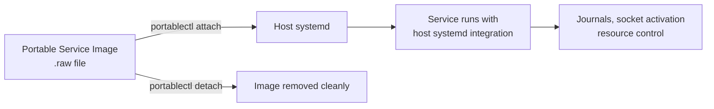

# How to Configure systemd Portable Services on RHEL

Author: [nawazdhandala](https://www.github.com/nawazdhandala)

Tags: RHEL, Systemd, Portable Services, Containers, Linux

Description: Learn how to use systemd portable services on RHEL to deploy self-contained service images that combine an application with its dependencies.

---

systemd portable services are a lightweight alternative to containers. They bundle an application and its dependencies into a disk image that can be attached and detached from a host system. The service runs with systemd integration but is isolated from the host filesystem.

## How Portable Services Work



## Step 1: Create a Portable Service Image

```bash
# Install tools for creating images
sudo dnf install -y systemd-container

# Create a directory tree for the portable service
mkdir -p myservice/usr/lib/systemd/system
mkdir -p myservice/usr/local/bin
mkdir -p myservice/etc

# Create the service binary
cat > myservice/usr/local/bin/myservice.sh << 'SCRIPT'
#!/bin/bash
# Simple service that logs a message every 10 seconds
while true; do
    echo "Portable service running at $(date)"
    sleep 10
done
SCRIPT
chmod +x myservice/usr/local/bin/myservice.sh

# Create the systemd unit file inside the image
cat > myservice/usr/lib/systemd/system/myservice.service << 'UNITEOF'
[Unit]
Description=My Portable Service

[Service]
ExecStart=/usr/local/bin/myservice.sh
DynamicUser=yes
UNITEOF

# Create an os-release file (required for portable services)
cat > myservice/etc/os-release << 'OSEOF'
ID=myservice
VERSION_ID=1.0
OSEOF

# Build the raw disk image
mksquashfs myservice myservice.raw -noappend
```

## Step 2: Attach the Portable Service

```bash
# Copy the image to the portable services directory
sudo cp myservice.raw /var/lib/portables/

# Attach the portable service
sudo portablectl attach myservice.raw

# List attached portable services
portablectl list

# Start the service
sudo systemctl start myservice.service

# Check status
sudo systemctl status myservice.service
journalctl -u myservice.service
```

## Step 3: Manage Portable Services

```bash
# Stop the service
sudo systemctl stop myservice.service

# Detach the image (removes unit files from host)
sudo portablectl detach myservice.raw

# Reattach with a specific profile for sandboxing
sudo portablectl attach --profile=strict myservice.raw
```

## Step 4: Use Built-in Profiles

```bash
# List available profiles
ls /usr/lib/systemd/portable/profile/

# Attach with the default profile (moderate sandboxing)
sudo portablectl attach --profile=default myservice.raw

# Attach with strict profile (maximum sandboxing)
sudo portablectl attach --profile=strict myservice.raw

# Attach with trusted profile (minimal restrictions)
sudo portablectl attach --profile=trusted myservice.raw
```

## Step 5: Inspect Portable Images

```bash
# Show information about a portable image
portablectl inspect myservice.raw

# List the unit files inside the image
portablectl inspect myservice.raw --cat

# Check image integrity
portablectl is-attached myservice.raw
```

## Summary

You have configured systemd portable services on RHEL. Portable services provide a lightweight way to deploy self-contained applications with full systemd integration, including journaling, resource control, and socket activation. They are simpler than containers while still providing filesystem isolation and clean deployment semantics.
