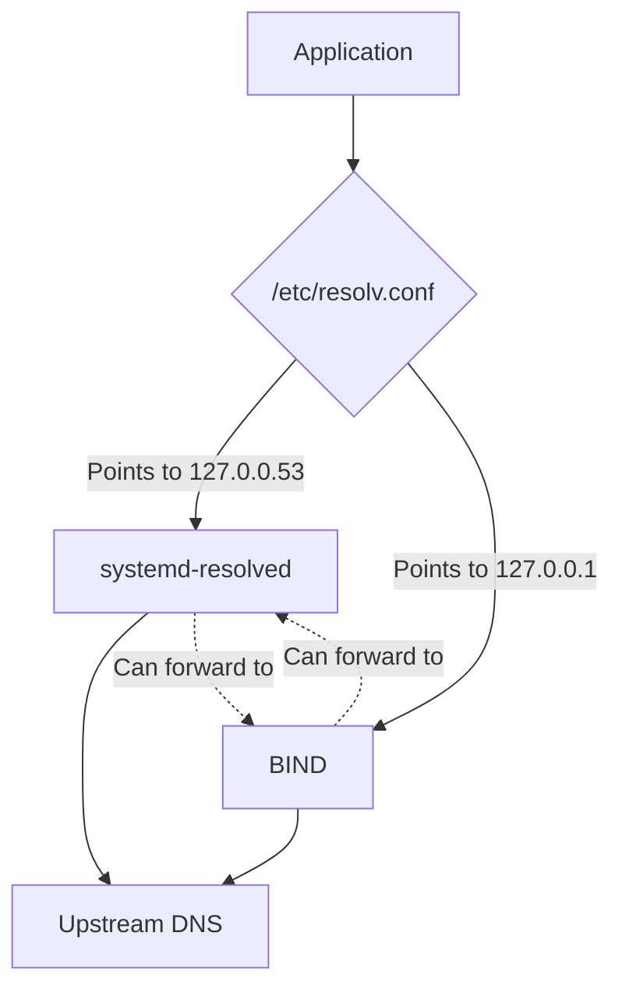

# How to Use systemd-resolved Alongside BIND on RHEL 9

Author: [nawazdhandala](https://www.github.com/nawazdhandala)

Tags: RHEL, systemd-resolved, BIND, DNS, Linux

Description: Learn how to configure systemd-resolved and BIND to coexist on RHEL 9, handling local and external DNS resolution without conflicts.

---

RHEL 9 includes systemd-resolved as an optional local DNS stub resolver, and many administrators run into confusion when it's active alongside BIND. Both want to listen on port 53, both manage DNS resolution, and they step on each other if not configured properly. This post explains how to make them work together, or how to choose between them.

## Understanding the Components



**systemd-resolved** is a local stub resolver. It listens on 127.0.0.53:53 and handles caching, LLMNR, and mDNS. It's lightweight and meant for workstation-style resolution.

**BIND** is a full DNS server. It can do authoritative serving, recursion, caching, and zone management.

## Checking What's Running

See if systemd-resolved is active:

```bash
systemctl is-active systemd-resolved
```

Check what's listening on port 53:

```bash
ss -tulnp | grep :53
```

Check where /etc/resolv.conf points:

```bash
ls -la /etc/resolv.conf
cat /etc/resolv.conf
```

If it's a symlink to `/run/systemd/resolve/stub-resolv.conf`, systemd-resolved is managing it.

## Option 1: Disable systemd-resolved, Use BIND Only

If you're running BIND as a full resolver or authoritative server, the simplest approach is to disable systemd-resolved entirely.

Stop and disable systemd-resolved:

```bash
systemctl stop systemd-resolved
systemctl disable systemd-resolved
```

Remove the symlink and create a static resolv.conf:

```bash
rm /etc/resolv.conf

cat > /etc/resolv.conf << 'EOF'
# Point to local BIND instance
nameserver 127.0.0.1
search example.com
EOF
```

Prevent NetworkManager from overwriting resolv.conf:

```bash
cat > /etc/NetworkManager/conf.d/90-dns-none.conf << 'EOF'
[main]
dns=none
EOF

systemctl restart NetworkManager
```

Now all DNS resolution goes through BIND.

## Option 2: Use systemd-resolved with BIND as Upstream

If you want systemd-resolved handling local resolution (mDNS, caching) and forwarding to BIND for your zones:

Configure systemd-resolved to use BIND as its DNS server:

```bash
mkdir -p /etc/systemd/resolved.conf.d

cat > /etc/systemd/resolved.conf.d/bind-upstream.conf << 'EOF'
[Resolve]
DNS=127.0.0.1
Domains=~example.com ~internal.corp
FallbackDNS=8.8.8.8
EOF
```

This tells systemd-resolved to forward queries for `example.com` and `internal.corp` to BIND on 127.0.0.1, and use 8.8.8.8 as a fallback for everything else.

Make sure BIND listens on a different interface or port to avoid conflict. Configure BIND to listen only on 127.0.0.1:

```
options {
    listen-on port 53 { 127.0.0.1; };
    // ... other options
};
```

Since systemd-resolved listens on 127.0.0.53 and BIND listens on 127.0.0.1, they won't conflict.

Restart both services:

```bash
systemctl restart systemd-resolved
systemctl restart named
```

Verify the setup:

```bash
resolvectl status
```

## Option 3: BIND for Network, systemd-resolved for Local

In this setup, BIND handles DNS for the network (listens on the server's real IP), while systemd-resolved handles the server's own local resolution.

Configure BIND to listen only on the network interface:

```
options {
    listen-on port 53 { 192.168.1.10; };
    listen-on-v6 port 53 { none; };
    // ... other options
};
```

Configure systemd-resolved to use BIND for domain-specific queries:

```bash
cat > /etc/systemd/resolved.conf.d/local.conf << 'EOF'
[Resolve]
DNS=192.168.1.10
Domains=~example.com
FallbackDNS=8.8.8.8 8.8.4.4
EOF

systemctl restart systemd-resolved
```

Check the configuration:

```bash
resolvectl status
```

## Managing /etc/resolv.conf

The resolv.conf file is the critical piece. There are several approaches:

**Symlink to systemd-resolved stub** (default when resolved is active):

```bash
ln -sf /run/systemd/resolve/stub-resolv.conf /etc/resolv.conf
```

This points to 127.0.0.53 and goes through systemd-resolved.

**Symlink to systemd-resolved upstream** (bypass the stub):

```bash
ln -sf /run/systemd/resolve/resolv.conf /etc/resolv.conf
```

This uses the actual upstream servers systemd-resolved is configured with.

**Static file** (manual management):

```bash
cat > /etc/resolv.conf << 'EOF'
nameserver 127.0.0.1
search example.com
EOF
```

## Troubleshooting Coexistence Issues

**Port 53 conflict:**

```bash
ss -tulnp | grep :53
```

If both try to bind to the same address, one will fail. Make sure they listen on different addresses.

**Queries going to the wrong resolver:**

```bash
# See which resolver handles a specific domain
resolvectl query www.example.com
```

**NetworkManager overwriting resolv.conf:**

```bash
# Check NetworkManager's DNS mode
nmcli general | grep -i dns
```

Set NetworkManager to not manage DNS:

```bash
cat > /etc/NetworkManager/conf.d/90-dns-none.conf << 'EOF'
[main]
dns=none
EOF
systemctl restart NetworkManager
```

**Cache inconsistencies:**

If you change records in BIND but systemd-resolved still returns old results:

```bash
resolvectl flush-caches
```

## Testing Resolution

Test through systemd-resolved:

```bash
resolvectl query www.example.com
```

Test through BIND directly:

```bash
dig @127.0.0.1 www.example.com
```

Test from an external client:

```bash
dig @192.168.1.10 www.example.com
```

## My Recommendation

For servers that run BIND, I usually disable systemd-resolved entirely. It's one less moving part, and BIND handles everything a server needs. systemd-resolved is more useful on workstations and laptops where mDNS, per-interface DNS, and VPN split-DNS are common needs. On a dedicated DNS server, it just adds complexity with no real benefit.
