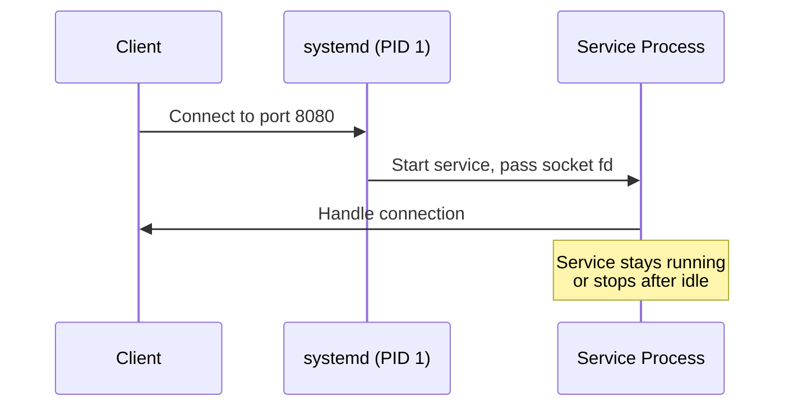

# How to Set Up systemd Socket Activation for On-Demand Services on RHEL

Author: [nawazdhandala](https://www.github.com/nawazdhandala)

Tags: RHEL, systemd, Socket Activation, Linux, Services

Description: Learn how to configure systemd socket activation on RHEL to start services on-demand when connections arrive, reducing resource usage and boot time.

---

systemd socket activation allows you to defer starting a service until a client actually connects. The systemd init system listens on the socket, and when a connection arrives, it starts the corresponding service and hands off the socket. This reduces boot time and saves resources for infrequently used services.

## How Socket Activation Works



## Step 1: Create a Simple Socket-Activated Service

Create the socket unit file:

```bash
# Create the socket unit that listens on port 8080
sudo tee /etc/systemd/system/myapp.socket << 'UNITEOF'
[Unit]
Description=MyApp Socket

[Socket]
# Listen on TCP port 8080
ListenStream=8080
# Accept connections and pass them to the service
Accept=false

[Install]
WantedBy=sockets.target
UNITEOF
```

Create the matching service unit:

```bash
# Create the service unit that handles connections
sudo tee /etc/systemd/system/myapp.service << 'UNITEOF'
[Unit]
Description=MyApp Service
Requires=myapp.socket

[Service]
# The service receives the socket file descriptor from systemd
ExecStart=/usr/local/bin/myapp
# Restart the service if it crashes
Restart=on-failure

[Install]
WantedBy=multi-user.target
UNITEOF
```

## Step 2: Create a Sample Application

```python
#!/usr/bin/env python3
"""myapp.py - A simple socket-activated service"""
import socket
import sys
import os

def main():
    # File descriptor 3 is the socket passed by systemd
    # SD_LISTEN_FDS_START is always 3
    fd = 3

    # Check if systemd passed us a socket
    listen_fds = int(os.environ.get('LISTEN_FDS', '0'))
    if listen_fds < 1:
        print("No socket passed by systemd", file=sys.stderr)
        sys.exit(1)

    # Create a socket object from the file descriptor
    server = socket.fromfd(fd, socket.AF_INET, socket.SOCK_STREAM)
    server.settimeout(30)  # Idle timeout

    print("Service started, waiting for connections...")

    while True:
        try:
            conn, addr = server.accept()
            print(f"Connection from {addr}")
            conn.sendall(b"Hello from socket-activated service!\n")
            conn.close()
        except socket.timeout:
            print("Idle timeout, shutting down")
            break

if __name__ == '__main__':
    main()
```

```bash
# Install the application
sudo cp myapp.py /usr/local/bin/myapp
sudo chmod +x /usr/local/bin/myapp
```

## Step 3: Enable and Start the Socket

```bash
# Reload systemd to pick up the new units
sudo systemctl daemon-reload

# Enable and start the socket (not the service)
sudo systemctl enable --now myapp.socket

# Verify the socket is listening
sudo systemctl status myapp.socket
ss -tlnp | grep 8080

# The service should NOT be running yet
sudo systemctl status myapp.service
```

## Step 4: Test Socket Activation

```bash
# Connect to the socket - this will trigger service start
nc localhost 8080
# You should see: Hello from socket-activated service!

# Now check the service status - it should be active
sudo systemctl status myapp.service
```

## Step 5: Accept Mode for Per-Connection Instances

For services that need a new process per connection, use `Accept=true`:

```bash
# Create a template service with Accept mode
sudo tee /etc/systemd/system/myapp-accept.socket << 'UNITEOF'
[Unit]
Description=MyApp Per-Connection Socket

[Socket]
ListenStream=8081
Accept=true

[Install]
WantedBy=sockets.target
UNITEOF

# The service must be a template unit (note the @ in the name)
sudo tee /etc/systemd/system/myapp-accept@.service << 'UNITEOF'
[Unit]
Description=MyApp Per-Connection Handler

[Service]
# stdin/stdout are connected to the socket
ExecStart=/usr/local/bin/myapp-handler
StandardInput=socket
StandardOutput=socket
UNITEOF

sudo systemctl daemon-reload
sudo systemctl enable --now myapp-accept.socket
```

## Step 6: Configure Idle Timeout

```bash
# Add idle timeout to automatically stop the service
sudo mkdir -p /etc/systemd/system/myapp.service.d
sudo tee /etc/systemd/system/myapp.service.d/timeout.conf << 'UNITEOF'
[Service]
# Stop the service after 60 seconds of inactivity
TimeoutStopSec=60
# The socket unit will restart the service when needed
UNITEOF

sudo systemctl daemon-reload
```

## Monitoring

```bash
# List all active sockets
systemctl list-sockets

# Check socket activation timestamps
systemctl show myapp.socket --property=NAccepted
systemctl show myapp.socket --property=NConnections

# View logs for socket-activated services
journalctl -u myapp.socket -u myapp.service --follow
```

## Summary

You have configured systemd socket activation on RHEL. Services now start on-demand when clients connect, saving system resources and reducing boot time. This pattern is ideal for infrequently accessed services, development environments, and systems with many optional services.
