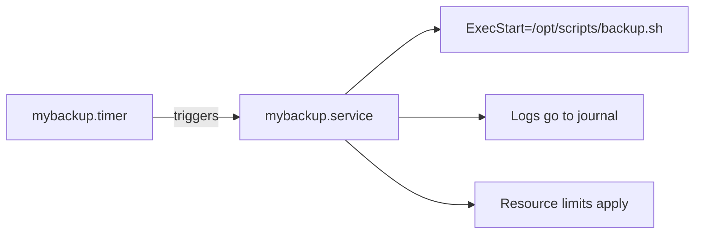

# How to Use systemd Timers as a Modern Alternative to Cron on RHEL

Author: [nawazdhandala](https://www.github.com/nawazdhandala)

Tags: RHEL, systemd Timers, Cron Alternative, Scheduling, Linux

Description: Learn how to use systemd timers on RHEL to schedule recurring tasks with better logging, dependency management, and resource control than traditional cron jobs.

---

Cron has been scheduling tasks on Unix systems for decades, and it works. But it has limitations that become painful at scale: no built-in logging, no dependency management, no resource controls, and a syntax that everyone has to look up every single time. systemd timers solve all of these problems using the same unit file system that manages your services.

I switched most of my cron jobs to systemd timers a few years ago and have not looked back. Here is how to make the move.

---

## How systemd Timers Work

A systemd timer consists of two unit files:

1. A **timer unit** (`.timer`) that defines when to run
2. A **service unit** (`.service`) that defines what to run

When the timer fires, it activates the corresponding service unit. This separation means your scheduled task gets all the benefits of a regular systemd service: journal logging, resource limits, dependency management, and proper process supervision.



---

## Creating Your First Timer

Let's create a timer that runs a backup script every day at 2:00 AM.

First, create the service unit that defines what to run:

```ini
# /etc/systemd/system/mybackup.service
[Unit]
Description=Daily Backup Job

[Service]
Type=oneshot
User=backup
Group=backup
ExecStart=/opt/scripts/backup.sh
StandardOutput=journal
StandardError=journal

# Prevent the backup from running forever
TimeoutStartSec=3600

# Resource limits
MemoryMax=1G
CPUQuota=50%
```

Note that there is no `[Install]` section. The service is activated by the timer, not by enable/disable directly.

Now create the timer unit:

```ini
# /etc/systemd/system/mybackup.timer
[Unit]
Description=Run daily backup at 2:00 AM

[Timer]
OnCalendar=*-*-* 02:00:00
Persistent=true

[Install]
WantedBy=timers.target
```

Reload systemd and enable the timer:

```bash
# Reload unit files and enable the timer
sudo systemctl daemon-reload
sudo systemctl enable --now mybackup.timer
```

Verify the timer is active:

```bash
# Check the timer status
sudo systemctl status mybackup.timer
```

---

## OnCalendar Syntax

The `OnCalendar` directive uses a flexible calendar expression format. Here are the most common patterns:

```ini
# Every day at midnight
OnCalendar=daily

# Every day at 2:30 AM
OnCalendar=*-*-* 02:30:00

# Every Monday at 6:00 AM
OnCalendar=Mon *-*-* 06:00:00

# Every hour
OnCalendar=hourly

# Every 15 minutes
OnCalendar=*:0/15

# First day of every month at 3:00 AM
OnCalendar=*-*-01 03:00:00

# Every weekday at 9:00 AM
OnCalendar=Mon..Fri *-*-* 09:00:00

# Every 6 hours
OnCalendar=*-*-* 00/6:00:00

# Specific date (one-shot schedule)
OnCalendar=2026-12-31 23:59:00
```

The general format is `DayOfWeek Year-Month-Day Hour:Minute:Second`. Wildcards (`*`) and ranges (`Mon..Fri`) make it flexible.

To test your expression without creating a timer, use `systemd-analyze`:

```bash
# Test a calendar expression - shows the next 5 trigger times
systemd-analyze calendar "*-*-* 02:00:00"

# Test a more complex expression
systemd-analyze calendar "Mon..Fri *-*-* 09:00:00"
```

This prints the normalized form and the next matching timestamps. Very handy for verifying your expression does what you think.

---

## Monotonic Timers

Besides calendar-based scheduling, systemd timers support monotonic timers that fire relative to some event:

```ini
[Timer]
# Run 15 minutes after the system boots
OnBootSec=15min

# Run 1 hour after the timer was last activated
OnUnitActiveSec=1h

# Run 30 minutes after the timer unit itself was started
OnActiveSec=30min

# Run 5 minutes after the service last finished
OnUnitInactiveSec=5min
```

You can combine multiple triggers. The timer fires whenever any condition is met:

```ini
[Timer]
# Run at boot plus 5 minutes, then every hour after that
OnBootSec=5min
OnUnitActiveSec=1h
```

This is useful for tasks like "check for updates every hour, and also right after boot."

---

## Persistent Timers

The `Persistent=true` option is one of the biggest advantages over cron. If the system was powered off when the timer should have fired, systemd will run the task immediately on the next boot:

```ini
[Timer]
OnCalendar=daily
Persistent=true
```

With cron, if the machine is off at 2:00 AM, the daily job just does not run that day. With a persistent timer, it catches up. This is critical for tasks like backups that must not be skipped.

---

## Randomized Delays

To avoid a thundering herd problem (all your servers running the same task at the same second), add a random delay:

```ini
[Timer]
OnCalendar=*-*-* 02:00:00
RandomizedDelaySec=900
Persistent=true
```

This adds a random delay of up to 900 seconds (15 minutes) before executing. Each system picks its own random offset, spreading the load across your fleet.

---

## Listing and Managing Timers

See all active timers on the system:

```bash
# List all timers with their next trigger time
systemctl list-timers
```

The output shows when each timer will fire next, when it last fired, and what service it triggers:

```
NEXT                         LEFT       LAST                         PASSED   UNIT                   ACTIVATES
Wed 2026-03-04 02:00:00 UTC  8h left    Tue 2026-03-03 02:00:12 UTC  15h ago  mybackup.timer         mybackup.service
Wed 2026-03-04 00:00:00 UTC  6h left    Tue 2026-03-03 00:00:00 UTC  17h ago  logrotate.timer        logrotate.service
```

Include inactive timers:

```bash
# List all timers including inactive ones
systemctl list-timers --all
```

Check the log output from the last timer run:

```bash
# See the logs from the last backup run
sudo journalctl -u mybackup.service -n 30
```

---

## Practical Example: Log Cleanup Timer

Here is a complete example for a log cleanup task:

```ini
# /etc/systemd/system/log-cleanup.service
[Unit]
Description=Clean up old application logs

[Service]
Type=oneshot
ExecStart=/usr/bin/find /var/log/myapp -name "*.log" -mtime +30 -delete
ExecStart=/usr/bin/find /var/log/myapp -name "*.gz" -mtime +90 -delete
StandardOutput=journal
StandardError=journal
```

```ini
# /etc/systemd/system/log-cleanup.timer
[Unit]
Description=Run log cleanup weekly

[Timer]
OnCalendar=Sun *-*-* 04:00:00
Persistent=true
RandomizedDelaySec=1800

[Install]
WantedBy=timers.target
```

Deploy and activate:

```bash
# Deploy both unit files
sudo cp log-cleanup.service log-cleanup.timer /etc/systemd/system/

# Reload and enable
sudo systemctl daemon-reload
sudo systemctl enable --now log-cleanup.timer

# Verify
systemctl list-timers | grep log-cleanup
```

---

## Migrating from Cron

Here is a quick reference for translating common cron expressions:

| Cron Expression | systemd OnCalendar |
|----------------|-------------------|
| `0 * * * *` (every hour) | `OnCalendar=hourly` |
| `*/15 * * * *` (every 15 min) | `OnCalendar=*:0/15` |
| `0 2 * * *` (daily at 2 AM) | `OnCalendar=*-*-* 02:00:00` |
| `0 0 * * 0` (weekly Sunday) | `OnCalendar=Sun *-*-* 00:00:00` |
| `0 0 1 * *` (monthly) | `OnCalendar=*-*-01 00:00:00` |
| `0 9 * * 1-5` (weekdays 9 AM) | `OnCalendar=Mon..Fri *-*-* 09:00:00` |

The advantages you get by migrating:

- **Logging**: Every run is captured in the journal. No more wondering if the cron job ran or what it printed.
- **Resource controls**: Set CPU, memory, and I/O limits per task.
- **Dependencies**: Wait for the network or another service before running.
- **Missed runs**: Persistent timers catch up after downtime.
- **No email surprises**: Cron emails stdout/stderr to root by default. Timers log to the journal where you can read them when you choose.

---

## Debugging Timers

When a timer is not firing as expected:

```bash
# Check the timer status for clues
sudo systemctl status mybackup.timer

# Verify the calendar expression
systemd-analyze calendar "*-*-* 02:00:00"

# Check if the service ran successfully
sudo journalctl -u mybackup.service --since today

# Manually trigger the service to test it
sudo systemctl start mybackup.service

# Watch the service output in real time
sudo journalctl -u mybackup.service -f
```

---

## Wrapping Up

systemd timers are not just a replacement for cron, they are an upgrade. You get proper logging, resource management, dependency handling, and persistent scheduling with no extra tools. The syntax takes a bit of getting used to if you have been writing cron expressions for years, but `systemd-analyze calendar` makes it easy to verify your expressions. Start by migrating your most important cron jobs, and once you see the improved visibility and reliability, you will want to move everything over.
