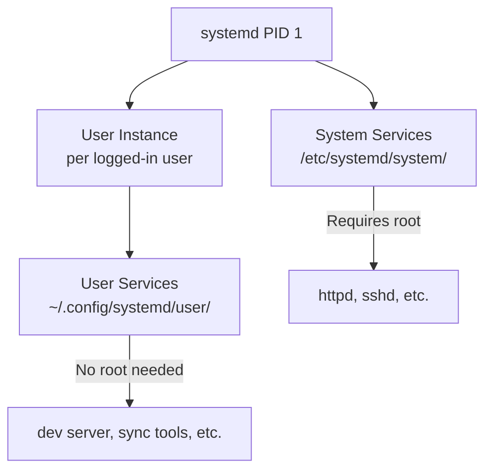

# How to Create and Manage systemd User Services on RHEL

Author: [nawazdhandala](https://www.github.com/nawazdhandala)

Tags: RHEL, Systemd, User Services, Linux, Process Management

Description: Learn how to create and manage systemd user services on RHEL that run in your user session without requiring root privileges.

---

systemd user services run under your user account, not as root. They are perfect for personal daemons, development servers, and background tasks that should only run when you are logged in (or persistently with lingering enabled).

## How User Services Differ from System Services



## Step 1: Create a User Service

```bash
# Create the user systemd directory
mkdir -p ~/.config/systemd/user

# Create a simple user service
cat > ~/.config/systemd/user/mydev.service << 'UNITEOF'
[Unit]
Description=My Development Server

[Service]
# Run a simple Python HTTP server
ExecStart=/usr/bin/python3 -m http.server 8080
WorkingDirectory=%h/projects
Restart=on-failure

[Install]
WantedBy=default.target
UNITEOF
```

## Step 2: Manage the User Service

```bash
# Reload user systemd instance
systemctl --user daemon-reload

# Start the service
systemctl --user start mydev.service

# Check status
systemctl --user status mydev.service

# Enable at login
systemctl --user enable mydev.service

# View logs
journalctl --user -u mydev.service --follow
```

## Step 3: Enable Lingering for Persistent Services

By default, user services only run while the user is logged in. Enable lingering to keep them running after logout.

```bash
# Enable lingering for the current user
sudo loginctl enable-linger $USER

# Verify lingering is enabled
loginctl show-user $USER --property=Linger

# Now user services will start at boot and persist after logout
```

## Step 4: Environment Variables

```bash
# Set environment variables for user services
cat > ~/.config/systemd/user/mydev.service.d/env.conf << 'UNITEOF'
[Service]
Environment="NODE_ENV=development"
Environment="PORT=3000"
UNITEOF

# Or use an environment file
cat > ~/.config/environment.d/mydev.conf << 'ENVEOF'
NODE_ENV=development
PORT=3000
ENVEOF

systemctl --user daemon-reload
systemctl --user restart mydev.service
```

## Step 5: Timer-Based User Services

```bash
# Create a user timer for periodic tasks
cat > ~/.config/systemd/user/backup.service << 'UNITEOF'
[Unit]
Description=Backup home directory

[Service]
Type=oneshot
ExecStart=/usr/bin/rsync -a %h/documents/ %h/backups/documents/
UNITEOF

cat > ~/.config/systemd/user/backup.timer << 'UNITEOF'
[Unit]
Description=Run backup every hour

[Timer]
OnCalendar=hourly
Persistent=true

[Install]
WantedBy=timers.target
UNITEOF

systemctl --user daemon-reload
systemctl --user enable --now backup.timer
systemctl --user list-timers
```

## Useful Commands

```bash
# List all user services
systemctl --user list-units --type=service

# Show failed user services
systemctl --user --failed

# Reset failed status
systemctl --user reset-failed

# Check the user systemd instance
systemctl --user status
```

## Summary

You have created and managed systemd user services on RHEL. User services run without root privileges, making them ideal for personal development tools, sync daemons, and background tasks. With lingering enabled, they persist even after you log out, behaving like system services but scoped to your user account.
