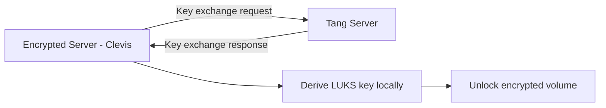
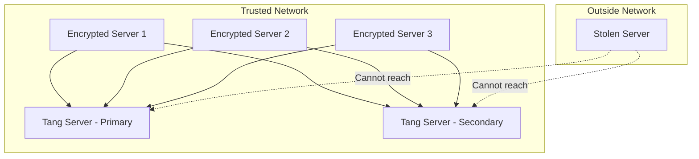

# How to Set Up a Tang Server for Network-Bound Disk Encryption on RHEL

Author: [nawazdhandala](https://www.github.com/nawazdhandala)

Tags: RHEL, Tang, NBDE, Encryption, Linux

Description: Learn how to deploy a Tang server on RHEL to provide Network-Bound Disk Encryption, enabling automatic LUKS volume unlocking when servers are on the trusted network.

---

Disk encryption is great until you need to reboot a server at 3 AM and someone has to type the LUKS passphrase. Network-Bound Disk Encryption (NBDE) solves this by letting servers automatically unlock their encrypted volumes when they can reach a Tang key server on the trusted network. If the server is stolen or taken off the network, the disks stay locked. This guide covers setting up the Tang server side.

## How NBDE Works

NBDE uses a client-server model. Tang is the server that holds encryption keys. Clevis is the client-side framework that talks to Tang during boot. The clever part is that Tang never stores or learns the encryption key for any client. Instead, it performs a key exchange that allows the client to derive its own key only when Tang is reachable.



If the server cannot reach Tang (because it has been removed from the network), the key exchange fails and the volume stays locked.

## Installing Tang

On the system that will serve as your Tang server:

```bash
# Install the Tang server package
sudo dnf install tang -y
```

Tang uses systemd socket activation through `tangd.socket`. Enable and start it:

```bash
# Enable and start the Tang socket
sudo systemctl enable --now tangd.socket
```

Tang listens on port 80 by default through its socket unit.

## Verifying the Tang Service

Check that Tang is listening:

```bash
# Check the socket status
sudo systemctl status tangd.socket

# Verify Tang is responding
curl -s http://localhost/adv | python3 -m json.tool
```

The `/adv` endpoint returns Tang's advertisement, which contains the public signing and exchange keys. Clients use this to verify they are talking to the right Tang server.

## Firewall Configuration

Allow Tang traffic through the firewall:

```bash
# Open HTTP port for Tang
sudo firewall-cmd --add-service=http --permanent
sudo firewall-cmd --reload

# Verify the rule
sudo firewall-cmd --list-services
```

## Understanding Tang Keys

Tang automatically generates its keys on first use. The keys are stored in `/var/db/tang/`:

```bash
# List Tang's key files
sudo ls -la /var/db/tang/
```

You will see files with `.jwk` extensions. These are JSON Web Keys. There are typically two types:

- Signing keys - used to sign the advertisement
- Exchange keys - used in the key derivation process

## Key Rotation

Periodically rotate Tang keys for security:

```bash
# Generate new keys (old keys remain for existing clients)
sudo /usr/libexec/tangd-keygen /var/db/tang

# List all keys including old ones
sudo ls -la /var/db/tang/
```

Old keys are kept so that existing Clevis bindings continue to work. To decommission old keys, rename them with a leading dot:

```bash
# Disable an old key by hiding it (replace with your actual key filename)
sudo mv /var/db/tang/old-key-id.jwk /var/db/tang/.old-key-id.jwk
```

After hiding old keys, clients bound to those keys will need to re-bind. Plan key rotation carefully to avoid locking out clients.

## Testing Tang from a Remote Client

From another RHEL system, verify Tang is reachable:

```bash
# Test Tang from a client machine
curl -sf http://tang-server.example.com/adv
```

If you get a JSON response with keys, Tang is working and reachable.

## Securing the Tang Server

Tang is security-critical infrastructure. Some hardening recommendations:

```bash
# Restrict SSH access
sudo vi /etc/ssh/sshd_config
# Set: AllowUsers admin

# Make sure only necessary services are running
sudo systemctl list-units --type=service --state=running

# Keep the system updated
sudo dnf update -y
```

Additional security considerations:

- Place Tang on an isolated management VLAN
- Use firewall rules to limit which subnets can reach Tang
- Monitor Tang access logs for unusual activity
- Keep the Tang server minimal - do not run other services on it

```bash
# Restrict Tang access to specific subnets using firewalld rich rules
sudo firewall-cmd --permanent --add-rich-rule='rule family="ipv4" source address="10.0.1.0/24" service name="http" accept'
sudo firewall-cmd --permanent --remove-service=http
sudo firewall-cmd --reload
```

## Tang Server Architecture

For a production deployment, consider the network layout:



## Backup and Recovery

Back up Tang's keys so you can recover if the Tang server fails:

```bash
# Back up Tang keys to a secure location
sudo tar czf /root/tang-keys-backup-$(date +%Y%m%d).tar.gz /var/db/tang/
```

Store this backup securely, encrypted, and offline. Anyone with these keys could impersonate your Tang server.

To restore on a new Tang server:

```bash
# On the replacement server after installing tang
sudo tar xzf tang-keys-backup.tar.gz -C /
sudo systemctl enable --now tangd.socket
```

Clients will reconnect to the new Tang server seamlessly as long as it has the same keys and is reachable at the expected address.

## Next Steps

With Tang running, the next step is configuring Clevis on your client systems to bind their LUKS volumes to the Tang server. That is covered in the companion guide on Clevis configuration.
