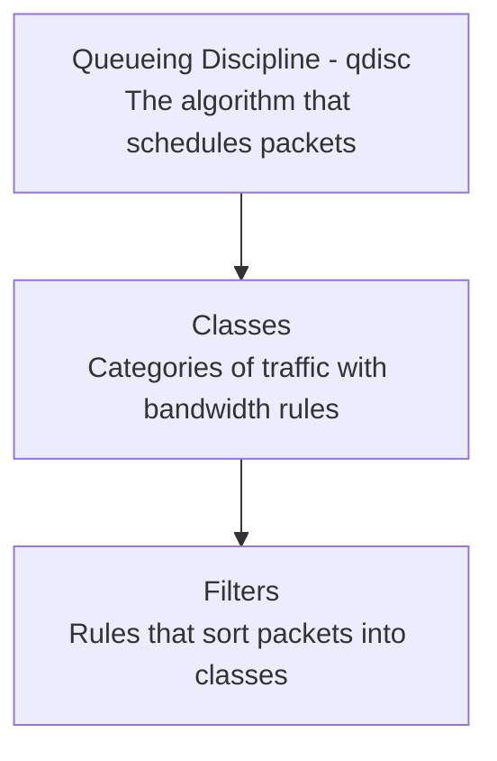

# How to Use tc to Limit Network Bandwidth on RHEL

Author: [nawazdhandala](https://www.github.com/nawazdhandala)

Tags: RHEL, Tc, Bandwidth, Traffic Control, Linux

Description: A practical guide to using the tc (traffic control) command on RHEL to limit and manage network bandwidth on specific interfaces, for specific applications, or for specific traffic types.

---

Bandwidth limiting is one of the most common traffic control tasks. Maybe you need to prevent a backup job from saturating your link, or you need to simulate a slow connection for testing, or you want to guarantee bandwidth for critical services. The `tc` command handles all of this on RHEL.

## Understanding tc Basics

`tc` works with three concepts:



- **qdisc** - The scheduling algorithm attached to an interface
- **class** - Bandwidth allocation buckets (only for classful qdiscs)
- **filter** - Rules that classify packets into classes

## Simple Bandwidth Limit with tbf

The Token Bucket Filter (tbf) is the simplest way to cap bandwidth on an interface.

```bash
# Limit ens192 to 100 Mbits/sec
sudo tc qdisc add dev ens192 root tbf rate 100mbit burst 32kbit latency 400ms

# Verify
tc qdisc show dev ens192
```

Parameters:
- **rate** - Maximum sustained bandwidth
- **burst** - Maximum burst size (should be at least rate/HZ)
- **latency** - Maximum time a packet can wait in the queue

```bash
# Remove the limit
sudo tc qdisc del dev ens192 root
```

## Limiting Bandwidth to a Specific Rate

Common bandwidth limits:

```bash
# Limit to 10 Mbits/sec (simulate a basic broadband connection)
sudo tc qdisc add dev ens192 root tbf rate 10mbit burst 10kbit latency 400ms

# Limit to 1 Mbit/sec (simulate a slow connection)
sudo tc qdisc add dev ens192 root tbf rate 1mbit burst 10kbit latency 400ms

# Limit to 50 Mbits/sec
sudo tc qdisc add dev ens192 root tbf rate 50mbit burst 32kbit latency 400ms
```

## Per-Application Bandwidth Limiting with HTB

To limit specific traffic types while leaving others unrestricted, use HTB (Hierarchical Token Bucket).

```bash
# Set up HTB with 1 Gbit total capacity
sudo tc qdisc add dev ens192 root handle 1: htb default 99

# Root class - full link capacity
sudo tc class add dev ens192 parent 1: classid 1:1 htb rate 1gbit

# Limited class - max 50 Mbits for specific traffic
sudo tc class add dev ens192 parent 1:1 classid 1:10 htb rate 50mbit ceil 50mbit

# Unlimited class - everything else gets full speed
sudo tc class add dev ens192 parent 1:1 classid 1:99 htb rate 950mbit ceil 1gbit

# Filter: traffic to port 873 (rsync) goes to the limited class
sudo tc filter add dev ens192 parent 1: protocol ip prio 1 u32 match ip dport 873 0xffff flowid 1:10

# Verify
tc -s class show dev ens192
```

## Limiting Bandwidth by IP Address

```bash
# Set up HTB
sudo tc qdisc add dev ens192 root handle 1: htb default 99
sudo tc class add dev ens192 parent 1: classid 1:1 htb rate 1gbit

# Limit traffic TO a specific IP to 10 Mbits
sudo tc class add dev ens192 parent 1:1 classid 1:10 htb rate 10mbit ceil 10mbit
sudo tc filter add dev ens192 parent 1: protocol ip prio 1 u32 match ip dst 192.168.1.50 flowid 1:10

# Default class for everything else
sudo tc class add dev ens192 parent 1:1 classid 1:99 htb rate 990mbit ceil 1gbit
```

## Limiting Bandwidth by Subnet

```bash
# Limit traffic to an entire subnet
sudo tc filter add dev ens192 parent 1: protocol ip prio 1 u32 \
    match ip dst 10.0.0.0/8 flowid 1:10
```

## Limiting Bandwidth on a VPN Interface

```bash
# Limit WireGuard tunnel to 50 Mbits
sudo tc qdisc add dev wg0 root tbf rate 50mbit burst 32kbit latency 400ms

# Or limit OpenVPN tunnel
sudo tc qdisc add dev tun0 root tbf rate 50mbit burst 32kbit latency 400ms
```

## Testing Your Bandwidth Limits

Use iperf3 to verify the limits are working:

```bash
# On the remote machine
iperf3 -s

# On the limited machine
iperf3 -c REMOTE_IP -t 10

# Compare with the limit you set
```

## Viewing Current tc Configuration

```bash
# Show all qdiscs
tc qdisc show dev ens192

# Show all classes with statistics
tc -s class show dev ens192

# Show filters
tc filter show dev ens192

# Detailed stats
tc -s -d qdisc show dev ens192
```

## Changing Existing Limits

```bash
# Change the rate on an existing tbf qdisc
sudo tc qdisc change dev ens192 root tbf rate 200mbit burst 32kbit latency 400ms

# Change a class rate
sudo tc class change dev ens192 parent 1:1 classid 1:10 htb rate 75mbit ceil 100mbit
```

## Making Limits Persistent

tc rules are lost on reboot. Make them persistent with a systemd service:

```bash
# Create a script
sudo tee /usr/local/bin/tc-setup.sh > /dev/null << 'EOF'
#!/bin/bash
# Bandwidth limiting setup

# Clear existing rules
tc qdisc del dev ens192 root 2>/dev/null

# Set a 100 Mbit limit
tc qdisc add dev ens192 root tbf rate 100mbit burst 32kbit latency 400ms
EOF

sudo chmod +x /usr/local/bin/tc-setup.sh

# Create a systemd service
sudo tee /etc/systemd/system/tc-setup.service > /dev/null << 'EOF'
[Unit]
Description=Traffic Control Bandwidth Limits
After=network-online.target
Wants=network-online.target

[Service]
Type=oneshot
ExecStart=/usr/local/bin/tc-setup.sh
RemainAfterExit=yes

[Install]
WantedBy=multi-user.target
EOF

sudo systemctl daemon-reload
sudo systemctl enable tc-setup
```

## Removing All tc Rules

```bash
# Remove everything and restore default qdisc
sudo tc qdisc del dev ens192 root

# Verify
tc qdisc show dev ens192
# Should show the default fq_codel
```

## Common Gotchas

1. **tc only shapes outbound traffic.** You can't directly limit incoming bandwidth. To limit download speed, apply tc on the sending side, or use an IFB device.

2. **burst must be large enough.** If burst is too small relative to the rate, you'll get lower throughput than expected.

3. **Don't forget the default class.** Without a default in HTB, unmatched traffic gets dropped.

4. **Units matter.** `mbit` is megabits, `mbps` is megabytes. Use `mbit` for bandwidth and `kbit` for burst sizes.

## Wrapping Up

Bandwidth limiting with tc on RHEL ranges from dead simple (tbf for a flat cap) to quite flexible (HTB for per-application limits). Start with tbf for basic needs, move to HTB when you need different limits for different traffic types. Always test with iperf3 to verify your limits work as expected, and make the configuration persistent with a systemd service.
