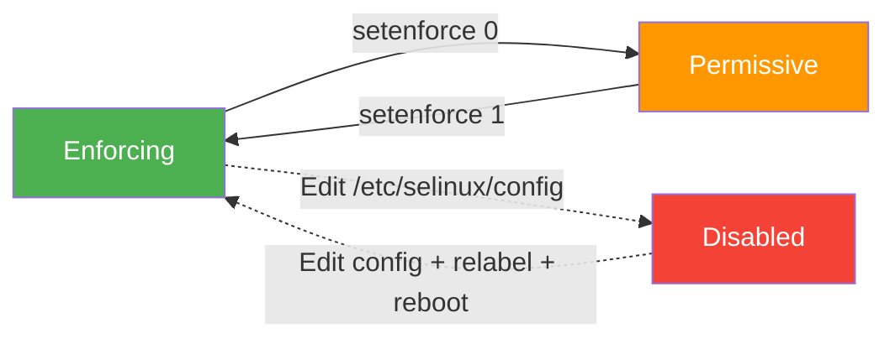

# How to Temporarily Switch SELinux to Permissive Mode for Troubleshooting on RHEL

Author: [nawazdhandala](https://www.github.com/nawazdhandala)

Tags: RHEL, SELinux, Permissive Mode, Troubleshooting, Security, Linux

Description: Learn how to safely switch SELinux to permissive mode on RHEL for troubleshooting access denials without permanently reducing system security.

---

When an application is being blocked by SELinux, switching to permissive mode is a valuable troubleshooting technique. In permissive mode, SELinux logs policy violations but does not enforce them, letting you identify exactly what is being denied without disrupting services. This guide shows you how to do it safely on RHEL.

## Understanding SELinux Modes

SELinux has three modes:



- **Enforcing** - SELinux policy is enforced. Violations are denied and logged.
- **Permissive** - SELinux policy is not enforced. Violations are only logged.
- **Disabled** - SELinux is completely turned off. Not recommended.

## Check the Current SELinux Mode

Before making changes, check what mode your system is currently running:

```bash
# Quick check
getenforce
# Output: Enforcing

# Detailed status
sestatus
```

The `sestatus` output shows both the mode from the config file and the current runtime mode:

```bash
SELinux status:                 enabled
SELinuxfs mount:                /sys/fs/selinux
SELinux root directory:         /etc/selinux
Loaded policy name:             targeted
Current mode:                   enforcing
Mode from config file:          enforcing
Policy MLS status:              enabled
Policy deny_unknown status:     allowed
Memory protection checking:     actual (secure)
Max kernel policy version:      33
```

## Switch to Permissive Mode at Runtime

To temporarily switch to permissive mode without rebooting and without changing the config file:

```bash
# Switch to permissive mode
sudo setenforce 0

# Verify the change
getenforce
# Output: Permissive
```

This change takes effect immediately and lasts until the next reboot. After rebooting, the system will return to whatever mode is set in `/etc/selinux/config`.

## Switch Back to Enforcing Mode

Once you have finished troubleshooting:

```bash
# Switch back to enforcing mode
sudo setenforce 1

# Verify
getenforce
# Output: Enforcing
```

## Set Permissive Mode for a Specific Domain Only

Instead of making the entire system permissive, you can make just one SELinux domain permissive. This is much safer because it only relaxes enforcement for the specific service you are troubleshooting:

```bash
# Make httpd_t domain permissive (only affects Apache/web server)
sudo semanage permissive -a httpd_t

# List all permissive domains
sudo semanage permissive -l
```

When you are done troubleshooting:

```bash
# Remove the permissive exception for httpd_t
sudo semanage permissive -d httpd_t
```

This approach is strongly recommended over making the entire system permissive, because it limits the security reduction to just one service.

## Troubleshooting Workflow with Permissive Mode

Here is a practical workflow for using permissive mode to diagnose SELinux issues:

### Step 1: Reproduce the Problem in Enforcing Mode

First, try the operation that is failing and check the audit log:

```bash
# Clear the audit log to get a clean starting point
sudo ausearch -m avc -ts recent
```

### Step 2: Switch to Permissive Mode

```bash
# Switch the entire system or just the relevant domain
sudo setenforce 0
# Or better: sudo semanage permissive -a target_domain_t
```

### Step 3: Reproduce the Operation

Run the operation again. This time it should succeed because SELinux is not blocking anything.

### Step 4: Collect All Denials

```bash
# View all AVC denials that were logged
sudo ausearch -m avc -ts recent

# Generate a human-readable report
sudo sealert -a /var/log/audit/audit.log
```

### Step 5: Create Policy Fixes

Use the denials to create appropriate policy fixes:

```bash
# Generate a policy module from the audit log denials
sudo ausearch -m avc -ts recent | audit2allow -M my_fix

# Review what the module would allow
cat my_fix.te

# If it looks correct, install the module
sudo semodule -i my_fix.pp
```

### Step 6: Return to Enforcing Mode

```bash
# Switch back to enforcing
sudo setenforce 1

# Or if you used per-domain permissive
sudo semanage permissive -d target_domain_t
```

### Step 7: Test Again

Verify that the operation works correctly in enforcing mode with the new policy in place.

## Setting Permissive Mode Across Reboots

If you need permissive mode to persist across reboots for extended troubleshooting:

```bash
# Edit the SELinux config file
sudo sed -i 's/^SELINUX=enforcing/SELINUX=permissive/' /etc/selinux/config

# Verify the change
grep ^SELINUX= /etc/selinux/config
```

Remember to change it back when you are done:

```bash
# Restore enforcing mode in the config
sudo sed -i 's/^SELINUX=permissive/SELINUX=enforcing/' /etc/selinux/config
```

## Setting SELinux Mode via GRUB (Boot Parameter)

You can also set the SELinux mode at boot time through the kernel command line, which is useful if the system will not boot in enforcing mode:

```bash
# Temporarily add to GRUB at boot:
# Press 'e' at the GRUB menu, then add to the linux line:
# enforcing=0

# Or to make it persistent in GRUB config:
sudo grubby --update-kernel ALL --args enforcing=0

# Remove it later:
sudo grubby --update-kernel ALL --remove-args enforcing
```

## Important Warnings

1. **Never leave production systems in permissive mode.** It should only be used during active troubleshooting sessions.
2. **Prefer per-domain permissive mode** over system-wide permissive mode whenever possible.
3. **Do not disable SELinux entirely.** Permissive mode gives you the same troubleshooting benefit while still logging violations.
4. **Document any changes** you make so you remember to revert them after troubleshooting.

## Summary

Temporarily switching SELinux to permissive mode on RHEL is a safe and effective troubleshooting technique. Use `setenforce 0` for a quick system-wide switch that reverts on reboot, or use `semanage permissive -a domain_t` for a targeted approach that only affects one service. Always switch back to enforcing mode after collecting the information you need.
