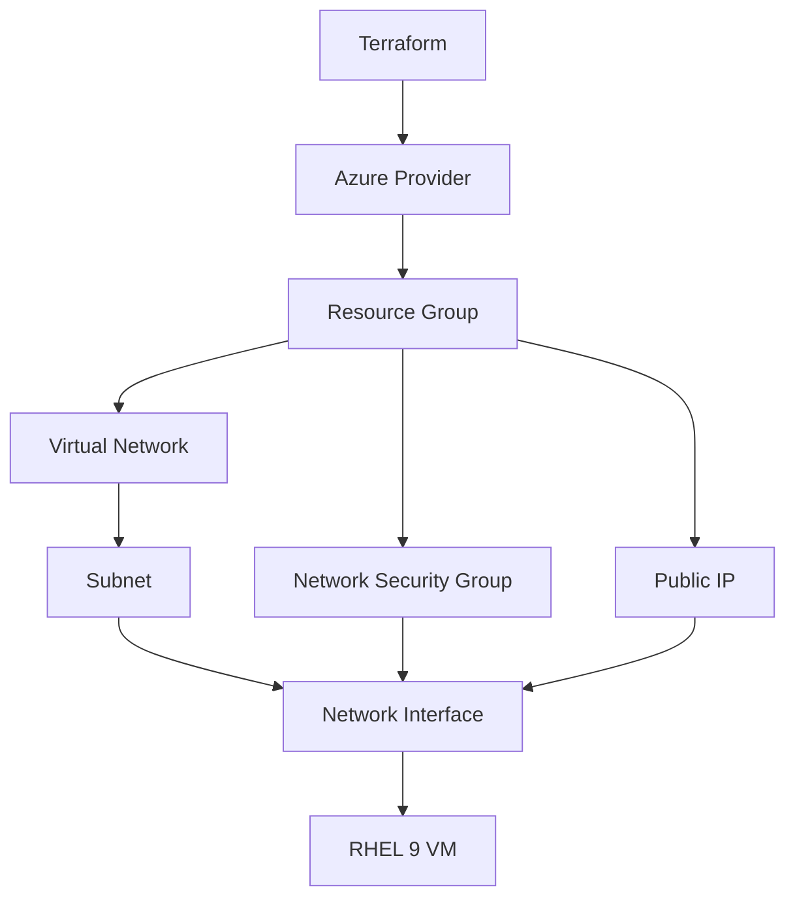

# How to Use Terraform to Deploy RHEL 9 on Azure Virtual Machines

Author: [nawazdhandala](https://www.github.com/nawazdhandala)

Tags: RHEL, Terraform, Azure, Cloud, Virtual Machines, Linux

Description: Deploy RHEL 9 virtual machines on Microsoft Azure using Terraform, covering resource groups, networking, and VM configuration.

---

Azure provides RHEL 9 images through the marketplace, and Terraform makes it easy to deploy and manage them programmatically. This guide walks through deploying a RHEL 9 VM on Azure with proper networking and security.

## Architecture



## Prerequisites

Install the Azure CLI and Terraform:

```bash
# Install Azure CLI
sudo rpm --import https://packages.microsoft.com/keys/microsoft.asc
sudo dnf install -y https://packages.microsoft.com/config/rhel/9.0/packages-microsoft-prod.rpm
sudo dnf install -y azure-cli

# Log in to Azure
az login

# Install Terraform
sudo dnf config-manager --add-repo https://rpm.releases.hashicorp.com/RHEL/hashicorp.repo
sudo dnf install -y terraform
```

## Provider Configuration

```hcl
# providers.tf - Azure provider
terraform {
  required_version = ">= 1.5"

  required_providers {
    azurerm = {
      source  = "hashicorp/azurerm"
      version = "~> 3.80"
    }
  }
}

provider "azurerm" {
  features {}
}
```

## Variables

```hcl
# variables.tf
variable "location" {
  description = "Azure region"
  default     = "East US"
}

variable "vm_size" {
  description = "Azure VM size"
  default     = "Standard_B2s"
}

variable "admin_username" {
  description = "Admin username for the VM"
  default     = "azureuser"
}

variable "ssh_public_key_path" {
  description = "Path to the SSH public key"
  default     = "~/.ssh/id_rsa.pub"
}
```

## Resource Group and Network

```hcl
# network.tf - Resource group, VNet, and subnet

# Create a resource group to hold everything
resource "azurerm_resource_group" "rhel" {
  name     = "rhel9-resources"
  location = var.location
}

# Create a virtual network
resource "azurerm_virtual_network" "rhel" {
  name                = "rhel9-vnet"
  address_space       = ["10.0.0.0/16"]
  location            = azurerm_resource_group.rhel.location
  resource_group_name = azurerm_resource_group.rhel.name
}

# Create a subnet within the VNet
resource "azurerm_subnet" "rhel" {
  name                 = "rhel9-subnet"
  resource_group_name  = azurerm_resource_group.rhel.name
  virtual_network_name = azurerm_virtual_network.rhel.name
  address_prefixes     = ["10.0.1.0/24"]
}

# Public IP for external access
resource "azurerm_public_ip" "rhel" {
  name                = "rhel9-publicip"
  location            = azurerm_resource_group.rhel.location
  resource_group_name = azurerm_resource_group.rhel.name
  allocation_method   = "Static"
  sku                 = "Standard"
}
```

## Network Security Group

```hcl
# security.tf - NSG rules for SSH access

resource "azurerm_network_security_group" "rhel" {
  name                = "rhel9-nsg"
  location            = azurerm_resource_group.rhel.location
  resource_group_name = azurerm_resource_group.rhel.name

  # Allow SSH from anywhere (restrict in production)
  security_rule {
    name                       = "SSH"
    priority                   = 1001
    direction                  = "Inbound"
    access                     = "Allow"
    protocol                   = "Tcp"
    source_port_range          = "*"
    destination_port_range     = "22"
    source_address_prefix      = "*"
    destination_address_prefix = "*"
  }
}

# Create a network interface
resource "azurerm_network_interface" "rhel" {
  name                = "rhel9-nic"
  location            = azurerm_resource_group.rhel.location
  resource_group_name = azurerm_resource_group.rhel.name

  ip_configuration {
    name                          = "internal"
    subnet_id                     = azurerm_subnet.rhel.id
    private_ip_address_allocation = "Dynamic"
    public_ip_address_id          = azurerm_public_ip.rhel.id
  }
}

# Associate the NSG with the NIC
resource "azurerm_network_interface_security_group_association" "rhel" {
  network_interface_id      = azurerm_network_interface.rhel.id
  network_security_group_id = azurerm_network_security_group.rhel.id
}
```

## Virtual Machine

```hcl
# vm.tf - RHEL 9 virtual machine

resource "azurerm_linux_virtual_machine" "rhel" {
  name                = "rhel9-vm"
  resource_group_name = azurerm_resource_group.rhel.name
  location            = azurerm_resource_group.rhel.location
  size                = var.vm_size
  admin_username      = var.admin_username

  network_interface_ids = [
    azurerm_network_interface.rhel.id,
  ]

  # SSH key authentication (no password)
  admin_ssh_key {
    username   = var.admin_username
    public_key = file(var.ssh_public_key_path)
  }

  # OS disk configuration
  os_disk {
    caching              = "ReadWrite"
    storage_account_type = "Standard_LRS"
    disk_size_gb         = 30
  }

  # Use the RHEL 9 marketplace image
  source_image_reference {
    publisher = "RedHat"
    offer     = "RHEL"
    sku       = "9-lvm-gen2"
    version   = "latest"
  }

  # Accept the marketplace plan
  plan {
    name      = "9-lvm-gen2"
    publisher = "redhat"
    product   = "rhel"
  }
}
```

## Outputs

```hcl
# outputs.tf
output "public_ip_address" {
  value = azurerm_public_ip.rhel.ip_address
}

output "ssh_command" {
  value = "ssh ${var.admin_username}@${azurerm_public_ip.rhel.ip_address}"
}
```

## Deploy and Connect

```bash
# Initialize and deploy
terraform init
terraform plan
terraform apply -auto-approve

# Connect to the VM
ssh azureuser@$(terraform output -raw public_ip_address)
```

## Clean Up

```bash
# Remove all Azure resources
terraform destroy -auto-approve
```

Using Terraform with Azure gives you repeatable RHEL 9 deployments that you can extend with additional disks, load balancers, or scale sets as your needs grow.
