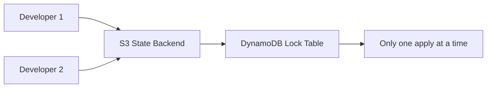

# How to Store Terraform State Remotely with S3 Backend on RHEL 9

Author: [nawazdhandala](https://www.github.com/nawazdhandala)

Tags: RHEL, Terraform, S3, State Management, AWS, Linux

Description: Configure Terraform to store its state file remotely in an AWS S3 bucket with DynamoDB locking on RHEL 9.

---

By default, Terraform stores its state in a local file called `terraform.tfstate`. This works fine for solo projects, but breaks down when multiple people work on the same infrastructure. Remote state with S3 and DynamoDB locking solves this problem.

## Why Remote State Matters



Local state files create several problems:
- Two people can run `terraform apply` simultaneously, causing conflicts
- The state file can be lost if a laptop dies
- Sensitive data in the state has no access controls

## Create the S3 Bucket and DynamoDB Table

First, set up the backend infrastructure. You can do this manually or with a bootstrap Terraform config:

```bash
# Create the S3 bucket for state storage
aws s3api create-bucket \
  --bucket my-terraform-state-bucket \
  --region us-east-1

# Enable versioning so you can recover old state files
aws s3api put-bucket-versioning \
  --bucket my-terraform-state-bucket \
  --versioning-configuration Status=Enabled

# Enable server-side encryption by default
aws s3api put-bucket-encryption \
  --bucket my-terraform-state-bucket \
  --server-side-encryption-configuration '{
    "Rules": [
      {
        "ApplyServerSideEncryptionByDefault": {
          "SSEAlgorithm": "aws:kms"
        }
      }
    ]
  }'

# Block all public access
aws s3api put-public-access-block \
  --bucket my-terraform-state-bucket \
  --public-access-block-configuration \
    BlockPublicAcls=true,IgnorePublicAcls=true,BlockPublicPolicy=true,RestrictPublicBuckets=true

# Create the DynamoDB table for state locking
aws dynamodb create-table \
  --table-name terraform-state-lock \
  --attribute-definitions AttributeName=LockID,AttributeType=S \
  --key-schema AttributeName=LockID,KeyType=HASH \
  --billing-mode PAY_PER_REQUEST \
  --region us-east-1
```

## Configure the S3 Backend

```hcl
# backend.tf - Configure remote state storage

terraform {
  backend "s3" {
    bucket         = "my-terraform-state-bucket"
    key            = "rhel9/infrastructure/terraform.tfstate"
    region         = "us-east-1"
    encrypt        = true
    dynamodb_table = "terraform-state-lock"
  }
}
```

## Initialize with the Remote Backend

```bash
# If migrating from local state, Terraform will ask to copy it
terraform init

# You should see a message like:
# Successfully configured the backend "s3"!
```

If you already had a local state file, Terraform will ask whether to copy it to the remote backend. Type `yes` to migrate.

## Verify the Remote State

```bash
# List the state file in S3
aws s3 ls s3://my-terraform-state-bucket/rhel9/infrastructure/

# Pull the remote state locally (read-only copy)
terraform state pull | head -20
```

## Use Backend Configuration Files

For different environments, use partial backend configuration:

```hcl
# backend.tf - Partial configuration (shared)
terraform {
  backend "s3" {
    key     = "rhel9/infrastructure/terraform.tfstate"
    encrypt = true
  }
}
```

Create environment-specific backend config files:

```ini
# backend-dev.hcl
bucket         = "my-terraform-state-dev"
region         = "us-east-1"
dynamodb_table = "terraform-state-lock-dev"
```

```ini
# backend-prod.hcl
bucket         = "my-terraform-state-prod"
region         = "us-east-1"
dynamodb_table = "terraform-state-lock-prod"
```

Initialize with the appropriate backend:

```bash
# Initialize for development
terraform init -backend-config=backend-dev.hcl

# Initialize for production
terraform init -backend-config=backend-prod.hcl
```

## State Locking in Action

When someone runs `terraform apply`, DynamoDB creates a lock entry. If another person tries to apply at the same time, they get an error:

```
Error: Error acquiring the state lock
Lock Info:
  ID:        a1b2c3d4-e5f6-7890-abcd-ef1234567890
  Path:      my-terraform-state-bucket/rhel9/infrastructure/terraform.tfstate
  Operation: OperationTypeApply
  Who:       user@hostname
  Version:   1.6.0
  Created:   2026-03-04 10:30:00.000000 UTC
```

If a lock gets stuck (for example, after a crash), you can force-unlock it:

```bash
# Only use this if you are sure no other operation is running
terraform force-unlock a1b2c3d4-e5f6-7890-abcd-ef1234567890
```

## State File Security

The state file contains sensitive information like passwords and access keys. Protect it:

```bash
# Create a bucket policy that restricts access
aws s3api put-bucket-policy \
  --bucket my-terraform-state-bucket \
  --policy '{
    "Version": "2012-10-17",
    "Statement": [
      {
        "Effect": "Deny",
        "Principal": "*",
        "Action": "s3:*",
        "Resource": [
          "arn:aws:s3:::my-terraform-state-bucket",
          "arn:aws:s3:::my-terraform-state-bucket/*"
        ],
        "Condition": {
          "Bool": {
            "aws:SecureTransport": "false"
          }
        }
      }
    ]
  }'
```

Remote state with S3 and DynamoDB gives your team safe, shared access to Terraform state on RHEL 9 workstations. Versioning protects against accidental corruption, and locking prevents concurrent modifications.
